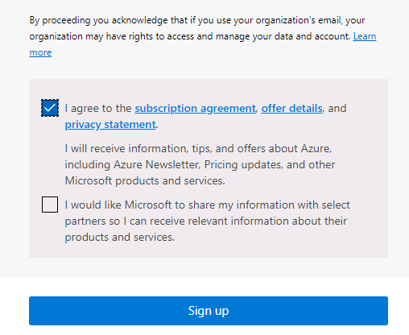

---
lab:
  title: 00 - ラボのセットアップ
  learning path: '01'
  module: Module 01 - Implement an identity management solution
---

# ラボ 00:ラボ環境のセットアップ

## ラボのシナリオ

今後のラボを完了する準備をするには、新しい Azure サブスクリプションを作成し、Azure AD P2 ライセンスを要求する必要があります。

#### 推定時間:5 分

## Azure アカウントを作成し、Azure Active Directory Premium P2 試用版ライセンスを追加する

この演習のタスクとこのラーニング パスの演習では、使用できる Azure サブスクリプションを既に所有しているか、Azure 試用版アカウントにサインアップすることが必要です。 自分の Azure サブスクリプションを既に所有している場合は、このタスクをスキップし、次の手順に進むことができます。

1. Web ブラウザーで、[https://azure.microsoft.com/free](https://azure.microsoft.com/free) にアクセスします。

1. 利用可能な特典と無料サービスの詳細については、ページを下までスクロールしてご覧ください。

1. **[開始 (無料)]** を選択します。

1. ウィザードを使用して Azure 試用版サブスクリプションにサインアップします。

1. 一部の演習では、完了するために Azure AD P2 ライセンスが必要です。 作成した組織で、**[Azure Active Directory]** を検索してから選択します。

1. 左側のナビゲーション メニューで **[作業の開始]** を選択します。

1. [Azure AD を使い始める] の下にある **[Azure AD Premium の無料試用版を入手する]** を選択します。

1. [アクティブ化] ペインの **[AZURE AD PREMIUM P2]** で **[無料試用版]** を選択し、**[アクティブ化]** を選択します。

1. 左側のナビゲーション メニューで **[概要]** を選択します。

1. 組織名の下に [Azure AD Premium P2] が表示されるまで、ブラウザーを更新します。 これには数分かかることがあります。

1. 問題が発生して、目的の機能が使用できない場合は、サインアウトしてから Microsoft Azure に再度サインインする必要があることがあります。

#### Azure Pass を引き換える

1. ブラウザーを開き、[www.microsoftazurepass.com](https://www.microsoftazurepass.com) に移動します。

1. すべてのブラウザーを閉じて、新しい InPrivate ブラウザー セッションを開くことをお勧めします。 アクティブ化手順中に他のログインが保持され、エラーの原因になる可能性があります。

1. **[開始]** ボタンを選んで、作業を始めます。

1. ユーザー名がラボ プロバイダー テナント アカウントと同じであることを確認します。

1. **[プロモーション コードの入力]** フィールドに Azure Pass のバウチャー コードを入力 します。 要求された場合は、自分が人間であることを証明します。 

1. **[プロファイル]** フィールドに住所情報を入力します。
    - **住所行 1**:1 Microsoft Way
    - **市区町村**:レドモンド
    - **[状態]** :ワシントン
    - **郵便番号**:98052

1. サブスクリプション契約に同意するボックスを選択し、 **[サインアップ]** を選択します。

    

1. ディレクトリのグローバル管理者アカウントを使用して、[https://portal.azure.com](https://portal.azure.com) にアクセスし、サインインします。

1. **[サブスクリプション]** に移動し、 **[Azure Pass - Sponsorship](Azure Pass - スポンサーシップ)** に**アクティブ**状態が表示されていることを確認します。 
