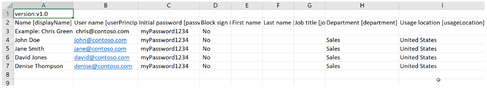

---
lab:
  title: 01 - ユーザー ロールを管理する
  learning path: '01'
  module: Module 01 - Implement an Identity Management Solution
  description: Microsoft Entra テナントで新しいユーザーに対するロールを作成、削除、追加するさまざまな方法を調べます。
  duration: 30 minutes
  level: 300
  islab: true
---

# WWL テナント - 使用条件

講師による指導付きトレーニング配信の一環としてテナントが提供されている場合は、テナントは講師による指導付きトレーニングの対話型ラボをサポートする目的で利用できることに注意してください。 テナントは、共有したり、対話型ラボ以外の目的で使用したりしないでください。 このコースで使われるテナントは試用版テナントであり、クラスが終了し、拡張機能の対象となっていない場合は、使用したりアクセスしたりすることはできません。 テナントを有料サブスクリプションに変換することはできません。 このコースの一環として取得したテナントは Microsoft Corporation の財産のままであり、当社はいつでもアクセス権とリポジトリを取得する権利を留保します。

# 2 種類のログイン オプション

このラボには、ラボのさまざまな部分に使用される 2 種類のログイン オプションがあります。 一方のログイン スタイルは、Azure リソースを必要とするラボ用で、もう一方は Microsoft Entra と Microsoft 365 のリソースのみを必要とするラボ用です。 ログインの種類:

  - Azure リソース ベースのログイン
  - Microsoft 365 と E5 テナントのログイン
      - MOD 管理者アカウント

使用するログインは各ラボで指示されます。


# ラボ 01: ユーザー ロールを管理する

### ログイン タイプ = Microsoft 365 と E5 テナントのログイン

## ラボのシナリオ

あなたの会社では最近、アプリケーション管理者として業務を遂行する新しい従業員を採用しました。 新しいユーザーを作成し、セキュリティ ロールを割り当てる必要があります。

#### 予想所要時間: 30 分

### 演習 1 - 新しいユーザーを作成し、アプリケーションの管理者権限をテストする

#### タスク 1 - 新しいユーザーを追加する

1. 新しい Microsoft Edge を開き、**Microsoft Entra 管理センター** (**`https://entra.microsoft.com`**) に移動します。 承認されたラボ ホスト (ALH) によって提供されたグローバル管理者アカウントを使用してサインインします。

    > **注:** サインイン中に多要素認証 (MFA) を完了するように求められる場合があります。 続行する前に、プロンプトに従って認証方法を構成または確認します。

1. 左側にあるナビゲーション メニューで、**[Entra ID]** の下にある **[ユーザー]** を選択します。

1. **[ユーザー]** ページで、**[すべてのユーザー]**、**[+ 新しいユーザー]**、**[新しいユーザーの作成]** の順に選択します。

1. その後、次の情報を使用してユーザーを作成します。

    | **設定**| **Value**|
    | :--- | :--- |
    | ユーザー プリンシパル名| ChrisG|
    | 表示名| Chris Green|

1. **[パスワードの自動生成]** オプションが選択されていることを確認します。

1. 次のタスクでアクセスできるように、ユーザー名と生成されたパスワードを任意の場所にコピーします。

     *このアカウントに最初にログインするときにパスワードを変更する必要があります*

1. **[確認および作成]** を選択します。 次に、レビュー画面で、[**作成**] を選択します。 これでユーザーが作成され、組織に登録されました。

#### タスク 2 - ログインしてアプリを作成する

1. 新しい InPrivate ブラウザー ウィンドウを開きます。

1. **Microsoft Entra 管理センター** (**`https://entra.microsoft.com`**) を開き、**Chris Green** としてサインインします。

    | **設定**| **Value**|
    | :--- | :--- |
    | ユーザー名| 前のタスクのユーザー名を入力します。 |
    | Password| 前のタスクで自動生成されたパスワードを入力します。 |

    > **注:** サインイン中に多要素認証 (MFA) を完了するように求められる場合があります。 続行する前に、プロンプトに従って認証方法を構成または確認します。

1. パスワードを更新します。

    | **設定**| **Value**|
    | :--- | :--- |
    | 現在のパスワード| 自動生成されたパスワードを使用します|
    | 新しいパスワード| 一意のセキュリティで保護されたパスワードを入力します |
    | パスワードの確認| 一意のセキュリティで保護されたパスワードを再入力します |

  **ラボのヒント** - ラボ環境で提供されているユーザー パスワードを使用することをお勧めします。

1. ページ上部の検索ボックスで、**エンタープライズ アプリケーション**を検索し、検索結果からそれを選択します。

1. **[+ 新しいアプリケーション]** を選択します。**[+ 独自のアプリケーションの作成]** は使用できないことに注意してください。

1. **[同意とアクセス許可]**、**[ユーザー設定]** などの他の設定を選択してみて、**Chris Green** に十分なアクセス許可がないことを確認してください。

1. 右上隅にある **[ChrisG]** をクリックし、サインアウトします。

### 演習の概要

この演習では、Microsoft Entra ID で新しいユーザーを作成し、そのユーザーとしてサインインして、アプリケーションをまだ管理できないことを確認しました。 この演習では、新しいアカウントに既定では特権アクセス権がないことを示しました。

### 演習 2 - アプリケーション管理者のロールを割り当て、アプリを作成する

#### タスク1 - ユーザーにロールを割り当てる

Microsoft Entra ID を使用すると、特権の低いロールで ID タスクを管理するための制限付き管理者を指定できます。 ユーザーの追加または変更、管理ロールの割り当て、ユーザーのパスワードのリセット、ユーザーのライセンスの管理、ドメイン名の管理などの目的で管理者を割り当てることができます。

1. 管理者の役割としてまだログインしていない場合は、Microsoft Entra 管理センターを開いてログインします。

1. 左側にあるナビゲーション メニューで、**[Entra ID]** の下にある **[ユーザー]** を選択します。

1. メニューの [管理] セクションで [**すべてのユーザー**] をクリックします。

1. **Chris Green** のアカウントを選択します。

1. [管理] メニューから **[割り当てられたロール]** を選択します。

1. **[+ 割り当ての追加]** を選択します。

1. ドロップダウンから [**アプリケーション管理者**] ロールを選択します。

1. **[次へ]** ボタンを選択します。

1. **[割り当ての種類]** で値 **[アクティブ]** を選択します。

1. 「ラボで必要」のような正当な理由を入力します。 **[割り当て]** を選択します

    ![[割り当てられたロール] ページ - 選択されたロールを表示中](./media/directory-role-select-role.png)

    >**注** - ラボ環境で既に Microsoft Entra ID Premium P2 がアクティブ化されている場合は、Privileged Identity Management (PIM) が有効になるため、[**次へ**] を選択し、このユーザーに永続的ロールを割り当てる必要があります。

1. **[更新]** ボタンをクリックします。

    >**注:** 新しく割り当てられたアプリケーション管理者ロールが、ユーザーの [割り当てられたロール] ページに表示されます。

#### タスク 2 - アプリケーションのアクセス許可を確認する

1. 新しい InPrivate ブラウザー ウィンドウを開きます。

1. Microsoft Entra 管理センター (**`https://entra.microsoft.com`**) を開き、**Chris Green** としてサインインします。

    | **設定**| **Value**|
    | :--- | :--- |
    | ユーザー名| 前のタスクのユーザー名を入力します。 |
    | Password| 先ほど作成した一意のセキュリティで保護されたパスワードを入力します |

1. ページ上部の検索ボックスで、**エンタープライズ アプリケーション**を検索し、検索結果からそれを選択します。

1. **[新しいアプリケーション]** を選択します。

1. **[独自のアプリケーションの作成]** が使用できるようになり、グレー表示されなくなりました。

1. **[+ 独自のアプリケーションの作成]** を選択します。

1. ウィンドウの下部にある **[作成]** ボタンが使用できるようになったことに注意してください。

    >**注:** アプリケーション管理者ロールが割り当てられると、このロールはテナントにアプリケーションを追加できるようになります。 この権限については、後のラボでさらに実験します。

1. ポータルの Chris Green のインスタンスからサインアウトし、ブラウザーを閉じます。

### 演習の概要

この演習では、ユーザーにアプリケーション管理者ロールを割り当て、エンタープライズ アプリケーションを作成できるようになったことを確認しました。 この演習では、ディレクトリ ロールによって、スコープ付き管理アクセス許可が付与されることを示しました。

### 演習3 - ロールの割り当てを削除する

#### タスク 1 - Chris Green からアプリケーション管理者を削除する

このタスクでは、別の方法を使用して、割り当てられたロールを削除します。つまり、Microsoft Entra ID の **[ロールと管理者]** オプションを使用します。

1. まだ管理者としてログインしていない場合は、Microsoft Entra 管理センターを起動し、今すぐログインします。

1. 検索ボックスに「**ロール**」と入力し、**[Microsoft Entra ID のロールと管理]** を起動します。

1. [**ロールと管理者**] の [**すべてのロール**] で、一覧から [**アプリケーション管理者**] ロールを選択します。

1. **[アプリケーション管理者 | 割り当て]** ページの一覧に Chris Green の名前が表示されます。

1. Chris Green の右までスクロールします。

1. ダイアログの上部にあるオプションから **[削除]** を選択します。

1. 確認ボックスが開いたら、**[はい]** と答えます。

1. 画面を閉じます。

### 演習の概要

この演習では、[ロールと管理者] を使用して、ユーザーからアプリケーション管理者ロールを削除しました。 この演習では、ロールの割り当てを管理するための代替方法を示しました。これは、最小限の特権ガバナンスに役立ちます。

### 演習 4 - ユーザーの一括インポート

#### タスク 1 - .csv ファイルを使用してユーザーを作成するための一括操作

1. Microsoft Entra ID メニューの [**Entra ID**] で、[**ユーザー**]、[**すべてのユーザー**] の順に選択します。

1. **[ユーザー | すべてのユーザー]** タイルで、**[一括操作]** ドロップダウン矢印を選択し、**[一括作成]** を選択します。

1. **[一括作成]** を選択すると、新しいタイルが開きます。 このタイルには、ユーザー情報を入力し、アップロードしてユーザーの一括作成を追加するために編集するテンプレート ファイルへの **[ダウンロード]** リンクが表示されます。

1. **[ダウンロード]** を選択して、**.csv** ファイルをダウンロードします。

1. .csv テンプレートには、ユーザー プロファイルに含まれるフィールドが用意されています。 これには、必要なユーザー名、表示名、初期パスワードが含まれます。 現時点では、部門や使用状況の場所などの省略可能なフィールドを入力することもできます。 次のスクリーンショットは、.csv ファイルを完了する方法の例です。 

    

    このファイルを変更して、ユーザーを一括操作で追加できます。  すべてのフィールドに入力する必要はないことに注意してください。  サンプル データに指定されている内容のとおり、主に名前とユーザー名の情報を追加する必要があります。

1. Allfiles/Labs/Lab1 フォルダーには、サンプルの CSV ファイル (**SC300BulkUser.csv**) が用意されています。
   1. メモ帳を開きます。
     - ラボ環境内で、[スタート] ボタンを選択し、「メモ帳」と入力します。  
   1. SC300BulkUser.csv ファイルを開きます
   1. **[ドメイン名を入力する]** を Azure ラボ環境のドメインに変更します。
   1. ファイルを保存します。

1. **[ユーザーの一括作成]** ダイアログの手順 3 で [ファイル フォルダー] アイコンを選択します。

1. Allfiles/Labs/Lab1 フォルダーを参照し、**SC300BulkUser.csv** ファイルを選択します。

1. **[Open (開く)]** を選択します。

1. ファイルが正常にアップロードされたことが通知されます。 **[送信]** ボタンを選択して、ユーザーを追加します。 

ユーザーが作成されると、作成が成功したことを確認するメッセージが表示されます。  [ユーザーの一括作成] タイルを閉じると、 **[ユーザー | すべてのユーザー]** の一覧に新しいユーザーが設定されます。 

#### タスク 2 - PowerShell を使用したユーザーの一括追加

1. Windows スタート メニューから PowerShell を開きます。

    >**注** - このラボを機能させるためには、PowerShell バージョン 7.2 以降が必要です。  PowerShell を開くと、画面の上部にバージョンが表示されます。古いバージョンを実行している場合は、画面の指示に従って `https://aka.ms/PowerShell-Release?tag=7.3.9` に移動してください。 [アセット] セクションまで下にスクロールし、powershell-7.3.1-win-x64.msi を選択します。 ダウンロードが完了したら、[ファイルを開く] を選択します。 すべての既定値を使用してインストールします。

    **ラボのヒント** - ラボ環境では、TouchType は PowerShell でうまく機能しません。  この問題を回避するには、ラボ環境でメモ帳を開きます。 次に、TouchType 機能を使用してスクリプトをメモ帳に入力したあと、最終的にコピーと貼り付けを使用してコマンドを PowerShell に入力します。  このような余分なステップが必要になり、申し訳ございません。

1. 以前に使用したことがない場合は、Microsoft.Graph PowerShell モジュールをインストールする必要があります。  次の 2 つのコマンドを実行し、確認を求められたら Y キーを押します。

    ```
    Install-Module Microsoft.Graph -Scope CurrentUser -Verbose
    ```

1. Microsoft.Graph モジュールがインストールされていることを確認します。

    ```
    Get-InstalledModule Microsoft.Graph
    ```

1. 次に、以下を実行して Microsoft Graph にログインする必要があります。  

    ```
    Connect-MgGraph -Scopes "User.ReadWrite.All"
    ``` 
    Edge ブラウザーが開き、サインインするように求められます。  MOD 管理者アカウントを使用して接続します。  アクセス許可要求に同意して、ブラウザー ウィンドウを閉じます。

1. 接続されていることを確認し、既存のユーザーを表示するには、次を実行します。  

    ``` 
    Get-MgUser 
    ```
    
1. すべての新規ユーザーに共通の一時パスワードを割り当てるには、次のコマンドを実行し、<Enter a complex Password> をユーザーに提供するパスワードに置き換えます。  

    ``` 
    $PWProfile = @{
        Password = "<Enter a complex password you will>";
        ForceChangePasswordNextSignIn = $false
    }
    ```

1. これで新しいキーを作成する準備が整いました。 次のコマンドにユーザー情報が入力され、実行されます。  追加するユーザーが複数ある場合は、メモ帳の txt ファイルを使用してユーザー情報を追加し、PowerShell にコピーして貼り付けることができます。 

    ```
    New-MgUser `
        -DisplayName "New PW User" `
        -GivenName "New" -Surname "User" `
        -MailNickname "newuser" `
        -UsageLocation "US" `
        -UserPrincipalName "newuser@<labtenantname.com>" `
        -PasswordProfile $PWProfile -AccountEnabled `
        -Department "Research" -JobTitle "Trainer"
    ```
    >**注**: **labtenantname.com** は、ラボ テナントによって割り当てられた **onmicrosoft.com** 名に置き換えます。

## ユーザーの管理を試す

Microsoft Entra ID ページを使用してユーザーを追加および削除できます。 ただし、スクリプトを使用してユーザーを作成し、ロールを割り当てることができます。  スクリプトを使用して、Chris Green のユーザー アカウントに別のロールを与えてみます。 

### 演習の概要

この演習では、CSV ファイルをアップロードし、PowerShell と Microsoft Graph を実行して、複数のユーザーを作成しました。 この演習では、ポータルを超えてユーザー プロビジョニングをスケーリングする方法を示しました。

### 演習 5 - Microsoft Entra ID からユーザーを削除する

#### タスク 1 - ユーザーを削除する

アカウントを削除した後、復元する必要がある場合があります。 最近削除されたアカウントを復元できるかどうかを確認する必要があります。

1. **Microsoft Entra 管理センター** (**`https://entra.microsoft.com`**) を参照します。

1. 左側にあるナビゲーション メニューで、**[Entra ID]** の下にある **[ユーザー]** を選択します。

1. **[すべてのユーザー]** を選択し、削除するユーザー (例: **Chris Green**) のチェック ボックスをオンにします。

    **ヒント** - リストからユーザーを選択すると、複数のユーザーを同時に管理できます。 ユーザーを選択してそのユーザーのページを開くと、その個別のユーザーのみを管理することになります。

    ![1 つのユーザー チェック ボックスがオンになり、リストから複数のユーザーを選択する機能を示す別のチェック ボックスが強調表示された、[すべてのユーザー] ユーザー リストを表示した画面イメージ。](./media/lp1-mod2-remove-user.png)

1. ユーザー アカウントを選択した状態で、メニューから **[削除]** を選択します。

1. 確認ダイアログを確認して、**[はい]** を選択します。

#### タスク 2 - 削除済みユーザーを復元する

1. **[ユーザー]** ページの左側にあるナビゲーション メニューで、**[削除済みのユーザー]** を選択します。

1. 削除済みのユーザーの一覧を確認し、**[Chris Green]** を選択します。

    **重要** - 既定では、削除されたユーザー アカウントは 30 日後に自動的に Azure Active Directory から完全に削除されます。

1. メニューで **[ユーザーの 復元]** を選択します。

1. ダイアログ ボックスを確認してから、**[OK]** を選択します。

1. 左側にあるナビゲーションで、**[すべてのユーザー]** を選択します。

1. ユーザーが復元されたことを確認します。

### 演習の概要

この演習では、ユーザー アカウントを削除し、それを [削除済みのユーザー] の一覧から復元しました。 この演習では、論理的な削除からの回復ウィンドウで、アカウントを偶発的な損失から保護する方法を示しました。

### 演習 6 - Windows 10 ライセンスをユーザー アカウントに追加する

#### タスク1 - Azure Active Directory でライセンスのないユーザーを検索する

組織内の一部のユーザー アカウントには、割り当てられたライセンスで利用可能なすべての製品が提供されない場合や、ライセンス割り当ての更新または追加が必要な場合があります。 Microsoft Entra ID でユーザー アカウントのライセンス割り当てを更新できるようにする必要があります。

1. **Microsoft Entra 管理センター** (**`https://entra.microsoft.com`**) を参照します。

1. 左側にあるナビゲーション メニューで、**[Entra ID]** の下にある **[ユーザー]** を選択し、**[すべてのユーザー]** を選択します。

1. **[ユーザー]** ページで、検索ボックスに「**Raul**」と入力します。

1. **[Raul Razo]** を選択します。

1. Raul のプロファイルを確認し、Usage Location が設定されていることを確認します。

    **警告** - ユーザーにライセンスを割り当てるには、ユーザーに使用場所が割り当てられている必要があります。

1. 左側にあるナビゲーション メニューで、**[ライセンス]** を選択します。

1. Raul に "ライセンスの割り当てが見つかりません" と表示されていることを確認します。

#### タスク 2 - Windows ライセンスを Raul に追加する

Microsoft 365 管理センターを使用してライセンスを追加および削除する必要があります。 これは比較的新しい変更です。

1. 新しいブラウザー タブを開きます。

1. **Microsoft 365 管理センター** (**`https://admin.microsoft.com`**) に移動します。 メッセージが表示されたら、管理者アカウントでサインインします。

1. 左側にあるナビゲーション メニューで、**[課金情報]**、**[ライセンス]** の順に選択します。

1. 一覧から **Windows 10/11 Enterprise E3** ライセンスを選択します。

1. メニューから [**+ ライセンスの割り当て**] を選択します。

1. **Raul Razo** を検索し、一覧からそのユーザーを選択します。

1. Raul を追加したら、**[ライセンスの割り当て**] を選択します。

1. **Microsoft Entra 管理センター**が開いているブラウザー タブに戻ります。

1. 左側にあるナビゲーション メニューで、**[Entra ID]** の下にある **[ユーザー]** を選択し、**[すべてのユーザー]** を選択します。

1. **[ユーザー]** ページで、**[Raul Razo]** を選択します。

1. 左側にあるナビゲーション メニューで、**[ライセンス]** を選択します。

1. ライセンスが割り当てられていることに注目してください。

1. ライセンス画面を終了できます。

### 演習の概要

この演習では、Microsoft 365 管理センターからユーザーに Windows 10/11 Enterprise E3 ライセンスを割り当て、Microsoft Entra ID で割り当てを確認しました。 この演習では、ライセンスの割り当てが実行され、管理センター全体に反映される方法を示しました。
