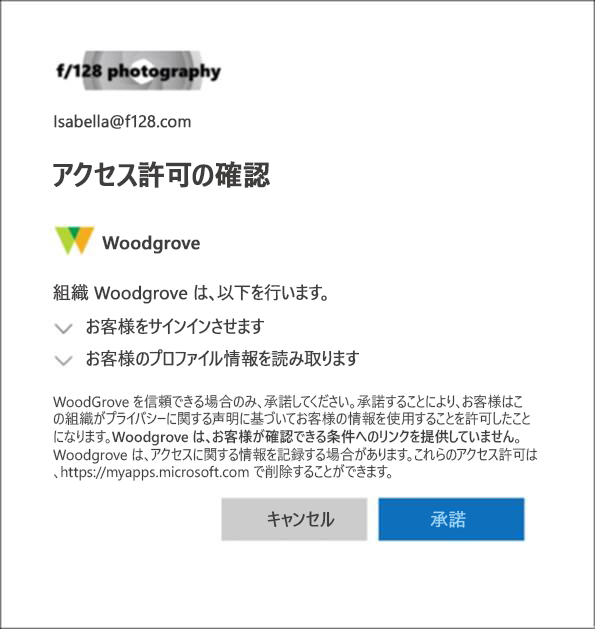

---
lab:
  title: 02 - テナントのプロパティを操作する
  learning path: '01'
  module: Module 01 - Implement an Identity Management Solution
  description: テナントに関連付けられているさまざまなプロパティを特定し、更新する必要があります。
  duration: 15 minutes
  level: 200
  islab: true
---

# ラボ 02: テナントのプロパティを操作する

### ログイン タイプ = Microsoft 365 と E5 テナントのログイン

## ラボのシナリオ

テナントに関連付けられているさまざまなプロパティを特定し、更新する必要があります。

#### 推定時間:15 分

### 演習 1 - カスタム サブドメインを作成する 

#### タスク 1 - カスタム サブドメイン名を作成する

Microsoft Entra ID を使用して、購入したドメインを作成します。  サブドメインを作成して既存の .onmicrosoft.com ドメインを分割する場合は、Microsoft 365 管理センターを使用する必要があります。

1. **`https://entra.microsoft.com`** で **Microsoft Entra 管理センター**を参照し、ディレクトリの全体管理者アカウントを使用してサインインします。

    > **注:** サインイン中に多要素認証 (MFA) を完了するように求められる場合があります。 続行する前に、プロンプトに従って認証方法を構成または確認します。

1. 左側のナビゲーションの **[Entra ID]** の下にある **[ドメイン名]** を選択します。

1. **[カスタム ドメイン名]** ページで、**[+ カスタム ドメインの追加]** を選択します。

1. "**カスタム ドメイン名**" フィールドで、**onmicrosoft.com** ドメイン名の前に **sales** を付けて、ラボ テナントのカスタム サブドメインを作成します。  形式は次のようになります。

    ```
    Sales.labTenantName.onmicrosoft.com
    ```

    >**注: ** **.onmicrosoft.com** ドメインを入力すると、Microsoft Entra ID で **onmicrosoft.com** ドメイン管理が制限されていることを示す制限メッセージが表示されます。 メッセージに表示されている **Microsoft 365 管理センター**のリンクを選択してこのアクションを完了してください。

1. **Microsoft 365 管理センター**の **[ドメイン]** ページで、**[ドメインの追加]** を選択してサブドメインを追加します。

1. ダイアログにサブドメイン名「`sales.tenantname.onmicrosoft.com`」を入力します。 必ず、*tenantname* を実際のテナントの名前に置き換えてください。

1. 画面の下部にある **[このドメインを使用する]** ボタンを選択します。

1. 次の画面が開いたら、**[閉じる]** ボタンを選択します。  このラボの目的では、DNS は設定しません。

### 演習の概要

この演習では、Microsoft Entra ID でカスタム サブドメインを追加するステップを確認しました。 この演習では、組織がどのようにしてパブリック DNS 名前空間をテナントに割り当てるかを示しました。

### 演習 2 - テナントの表示名を変更する

#### タスク 1 - テナント名と技術部連絡先を設定する

1. Microsoft Entra 管理センター内から、**[ID]** メニューを開きます。

1. 左側のナビゲーションで、**[概要]** メニュー項目を選択した後、**[プロパティ]** を選択します。

1. ダイアログで **[名前]** と **[技術部連絡先]** のテナント プロパティを変更します。

    | **設定** | **Value** |
    | :--- | :--- |
    | 名前 | **Contoso Marketing** |
    | 技術部連絡先 | **グローバル管理者アカウント** |

1. **[保存]** を選択してテナント プロパティを更新します。

   **保存が完了するとすぐに名前が変更されます。**

#### タスク 2 - テナントに関連付けられている国または地域およびその他の値を確認する

1. 左側のナビゲーションで、**[概要]** を選択した後、**[プロパティ]** を選択します。

1. **[テナントのプロパティ]** で、**[国または地域]** を見つけて、情報を確認します。

    **重要** - テナントが作成されると、その時点で国または地域が指定されます。 この設定は後で変更できます。

1. **[プロパティ]** ページの **[テナントのプロパティ]** で、 **[場所]** を見つけて情報を確認します。

    ![[国または地域] と [場所] の設定が強調表示されている Azure Active Directory の [プロパティ] ページを表示する画面イメージ](./media/azure-active-directory-properties-country-location.png)

#### タスク3 - テナント ID を見つける

Azure サブスクリプションには、Microsoft Entra ID との信頼関係があります。 サブスクリプションでは、ユーザー、サービス、デバイスを認証するために Microsoft Entra ID が信頼されます。 各サブスクリプションには、それに関連付けられているテナント ID があり、いくつかの方法で、お使いのサブスクリプションのテナント ID を見つけることができます。

1. **`https://entra.microsoft.com`** で、**[Microsoft Entra 管理センター]** を開きます。

1. 左側のナビゲーションで、**[概要]** を選択した後、**[プロパティ]** を選択します。

1. **[テナントのプロパティ]** で、**[テナント ID]** を見つけます。 これは一意のテナント識別子です。

    ![[テナント ID] ボックスが強調表示されている [テナントのプロパティ] ページを表示する画面イメージ](./media/portal-tenant-id.png)

    >**注:** 今後のラボで使用するために、テナント ID をメモ帳などの場所に記録すると便利です。

### 演習の概要

この演習では、テナントの表示名を更新し、特定に役立つ国、所在地、テナント ID などのテナント プロパティを確認しました。 この演習では、ブランドや識別情報がテナント レベルでどのように管理されているかを示しました。

### 演習 3 - プライバシー情報を設定する

#### タスク 1 - Microsoft Entra ID での (グローバル プライバシー連絡先、プライバシー ステートメント URL を含む) プライバシー情報の追加

Microsoft では、社内の従業員と外部のゲストがポリシーを確認できるように、グローバル プライバシー連絡先と組織のプライバシーに関する声明の両方を追加することを強くお勧めします。 プライバシーに関する声明はそれぞれの会社に合わせて独自に作成､変更されるため､弁護士に相談することを強くお勧めします｡

   >**注:** 個人データの表示または削除については、[https://docs.microsoft.com/microsoft-365/compliance/gdpr-dsr-azure](https://docs.microsoft.com/microsoft-365/compliance/gdpr-dsr-azure) を参照してください。 GDPR の詳細については、[https://servicetrust.microsoft.com/ViewPage/GDPRGetStarted](https://servicetrust.microsoft.com/ViewPage/GDPRGetStarted) を参照してください。

組織のプライバシー情報は、Microsoft Entra ID の  **[プロパティ]**  エリアに追加します。 [Properties] エリアにアクセスしてプライバシー情報を追加するには:

1. 左側のナビゲーションで、**[概要]** を選択した後、**[プロパティ]** を選択します。

    ![[技術部連絡先]、[グローバル プライバシー連絡先]、[プライバシーに関する声明] の各ボックスが強調表示されている、テナントのプロパティを表示する画面イメージ](./media/properties-area.png)

1. 従業員のプライバシー情報を追加します｡

- **[グローバル プライバシー連絡先]** - `AllanD@<your Azure lab domain>`
     - Allan Deyoung は、IT 管理者として働く Azure ラボ テナントの組み込みユーザーです。彼をプライバシー連絡先として使用します。
     - この連絡先は､データに関する違反があった場合に Microsoft が問い合わせを行う連絡先でもあります｡ 問い合わせの記載がない場合､Microsoft はグローバル管理者に問い合わせます｡

- **プライバシーに関する声明の URL** -  <https://github.com/MicrosoftLearning/SC-300-Identity-and-Access-Administrator/blob/master/Allfiles/Labs/Lab2/SC-300-Lab_ContosoPrivacySample.pdf>

     - サンプルのプライバシー PDF は、ラボのディレクトリにあります。
     \- 組織が社内と外部のゲストの両方のデータのプライバシーをどのように扱うかを説明している組織のドキュメントへのリンクを入力します。

    **重要** - プライバシーに関する独自の声明とプライバシー連絡先のどちらも含めていない場合は、外部のゲストの [アクセス許可の確認] ボックスに、 **<組織名\>** はユーザーが確認する使用条件へのリンクを提供していませんというテキストが表示されます。 たとえば､このメッセージは､B2B コラボレーションでゲスト ユーザーが組織にアクセスするための招待を受けたときに表示されます｡

    

1. **[保存]** を選択します。

#### タスク 2 - プライバシーに関する声明を確認する

1. **[Microsoft Entra 管理センター]** ダッシュボードに戻ります。

1. UI の右上隅で、ユーザー名を選択します。

1. ドロップダウン メニューから **[アカウントの表示]** を選択します。

     **新しいブラウザー タブが自動的に開きます。**

1. 左側のメニューで **[設定とプライバシー]** を選択します。

1. **[プライバシー]** を選択します。

1. **[組織の通知]** で、Contoso マーケティング組織のプライバシーに関する声明の横にある **[表示]** 項目を選びます。

     **リンクしたプライバシー PDF ファイルが表示された新しいブラウザー タブが開きます。**

1. サンプルのプライバシーに関する声明を確認します。

1. PDF が含まれているブラウザー タブを閉じます。

1. **マイ アカウント**　アイテムを表示しているブラウザー タブを閉じます。

### 演習の概要

この演習では、テナントのプライバシー連絡先とプライバシー ステートメントの URL を設定し、ユーザー アカウントからのリンクを確認しました。 この演習では、社内外のユーザーに対して必要な組織通知を表示する方法を示しました。
