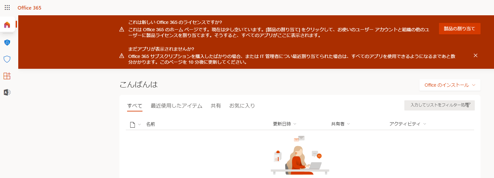

---
lab:
  title: 03 - グループ メンバーシップを使用してライセンスを割り当てる
  learning path: '01'
  module: Module 01 - Implement an identity management solution
---

# ラボ 03:グループ メンバーシップを使用してライセンスを割り当てる

## ラボのシナリオ

組織は、Microsoft Entra ID のセキュリティ グループを使用して、ライセンスを管理することに決めました。 新しいセキュリティ グループを設定し、そのグループにライセンスを割り当て、グループ メンバーのライセンスが更新されたことを確認する必要があります。

#### 推定時間: 25 分

### 演習 1 - セキュリティ グループを作成してユーザーを追加する

#### タスク 1 - Delia Dennis が Office 365 にアクセスできるかどうかを確認する

1. 新しい InPrivate ブラウザー ウィンドウを開きます。
2. [https://www.office.com](https://www.office.com) に接続します。
3. [サインイン] をクリックして、Delia Dennis として接続します。

   | **設定**| **Value**|
   | :--- | :--- |
   | ユーザー名 | DeliaD@`your domain name.com`|
   | Password| リソースからグローバル管理者のパスワードを入力します|

4. Office.com の Web サイトに接続する必要がありますが、ライセンスがないことを示すメッセージが表示されます。

   
    
5. ブラウザー ウィンドウを閉じます。

#### タスク 2 - Microsoft Entra ID でセキュリティ グループを作成する

1. [https://entra.microsoft.com](https://entra.microsoft.com) を参照します。

2. 左側のナビゲーションの **[ID]** で、**[グループ]**、**[すべてのグループ]** の順に選択します。
3. [グループ] ページのメニューで、 **[新しいグループ]** を選択します。
4. 次の情報を使用して、グループを作成します。

   | **設定**| **Value**|
   | :--- | :--- |
   | グループの種類| セキュリティ|
   | グループ名| sg-SC300-O365|
   | メンバーシップの種類| 割り当て済み|
   | 所有者| *自分の管理者アカウントをグループの所有者として割り当てる*|

5. [メンバー] の下にある "**メンバーが選択されていません**" のテキストを選択します。
6. ユーザーの一覧から、 **「Delia Dennis」** を選択します。
7. **[選択]** ボタンを選択します。

   ![[グループの種類]、[グループ名]、[所有者]、[メンバー] が強調表示された [新しいグループ] ページが表示されている画面イメージ](./media/lp1-mod2-create-group.png)

8. **[作成]** ボタンを選択します。
9. 完了したら、**sg-SC300-O365** という名前のグループが **「すべてのグループ」** リストに表示されていることを確認します。

#### タスク3 - グループにライセンスを割り当てる

1. **「すべてのグループ」** リストで **sg-SC300-O365** を選択します。
2. [マーケティング] ページの **[管理]** で **[ライセンス]** を選択します。
3. メニューで **「+ 割り当て」** を選択します。
4. [ライセンス割り当ての更新] ページの **[ライセンスの選択]** で、使用できるライセンスのリストを確認し、 **[Office 365 E3]** チェック ボックスをオンにします。

   **ヒント** - 複数のライセンスが選択されている場合は、[ライセンス条項の確認] オプション メニューを使用して特定のライセンスを選択し、そのライセンスのライセンス オプションを表示できます。

   ![選択され、グループに割り当てられているライセンスを表示した画面イメージ。 [ライセンス条項の確認] メニューも選択され、複数選択オプションが表示されます。](./media/lp1-mod2-assign-license-group.png)

6. **[保存]** を選択します。

#### タスク 4 - Office 365 ライセンスを確認する

1. 新しい InPrivate ブラウザー ウィンドウを開きます。
2. [https://www.office.com](https://www.office.com) に接続します。
3. [サインイン] をクリックして、Delia Dennis として接続します。

   | **設定**| **Value**|
   | :--- | :--- |
   | ユーザー名 | DeliaD@`your domain name.com`|
   | Password| リソースからグローバル管理者のパスワードを入力します|

4. Office.com Web サイトに接続すると、ライセンスに関するメッセージは表示されません。 左側にあるすべての Office アプリケーションを利用できます。

   
    
5. ブラウザー ウィンドウを閉じます。 

### 演習 2 - Microsoft Entra ID で Microsoft 365 グループを作成する

#### タスク 1 - グループを作成する

Microsoft Entra 管理者の職務の一環として、さまざまな種類のグループを作成します。 組織の営業部門用に新しい Microsoft 365 グループを作成する必要があります。

1. [https://entra.microsoft.com]( https://entra.microsoft.com) にアクセスします。

2. 左側のナビゲーションの **[ID]** で、**[グループ]**、**[すべてのグループ]** の順に選択します。

3. [グループ] ページのメニューで、 **[新しいグループ]** を選択します。

4. 次の情報を使用して、グループを作成します。

   | **設定**| **Value**|
   | :--- | :--- |
   | グループの種類| Microsoft 365|
   | グループ名| Northwest Sales|
   | メンバーシップの種類| 割り当て済み|
   | 所有者| *自分の管理者アカウントをグループの所有者として割り当てる*|
   | メンバー| **Alex Wilber** と **Bianca Pisani**|

   ![[グループの種類]、[グループ名]、[所有者]、[メンバー] が強調表示された [新しいグループ] ページが表示されている画面イメージ](./media/lp1-mod2-create-o365-group.png)

5. 完了したら、**Northwest sales** という名前のグループが **[すべてのグループ]** リストに表示されていることを確認します。

### 演習 3 - すべてのユーザーをメンバーとして持つ動的グループを作成する

#### タスク 1 - 動的グループを作成する

会社の規模が大きくなると、手作業でのグループ管理は時間がかかりすぎます。 ディレクトリを標準化したことで、動的グループを活用できるようになりました。 運用環境で動的グループを作成できるようにするためには、新しい動的グループを作成する必要があります。

1. テナントのグローバル管理者またはユーザー管理者ロールが割り当てられたアカウントで [https://entra.microsoft.com](https://entra.microsoft.com) にサインインします。

2. **[ID]** を選択します。

3. **[グループ]** で **[すべてのグループ]**、**[新しいグループ]** の順に選択します。

4. [新しいグループ] ページで、 **[グループの種類]** の下の **[セキュリティ]** を選択します。

5. **「グループ名」** ボックスに、 **「SC300-myDynamicGroup」** と入力します。

6. **[メンバーシップの種類]** メニューを選択し、**[動的ユーザー]** を選択します。

7. グループの**所有者**を選択します。

7. **[動的なユーザー メンバー]** で、**[動的クエリの追加]** を選択します。

8. **[ルール構文]** ボックスの上にある **[編集]** を選択します。

9. [ルール構文の編集] ウィンドウで、**[ルール構文]** ボックスに次の式を入力します。

   ```powershell
   user.objectid -ne null
   ```

   **警告** - `user.objectid` は大文字と小文字が区別されます。

10. **[OK]** を選択します。 [ルール構文] ボックスにルールが表示されます。

   ![ルール構文が強調表示されている [動的グループ メンバーシップ ルール] ページを表示する画面イメージ](./media/lp1-mod3-dynamic-group-membership-rule.png)

11. **[保存]** を選択します。 これで、新しい動的グループには、B2B ゲスト ユーザーとメンバー ユーザーが含まれるようになります。

12. [新規グループ] ページで **[作成]** を選択して、グループを作成します。

#### タスク 2 - メンバーが追加されたことを確認する

**注**: 動的グループ メンバーシップの作成には、最大 15 分かかる場合があります。

1. **[ホーム]** `Microsoft Entra admin center` を選択します。
2. **[ID]** を起動します。
3. **[グループ]** メニューで **[すべてのグループ]** を選択します。
4. フィルター ボックスに **「SC300」** と入力すると、新しく作成したグループが一覧表示されます。
5. **[SC300-myDynamicGroup]** を選択して、グループを開きます。
6. 30 人以上の **ダイレクト メンバー* が含まれていることを示していることに注意してください。
7. **[管理]** メニューの **[メンバー]** を選択します。
8. メンバーを確認します。

#### タスク 3 - 別のルールを試す

1. **ゲスト** ユーザーのみでグループを作成してみます。

   - (user.objectid -ne null) と (user.userType -eq "Guest")

2. Microsoft Entra ユーザーの **メンバー** のみでグループを作成してみます。

   - (user.objectid -ne null) と (user.userType -eq "Member")
