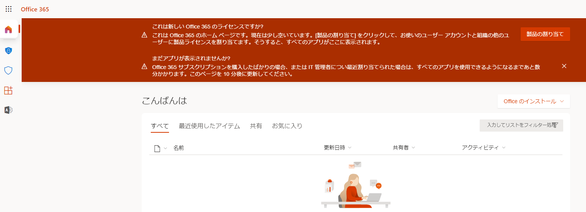
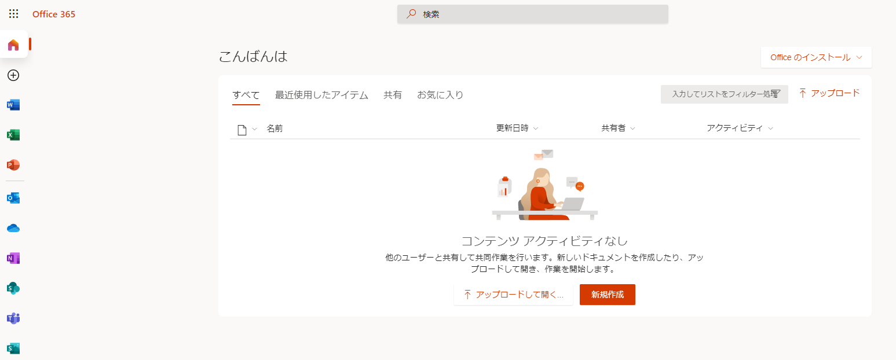

---
lab:
  title: 03 - グループ メンバーシップを使用してライセンスを割り当てる
  learning path: '01'
  module: Module 01 - Implement an identity management solution
  description: 組織は、Microsoft Entra ID のセキュリティ グループを使用して、ライセンスを管理することに決めました。 新しいセキュリティ グループを設定し、そのグループにライセンスを割り当て、グループ メンバーのライセンスが更新されたことを確認する必要があります。
  duration: 25 minutes
  level: 300
  islab: true
  primarytopics:
    - Microsoft Entra
    - Microsoft Entra ID
---

# ラボ 03:グループ メンバーシップを使用してライセンスを割り当てる

### ログイン タイプ = Microsoft 365 と E5 テナントのログイン

## ラボのシナリオ

組織は、Microsoft Entra ID のセキュリティ グループを使用して、ライセンスを管理することに決めました。 新しいセキュリティ グループを設定し、そのグループにライセンスを割り当て、グループ メンバーのライセンスが更新されたことを確認する必要があります。

#### 推定時間: 25 分

### 演習 1 - セキュリティ グループを作成してユーザーを追加する

#### タスク 1 - Delia Dennis が Office 365 にアクセスできるかどうかを確認する

1. 新しい InPrivate ブラウザー ウィンドウを開きます。

1. Office 365 (**`https://www.office.com`**) に接続します。

1. [サインイン] をクリックして、Delia Dennis として接続します。

   | **設定** | **Value** |
   | :--- | :--- |
   | ユーザー名 | DeliaD@`your domain name.com` |
   | Password| DeliaD に指定されたユーザー パスワードを入力します |

1. Office.com の Web サイトに接続する必要がありますが、ライセンスがないことを示すメッセージが表示されます。

   
    
1. ブラウザー ウィンドウを閉じます。

#### タスク 2 - Microsoft Entra ID でセキュリティ グループを作成する

1. **`https://entra.microsoft.com`** で **Microsoft Entra 管理センター**を参照し、ディレクトリの全体管理者アカウントを使用してサインインします。

   > **注:** サインイン中に多要素認証 (MFA) を完了するように求められる場合があります。 続行する前に、プロンプトに従って認証方法を構成または確認します。

1. 左側のナビゲーションで、**[Entra ID]** の下にある **[グループ]** を選択し、**[すべてのグループ]** を選択します。

1. [グループ] ページのメニューで、 **[新しいグループ]** を選択します。

1. 次の情報を使用して、グループを作成します。

   | **設定**| **Value**|
   | :--- | :--- |
   | グループの種類| **Security** |
   | グループ名| **sg-SC300-O365** |
   | メンバーシップの種類| **割り当て済み** |
   | 所有者| *自分の管理者アカウントをグループの所有者として割り当てる*|

1. [メンバー] の下にある "**メンバーが選択されていません**" のテキストを選択します。

1. ユーザーの一覧から、 **「Delia Dennis」** を選択します。

1. **[選択]** ボタンを選択します。

   ![[グループの種類]、[グループ名]、[所有者]、[メンバー] が強調表示された [新しいグループ] ページが表示されている画面イメージ](./media/lp1-mod2-create-group.png)

1. **[作成]** ボタンを選択します。

1. 完了したら、**sg-SC300-O365** という名前のグループが **「すべてのグループ」** リストに表示されていることを確認します。

#### タスク 3 - Office ライセンスを sg-SC300-O365 に追加する

   **ラボのヒント** - Microsoft 365 管理センターを使用してライセンスを追加および削除する必要があります。 これは比較的新しい変更です。

1. Web ブラウザーで新しいタブを開きます。

1. **Microsoft 365 管理センター** (**`http://admin.microsoft.com`**) に接続します。

1. メッセージが表示されたら、管理者アカウントでログインします。

1. 左側のメニューから **[課金情報]** を選択し、**[ライセンス]** を選択します。

1. 一覧から **Office 365 E3** ライセンスを選択します。

1. ライセンス画面で **[グループ]** タブを選択します。

1. **[+ ライセンスの割り当て]** 項目を選択します。

1. 「**sg-SC300-O365**」グループを検索し、一覧から選択します。

1. そのグループを追加したら、**[割り当て]** を選択します。
 
1. 確認メッセージを閉じます。

1. **Microsoft Entra 管理センター**が開いているブラウザー タブに戻ります。

1. 左側のナビゲーションの **[すべてのグループ]** に戻り、**[Entra ID]** の下にある **[グループ]** を選択します。

1. [グループ] ページで、**sg-SC300-O365** を選択します。

1. 左側のナビゲーションで、**[ライセンス]** を選択します。

1. Office 365 E3 ライセンスが割り当てられていることを確認します。

1. ライセンス画面を終了できます。

#### タスク 4 - Office 365 ライセンスを確認する

1. 新しい InPrivate ブラウザー ウィンドウを開きます。

1. Office 365 (**`https://www.office.com`**) に接続します。

1. [サインイン] をクリックして、Delia Dennis として接続します。

   | **設定**| **Value**|
   | :--- | :--- |
   | Username (ユーザー名) | `DeliaD@<your domain name.com>` |
   | Password (パスワード)| ユーザーの指定されたパスワードを入力します  |

1. Office.com Web サイトに接続すると、ライセンスに関するメッセージは表示されません。 左側にあるすべての Office アプリケーションを利用できます。

   
    
1. ブラウザー ウィンドウを閉じます。

### 演習の概要

この演習では、セキュリティ グループを作成し、そのグループにライセンスを割り当て、グループのメンバーがそのライセンスを継承したことを確認しました。 この演習では、グループベースのライセンスにより、ユーザーごとの割り当てを超えてライセンスの管理を拡大する方法を示しました。

### 演習 2: Microsoft Entra ID で Microsoft 365 グループを作成する

#### タスク 1 - グループを作成する

Microsoft Entra 管理者の職務の一環として、さまざまな種類のグループを作成します。 組織の営業部門用に新しい Microsoft 365 グループを作成する必要があります。

1. **Microsoft Entra 管理センター** (**`https://entra.microsoft.com`**) を参照します。

1. 左側のナビゲーションで、**[Entra ID]** の下にある **[グループ]** を選択し、**[すべてのグループ]** を選択します。

1. [グループ] ページのメニューで、 **[新しいグループ]** を選択します。

1. 次の情報を使用して、グループを作成します。

   | **設定**| **Value**|
   | :--- | :--- |
   | グループの種類| **Microsoft 365** |
   | グループ名| **Northwest Sales** |
   | メンバーシップの種類| **割り当て済み** |
   | 所有者| *自分の管理者アカウントをグループの所有者として割り当てる*|
   | メンバー| **Alex Wilber** と **Bianca Pisani**|

   ![[グループの種類]、[グループ名]、[所有者]、[メンバー] が強調表示された [新しいグループ] ページが表示されている画面イメージ](./media/lp1-mod2-create-o365-group.png)

1. 完了したら、**Northwest sales** という名前のグループが **[すべてのグループ]** リストに表示されていることを確認します。

### 演習の概要

この演習では、メンバーシップと所有者が割り当てられた Microsoft 365 グループを作成しました。 この演習では、Microsoft 365 グループを使用して、単純なアクセス制御以外にもコラボレーション シナリオをサポートする方法を示しました。

### 演習 3 - すべてのユーザーをメンバーとして持つ動的グループを作成する

#### タスク 1 - 動的グループを作成する

会社の規模が大きくなると、手作業でのグループ管理は時間がかかりすぎます。 ディレクトリを標準化したことで、動的グループを活用できるようになりました。 運用環境で動的グループを作成できるようにするためには、新しい動的グループを作成する必要があります。

1. **`https://entra.microsoft.com`** で、提供された管理者アカウントを使用して **Microsoft Entra 管理センター**にサインインします。 テナントには、少なくともユーザー管理者ロールが必要です。

1. 左側のナビゲーションで、**[Entra ID]** の下にある **[グループ]** を選択し、**[すべてのグループ]** を選択します。

1. [グループ] ページのメニューで、**[新しいグループ]** を選択します。

1. [新しいグループ] ページで、 **[グループの種類]** の下の **[セキュリティ]** を選択します。

1. **[グループ名]** ボックスに「`SC300-myDynamicGroup`」と入力します。

1. **[メンバーシップの種類]** メニューを選択し、**[動的ユーザー]** を選択します。

1. グループの**所有者**を選択します。

1. **[動的なユーザー メンバー]** で、**[動的クエリの追加]** を選択します。

1. **[ルール構文]** ボックスの上にある **[編集]** を選択します。

1. [ルール構文の編集] ウィンドウで、**[ルール構文]** ボックスに次の式を入力します。

   ```powershell
   user.objectId -ne null
   ```

   **警告** - `user.objectId` は大文字と小文字が区別されます。

1. **[OK]** を選択します。 [ルール構文] ボックスにルールが表示されます。

   ![ルール構文が強調表示されている [動的グループ メンバーシップ ルール] ページを表示する画面イメージ](./media/lp1-mod3-dynamic-group-membership-rule.png)

1. **[保存]** を選択します。 これで、新しい動的グループには、B2B ゲスト ユーザーとメンバー ユーザーが含まれるようになります。

1. [新規グループ] ページで **[作成]** を選択して、グループを作成します。

#### タスク 2 - メンバーが追加されたことを確認する

>**注**: 動的グループ メンバーシップの作成には、最大 15 分かかる場合があります。

1. **[ホーム]** `Microsoft Entra 管理センター` を選択します。

1. 左側のナビゲーション メニューで、**[Entra ID]** の下にある **[グループ]** を選択します。

1. **[グループ]** メニューで **[すべてのグループ]** を選択します。

1. フィルター ボックスに **「SC300」** と入力すると、新しく作成したグループが一覧表示されます。

1. **[SC300-myDynamicGroup]** を選択して、グループを開きます。

1. これは、このグループに 30 人以上の**直接メンバー**が含まれていることを示していることに注意してください。

1. **[管理]** メニューの **[メンバー]** を選択します。

1. メンバーを確認します。

#### タスク 3 - 別のルールを試す

1. **ゲスト** ユーザーのみでグループを作成してみます。

   - (user.objectId -ne null) and (user.userType -eq "Guest")

1. Microsoft Entra ユーザーの **メンバー** のみでグループを作成してみます。

   - (user.objectId -ne null) and (user.userType -eq "Member")

**ラボのヒント** - "グループを作成できませんでした" というメッセージが表示され、”演算子が無効です” と指摘された場合は、演算子のスペルを確認します。  objectId の I と userType の T は大文字であることに注意してください。

### 演習の概要

この演習では、ユーザー属性に基づいてメンバーが評価されるダイナミック メンバーシップ グループを作成し、ゲスト ユーザーとメンバー ユーザーに関する代替ルールを調べました。 この演習では、ダイナミック グループを使用することにより、静的なメンバーシップ リストの維持を不要にする方法を示しました。
