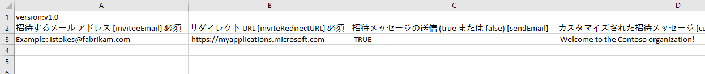
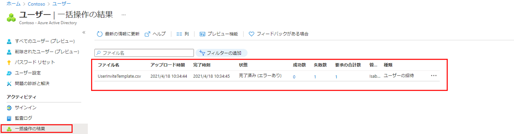

---
lab:
  title: 05 - ゲスト ユーザーをディレクトリに追加する
  learning path: "01"
  module: Module 01 - Implement an identity management solution
ms.openlocfilehash: 48a24758034e463192f9f726b223dce1b961bb76
ms.sourcegitcommit: b5fc07c53b5663eaa1883cf38b70c57cd88470ca
ms.translationtype: HT
ms.contentlocale: ja-JP
ms.lasthandoff: 06/29/2022
ms.locfileid: "146741702"
---
# <a name="lab-05-add-guest-users-to-the-directory"></a>ラボ 05:ゲスト ユーザーをディレクトリに追加する

## <a name="lab-scenario"></a>ラボのシナリオ

あなたの会社は多くのベンダーと協力していますが、場合によっては、ベンダーのアカウントをゲストとしてディレクトリに追加する必要があります。

#### <a name="estimated-time-20-minutes"></a>推定時間:20 分

### <a name="exercise-1---add-guest-users-to-the-directory"></a>演習 1 - ゲスト ユーザーをディレクトリに追加する

#### <a name="task---add-the-guest-user"></a>タスク - ゲスト ユーザーを追加する

1. 制限付き管理者ディレクトリ ロールまたはゲストの招待元ロールが割り当てられたユーザーとして、[https://portal.azure.com](https://portal.azure.com) にサインインします。

2. **[Azure Active Directory]** を選択します。

3. **[管理]** にある **[ユーザー]** を選択します。

4. **[新しいゲスト ユーザー]** を選択します。

    ![[新しいゲストユーザー] メニュー オプションが選択された [ユーザー] ページを表示する画面イメージ](./media/lp1-mod3-new-guest-user-menu-selection.png)

5. [新しいユーザー] ページで **[ユーザーの招待]** を選択し、ゲスト ユーザーの情報を追加します。

    >**注** - グループのメール アドレスはサポートされていません。個人のメール アドレスを入力してください。 また、一部の電子メール プロバイダーでは、ユーザーはプラス記号 (+) と追加テキストを電子メール アドレスに付け加えて、受信ボックスのフィルター処理などに役立てることができます。 ただし、Azure AD では現在、電子メール アドレスのプラス記号はサポートされていません。 配信の問題を回避するために、プラス記号と、それに続く @ 記号より前の任意の文字を含めません。

6. 電子メール アドレスを入力します (例: **sc300externaluser1@sc300email.com** )。

7. 完了したら、 **[招待する]** を選択します。

8. [ユーザー] ページで、アカウントが一覧表示されていることを確認し、 **[ユーザーの種類]** 列に **[ゲスト]** が表示されていることを確認します。

招待を送信すると、ユーザー アカウントがディレクトリにゲストとして自動的に追加されます。


### <a name="exercise-2---invite-guest-users-in-bulk"></a>演習 2 - ゲスト ユーザーを一括で招待する

#### <a name="task-1---bulk-user-invite"></a>タスク 1 - ユーザーの一括招待

最近では、他社との提携が行われています。 当面は、パートナー企業の従業員がゲストとして追加されます。 複数のゲスト ユーザーを一度にインポートできるようにする必要があります。

1. グローバル管理者として [https://portal.azure.com](https://portal.azure.com) にサインインします。

2. ナビゲーション ペインで、 **[Azure Active Directory]** を選択します。

3. **[管理]** にある **[ユーザー]** を選択します。

4. [ユーザー] ページのメニューで、 **[一括操作]、[一括招待]** の順に選択します。

     

5. [ユーザー一括招待] ウィンドウで、招待プロパティを持つサンプル CSV テンプレートへの **[ダウンロード]** を選択します。

6. エディターを使用して CSV ファイルを表示し、テンプレートを確認します。

7. この .csv テンプレートを開いて、ゲスト ユーザーごとに 1 行追加します。 必要な値は次のとおりです。

    - **招待するメール アドレス** - 招待が送信されるユーザー
    - **リダイレクト URL** - 招待されたユーザーが招待を承認した後に転送される URL。

    

8. ファイルを保存します。

9. [ユーザー一括招待] ページの **[csv ファイルをアップロードします]** で、そのファイルを参照します。

     **注** - ファイルを選択すると、.csv ファイルの検証が開始されます。

10. ファイルの内容が検証された後、**[ファイルが正常にアップロードされました]** と表示されます。 エラーが存在する場合は、ジョブを送信する前にそれらを修正する必要があります。

    

11. ファイルが検証に合格したら、 **[送信]** を選択して、招待を追加する Azure の一括操作を開始します。

12. ジョブの状態を表示するには、 **[各操作の状態を表示するには、ここを選択します]** を選択します。 または、 [アクティビティ] セクションの **[一括操作の結果]** を選択します。 一括操作に含まれる各行の項目の詳細については、 **[成功数]** 、 **[失敗数]** 、 **[要求数合計]** の各列の値を選択してください。 エラーが発生した場合、その理由が表示されます。

    

13. ジョブが完了すると、一括操作が成功したという通知が表示されます。

#### <a name="task-2---invite-guest-users-with-powershell"></a>タスク 2 - PowerShell を使用してゲスト ユーザーを招待する

1. PowerShell を管理者として開きます。  これを行うには、Windows で PowerShell を検索し、[管理者として実行] を選択します。  

1. 以前に使用していない場合は、Azure AD PowerShell モジュールを追加する必要があります。  次のコマンドを実行します。Install-Module AzureAD。  メッセージが表示されたら、Y キーを押して続行します。

    ``` 
    Install-Module AzureAD
    ```

1. 次のコマンドを実行して、モジュールが正しくインストールされていることを確認します。  

    ```
    Get-Module AzureAD 
    ```

1. 次に、次を実行して Azure にログインする必要があります。  

    ```
    Connect-AzureAD
    ```
    
1. Azure AD にログインするための Microsoft ログイン ウィンドウが表示されます。  

1. 接続されていることを確認し、既存のユーザーを表示するには、次を実行します。  

    ```
    Get-AzureADUser 
    ```

1. ゲスト ユーザーを招待する準備ができました。  次のコマンドにユーザー情報が入力され、実行されます。  追加するユーザーが複数ある場合は、メモ帳の txt ファイルを使用してユーザー情報を追加し、PowerShell にコピーして貼り付けることができます。 

    ```
    New-AzureADMSInvitation -InvitedUserDisplayName "Display" -InvitedUserEmailAddress name@emaildomain.com -InviteRedirectURL https://myapps.microsoft.com -SendInvitationMessage $true 
    ```

Azure AD ポータル、Microsoft 365 管理センター、csv ファイルによる一括招待、PowerShell コマンドを利用してユーザーを招待する方法について説明しました。
