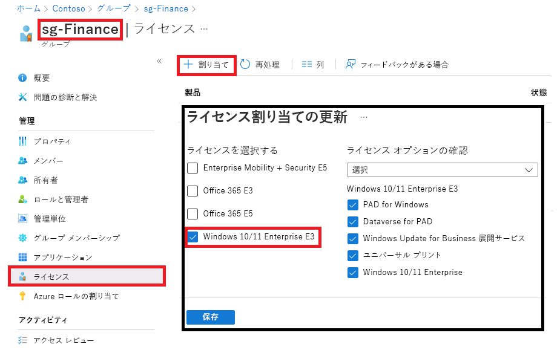

---
lab:
  title: 06 - グループ ライセンス割り当てを変更する
  learning path: "01"
  module: Module 01 - Implement an identity management solution
ms.openlocfilehash: a76182eb79197a26a692c5bab7bfcde1080a97c2
ms.sourcegitcommit: a60b8d48791d600c44fa5fa617b6a9b2c0edaa71
ms.translationtype: HT
ms.contentlocale: ja-JP
ms.lasthandoff: 04/04/2022
ms.locfileid: "141368857"
---
# ラボ 06:グループ ライセンス割り当てを変更する

## ラボのシナリオ

時折、Azure AD セキュリティ グループで使用されているライセンスの割り当てを変更する必要があります。 グループのライセンス割り当てを変更する手順を確実に理解しておく必要があります。

#### 推定時間:5 分

### 演習 1 - グループ ライセンスの割り当てを変更する

#### タスク - Azure AD ポータルを使って変更する

1. [https://portal.azure.com/#blade/Microsoft_AAD_IAM/ActiveDirectoryMenuBlade/Overview]( https://portal.azure.com/#blade/Microsoft_AAD_IAM/ActiveDirectoryMenuBlade/Overview) を参照します。

2. 左側のナビゲーション メニューの **[管理]** で、**[グループ]** を選択します。

3. **sg-Finance** グループを選びます。

4. 左側のナビゲーション メニューの **[管理]** で、**[ライセンス]** を選択します。

5. 現在の割り当てを確認し、メニューの **[+ 割り当て]** を選択します。

    

6. [ライセンスの割り当ての更新] ブレードで、**Windows 10/11 Enterprise E3** ライセンスを選択、既存のライセンスを選択解除、ライセンス オプションの追加または削除のいずれかを選びます。またはこれらを組み合わせることもできます。

7. 完了したら、**[保存]** を選択します。

8. グループの [ライセンス] ページで、変更を確認します。
