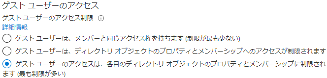

---
lab:
  title: 08 - 外部コラボレーションの設定を構成する
  learning path: "01"
  module: Module 01 - Implement an identity management solution
ms.openlocfilehash: 9a82597453c294ee9a0476a681abeb4a793add2e
ms.sourcegitcommit: fbe0a16b7c6a9a2ac2c2ea3b3f707faa0afe23a2
ms.translationtype: HT
ms.contentlocale: ja-JP
ms.lasthandoff: 03/02/2022
ms.locfileid: "139258488"
---
# ラボ 08:外部コラボレーションの設定を構成する

## ラボのシナリオ

承認されたゲストがアクセスするには、組織の外部コラボレーション設定を有効にする必要があります。

#### 推定時間:5 分

### 演習 1 - ゲスト ユーザーを組織に招待できるようにする

#### タスク - 外部コラボレーションの設定を構成する

1. テナント管理者として [https://portal.azure.com](https://portal.azure.com) にサインインします。
2. **[Azure Active Directory]** を選択します。
3. **[External Identities] > [外部コラボレーションの設定]** を選択します。
4. 画面の上部に表示される **[電子メールのワンタイム パスコード]** 通知リンクをクリックします。

    **注** - ワンタイム パスコードは、ユーザーを組織に招待するための非常に安全な方法です。

5. `Home > Contoso Marketing >` **[外部 ID]** をクリックして、前の画面に戻ります。
6. 左側の **[外部コラボレーションの設定]** ' をクリックします

7. **[Guest user access]\(ゲスト ユーザー アクセス\)** で、使用可能なアクセス レベルを確認し、**[Guest user access is restricted to properties and memberships of their own directory objects (most restrictive)]\(ゲスト ユーザーのアクセスを、自分のディレクトリ オブジェクトのプロパティとメンバーシップに制限する (最も厳しい制限)\)** を選択します。

    **注**
    - Guest users have the same access as members (most inclusive) (ゲスト ユーザーにメンバーと同じアクセス権を付与する (最も包括的)) :このオプションを選択すると、ゲストがメンバー ユーザーと同じように Azure AD リソースとディレクトリ データにアクセスできるようになります。
    - Guest users have limited access to properties and memberships of directory objects (ゲスト ユーザーに対してディレクトリ オブジェクトのプロパティとメンバーシップへのアクセスを制限する) :(デフォルト) この設定を選択すると、ゲストは、特定のディレクトリ タスク (ユーザー、グループ、またはその他のディレクトリ リソースを列挙するなど) を実行できなくなります。 ゲストは、非表示でないすべてのグループのメンバーシップを表示できます。
    - Guest user access is restricted to properties and memberships of their own directory objects (most restrictive) (ゲスト ユーザーのアクセスを、自分のディレクトリ オブジェクトのプロパティとメンバーシップに制限する (最も厳しい制限)) :この設定では、ゲストは自分のプロファイルのみにアクセスできます。 ゲストは、他のユーザーのプロファイル、グループ、またはグループ メンバーシップを参照することはできません。

    

8. **[ゲストの招待設定]** で、**メンバー ユーザーと特定の管理者のロールに割り当てられたユーザーは、メンバーの権限を持つゲストを含むゲストユーザーを招待できる** を選択します。

    **注**
    - ゲストと非管理者を含む組織内のすべてのユーザーがゲスト ユーザーを招待できる (最も包括的) : 組織内のゲストが、組織のメンバーでないひとも含めて他のゲストを招待できるようにするには、このオプション ボタンを選択します。
    - メンバー アクセス許可を持つゲストを含むメンバー ユーザーと特定の管理者ロールに割り当てられたユーザーがゲスト ユーザーを招待できる: メンバー ユーザーと特定の管理者の役割を持つユーザーがゲストを招待できるようにするには、このオプション ボタンを選択します。
    - 特定の管理者ロールに割り当てられているユーザーのみがゲスト ユーザーを招待できる: 管理者の役割を持つユーザーだけがゲストを招待できるようにするには、このオプション ボタンを選択します。 管理者の役割には、全体管理者、ユーザー管理者、およびゲスト招待元が含まれます。
    - 管理者を含む組織内のすべてのユーザーがゲスト ユーザーを招待できない (最も制限的) : 組織内のだれもがゲストを招待できないようにするには、このオプション ボタンを選択します。
    - [メンバーは招待ができる] が [いいえ] に設定され、 [管理者とゲスト招待元ロールのユーザーは招待ができる] が [はい] に設定されている場合、ゲスト招待元ロールのユーザーは引き続きゲストを招待できます。

    ![[ゲストは招待ができる] が [いいえ] に設定されて強調表示されているゲスト招待の設定を表示している画面イメージ](./media/lp1-mod3-guest-user-invite-settings.png)

9. **[コラボレーションの制限]** で、使用可能なオプションを確認し、既定の設定をそのまま使用します。

    **重要**
    - 許可リストまたは拒否リストのいずれかを作成できます。 両方の種類のリストを設定することはできません。 既定では、許可リストに含まれないドメインはすべて拒否リストに含まれます。また、その逆も言えます。
    - 各組織に作成できるポリシーは 1 つだけです。 ポリシーを更新してより多くのドメインを含めることも、ポリシーを削除して新規に作成することもできます。
    - 許可リストまたは拒否リストに追加できるドメインの数は、ポリシーのサイズによってのみ制限されます。 ポリシー全体の最大サイズは 25 KB (25,000 文字) です。これには、許可リストまたは拒否リストと、他の機能向けに構成された他のパラメーターが含まれます。
    - このリストは、OneDrive for Business や SharePoint Online の許可/ブロック リストとは無関係に機能します。 SharePoint Online で個々のファイルの共有を制限する場合は、OneDrive for Business および SharePoint Online の許可リストまたは拒否リストを設定する必要があります。
    - このリストは、招待を既に使用した外部ユーザーには適用されません。 リストは、リストの設定後に適用されます。 ユーザーの招待が保留中の状態にあり、ドメインをブロックするポリシーを設定した場合、ユーザーが招待の使用を試みると失敗します。

10. 完了したら、変更を **保存** します。
