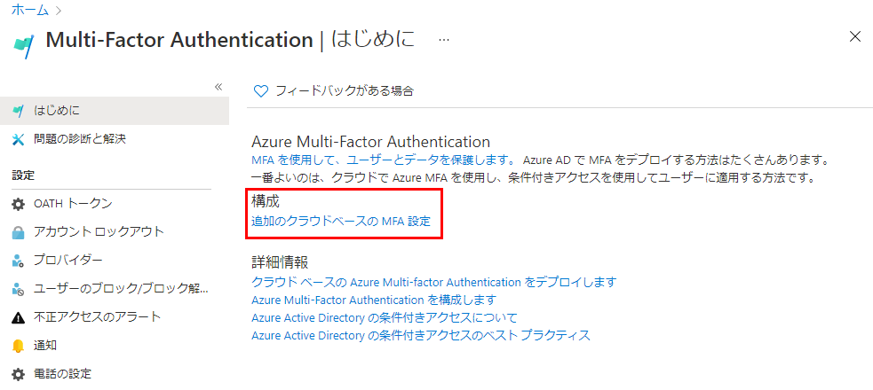
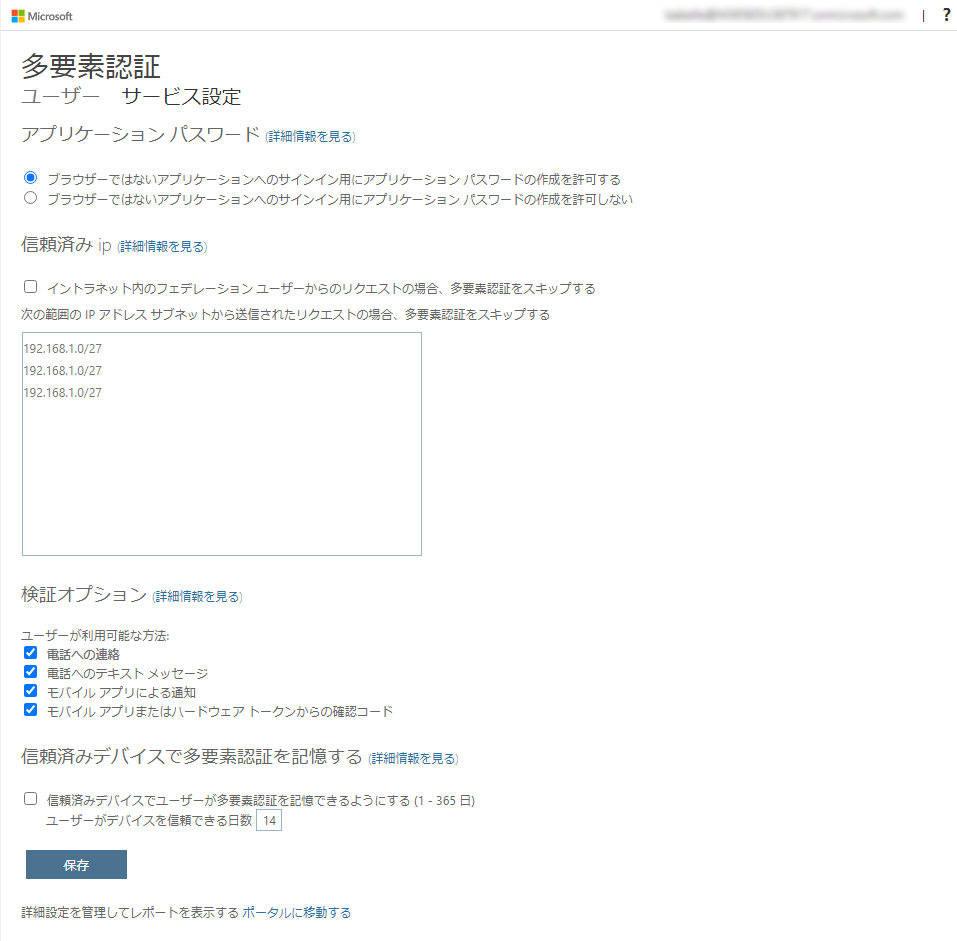
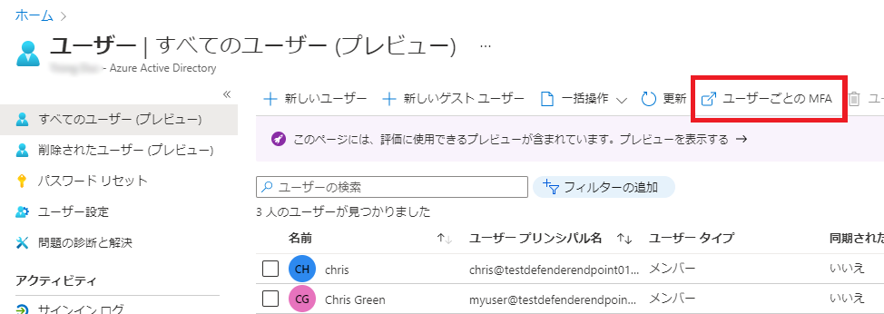
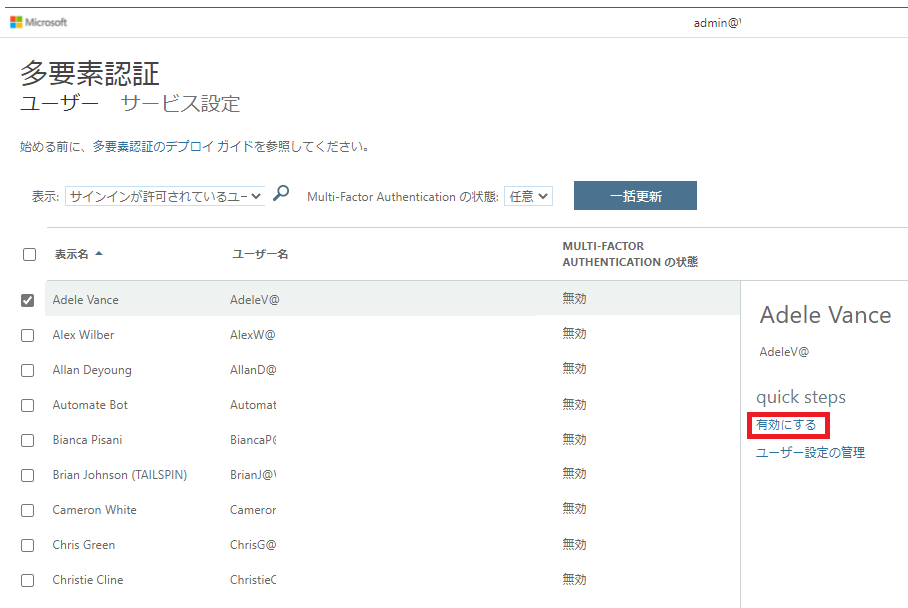

---
lab:
  title: 08 - 多要素認証を有効にする
  learning path: '02'
  module: Module 02 - Implement an Authentication and Access Management Solution
  description: 多要素認証システムを Microsoft Entra テナントにロールアウトします。 会社のセキュリティ目標に基づいて、さまざまな認証方法を調べます。
  duration: 15 minutes
  level: 200
  islab: true
  primarytopics:
    - Microsoft Entra
---

# ラボ 08 - 多要素認証を有効にする

### ログイン タイプ = Microsoft 365 と E5 テナントのログイン

## ラボのシナリオ

組織のセキュリティを向上させるために、Microsoft Entra ID の多要素認証を有効にするよう指示されています。

#### 推定時間:15 分

**重要** - この演習には Microsoft Entra ID Premium ライセンスが必要です。

### 演習 1 - Azure で多要素認証を確認して有効にする

#### タスク1 - Azure Multi-Factor Authentication オプションを確認する

1. 全体管理者アカウントを使用して、**Microsoft Entra 管理センター** (**`https://entra.microsoft.com`** ) を参照します。

    > **注:** サインイン中に多要素認証 (MFA) を完了するように求められる場合があります。 続行する前に、プロンプトに従って認証方法を構成または確認します。

1. 検索機能を使用して、「**多要素**」を検索します。

1. 検索結果で、**[多要素認証]** を選択します。

    または、左側のナビゲーションの **[Entra ID]** で、**[多要素認証]** を選択します。

1. [はじめに] ページの **[構成]** で、**[追加のクラウドベースの MFA 設定]** を選択します。

    

1. 新しいブラウザー ページには、Azure ユーザーの MFA オプションとサービス設定が表示されます。

    

    ここで、サポートされている認証方法を選択します。上の画面では、すべてが選択されています。

    ここでは "アプリ パスワード" の有効/無効を切り替えることもできます。これにより、多要素認証がサポートされないアプリに対して一意のアカウント パスワードを作成できます。 この機能を使うと、ユーザーはそのアプリに固有となる別のパスワードを利用し、Microsoft Entra の ID で認証できます。

#### タスク 2 - Delia Dennis の MFA の条件付きアクセス ルールを設定する

次に、ネットワークにある特定のアプリにアクセスするゲスト ユーザーに MFA を強制する条件付きアクセス ポリシー ルールを設定する方法を確認してみましょう。

1. Microsoft Entra 管理センターに戻り、左側のナビゲーションで、**[Entra ID]** の下にある **[条件付きアクセス]** を選択します。

1. メニューで **[+ 新しいポリシー]** を選択します。

    ![Microsoft Entra 管理センターの [新しいポリシー] ボタンが強調表示されているスクリーンショット。](./media/lp2-mod1-azure-ad-conditional-access-policy.png)

1. **[名前]** 欄に「**MFA_for_Delia**」と入力します。

1. **[割り当て]** の下の **[ユーザーまたはエージェント (プレビュー)]** セクションで、選択 **[0 人のユーザーまたはエージェント (プレビュー) が選択済み]** を選択します。

1. **[含める]** タブで、**[ユーザーとグループを選択]** をマークし、**[ユーザーとグループ]** チェック ボックスをオンにします。

1. **[ユーザーとグループの選択]** ペインで、**Delia Dennis** アカウントを選択し、**[選択]** を選択します。

1. **[ターゲット リソース]** セクションで、**[ターゲット リソースが選択されていません]** を選択します。

1. ドロップダウンで、**[リソース (旧称クラウド アプリ)]** が選択されていることを確認します。

1. **[含める]** タブで **[リソースの選択]** を選択し、**[特定のリソースを選択]** で **[なし]** を選択します。

1. **[リソース]** ペインで、**[Office 365]** を検索して選択します。

    - **リマインダー** - 以前のラボで、Delia Dennis に Office 365 ライセンスを付与し、ログインして動作することを確実にしました。

1. **[ネットワーク]** で **[未構成]** を選択し、**[構成]** を **[はい]** に設定します。

1. **[含める]** タブで **[任意のネットワークまたは場所]** を選択します。

    > **注:** **[条件]** > **[場所]** でネットワークの位置を設定することもできます。 どちらのオプションも同じ設定画面を開きます。

<!-- 1. Under **Conditions** section, select **0 conditions selected**.

1. At the bottom of the newly opened menu find the **Locations** section, and select **Not configured**, then set **Configure** to **Yes**. 

1. In the **Include** tab, select **Any network or location**. -->

1. **[アクセス制御]** の **[許可]** セクションで、**[0 個のコントロールが選択されました]** を選択します。

1. **[多要素認証を要求する]** チェック ボックスをオンにして、MFA を適用します。

1. **[選択したコントロールすべてが必要]** が選択されていることを確認し、**[選択]** を選びます。

1. **[ポリシーを有効にする]** を **[オン]** に設定します。

1. **[作成]** ボタンを選択してこのポリシーを作成します。

    ![入力後の [ポリシーの追加] ダイアログを示すスクリーンショット](./media/lp2-mod1-conditional-access-new-policy-complete.png)

    これで、選択したユーザーとアプリケーションに対して MFA が有効になりました。 次回、ゲストがそのアプリにサインインしようとすると、MFA の登録が求められます。

#### タスク 3 - Delia のログインをテストする

1. 新しい InPrivate ブラウジング ウィンドウを開きます。

1. Office 365 (**`https://www.office.com`**) に接続します。

1. サインイン オプションを選択します。

1. 「`DeliaD@<your domain address>`」と入力します。

1. パスワードを入力します = テナントのグローバル管理者パスワードを入力します (注: 管理者パスワードを取得するには、[ラボ リソース] タブを参照してください)。

>**注:** この時点で、2 つのことのうちの 1 つが起こります。  Authenticator アプリをセットアップして MFA に登録する必要があるというメッセージが表示されます。  プロンプトに従って、個人の電話を使用して完了します。  注 - 続行する方法に関するいくつかのオプションを含むログイン失敗メッセージが表示される可能性があります。  この場合、 **[再試行]** オプションを選択します。

Delia 用に作成した条件付きアクセス ルールのため、MFA は Office 365 ホーム ページを起動するために必要であることがわかります。

### 演習の概要

この演習では、Microsoft Entra MFA オプションを確認し、ターゲット ユーザーに MFA を要求する条件付きアクセス ポリシーを作成しました。 この演習では、多要素認証によるサインイン保護に使用できる方法を紹介しました。

### 演習 2 - ログインを必要とするように MFA を構成する

#### タスク 1 - Microsoft Entra ユーザーごとに MFA を構成する

最後に、ユーザー アカウントに対して MFA を構成する方法を見ていきましょう これは多要素認証設定にアクセスするもう 1 つの方法です。

1. **Microsoft Entra 管理センター**に戻ります。

1. 左側にあるナビゲーション メニューで、**[Entra ID]** の下にある **[ユーザー]** を選択し、**[すべてのユーザー]** を選択します。

1. [ユーザー] ウィンドウの一番上で、**[Per-user MFA]** を選択します。

   >**注:** ユーザーごとの MFA メニュー項目にアクセスするには、省略記号 (...) を使用する必要がある場合があります。

   

1. 新しいブラウザーのタブ/ウィンドウが開き、多要素認証のユーザー設定ダイアログが表示されます。

   ユーザーを選択し、右側にあるクイック手順を利用することで、ユーザー ベースで MFA の有効/無効を切り替えることができます。

   

1. チェックマークの付いた **Adele Vance** を選択します。

1. クイック操作にある **[MFA の有効化]** オプションを選択します。

1. 通知ポップアップが表示されたらそれを読み、**[有効にする]** を選択します。

1. **[閉じる]** を選択します。

1. Adele が MFA ステータスとして**有効になっている**ことに注意してください。

1. **[サービス設定]** を選択すると、ラボの前半で確認した MFA 設定画面を表示できます。

1. [MFA 設定] タブを閉じます。

#### タスク 2 -- Adele としてログインを試みる

1. MFA ログイン プロセスの別の例を見たい場合は、Adele にログインしてみてください。

### 演習の概要

この演習では、ユーザー別の MFA を有効にし、サインイン チャレンジをテストしました。 この演習では、MFA で認証を強化し、資格情報の漏洩から保護する仕組みを紹介しました。
