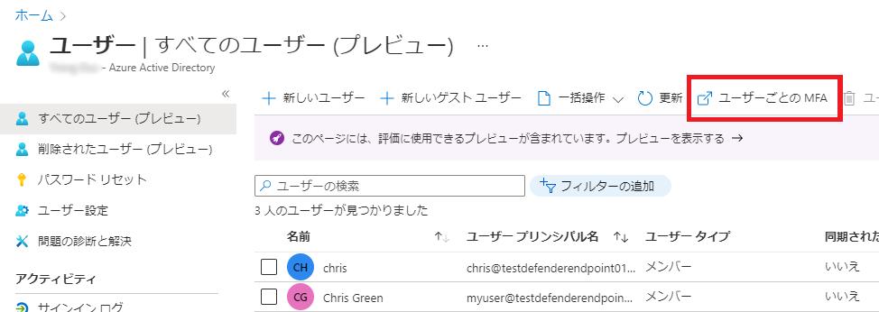

---
lab:
  title: 08 - 多要素認証を有効にする
  learning path: '02'
  module: Module 02 - Implement an Authentication and Access Management Solution
---

# ラボ 08 - 多要素認証を有効にする

### ログイン タイプ = Microsoft 365 と E5 テナントのログイン

## ラボのシナリオ

組織のセキュリティを向上させるために、Microsoft Entra ID の多要素認証を有効にするよう指示されています。

#### 推定時間:15 分

**重要** - この演習には Microsoft Entra ID Premium ライセンスが必要です。

### 演習 1 - Azure で多要素認証を確認して有効にする

#### タスク1 - Azure Multi-Factor Authentication オプションを確認する

1. ディレクトリのグローバル管理者アカウントを使用して、[https://entra.microsoft.com](https://entra.microsoft.com) にアクセスし、サインインします。

2. 検索機能を使用して、「**多要素**」を検索します。

3. 検索結果で、**[多要素認証]** を選択します。

    または、**[ID]** を開き、**[保護]**、**[多要素認証]** の順に選択することもできます。

4. [はじめに] ページの **[構成]** で、**[追加のクラウドベースの MFA 設定]** を選択します。

    

5. 新しいブラウザー ページには、Azure ユーザーの MFA オプションとサービス設定が表示されます。

    

    ここで、サポートされている認証方法を選択します。上の画面では、すべてが選択されています。

    ここでは "アプリ パスワード" の有効/無効を切り替えることもできます。これにより、多要素認証がサポートされないアプリに対して一意のアカウント パスワードを作成できます。 この機能を使うと、ユーザーはそのアプリに固有となる別のパスワードを利用し、Microsoft Entra の ID で認証できます。

#### タスク 2 - Delia Dennis の MFA の条件付きアクセス ルールを設定する

次に、ネットワークにある特定のアプリにアクセスするゲスト ユーザーに MFA を強制する条件付きアクセス ポリシー ルールを設定する方法を確認してみましょう。

1. Microsoft Entra 管理センターに戻り、**[ID]**、**[保護]**、**[条件付きアクセス]** の順に選択します。

2. メニューで **[+ 新しいポリシー]** を選択します。 ドロップダウンから **[+ 新しいポリシーの作成]** を選択します。

    ![Microsoft Entra 管理センターの [新しいポリシー] ボタンが強調表示されているスクリーンショット。](./media/lp2-mod1-azure-ad-conditional-access-policy.png)

3. ポリシーに名前を付けます。たとえば、**MFA_for_Delia** にします。

4. [割り当て] で **[ユーザーまたはワークロード ID]** を選択します。

    - **[ユーザーまたはワークロード ID が選択されていません]** を選択します  
    - 右側の画面で、**[構成するユーザーとグループを選択する]** チェックボックスをオンにします。
    - **ユーザーとグループ**を確認します (使用可能なユーザーは右側に表示されます)
    - ユーザーのリストから **[Delia Dennis]** を選択し、**[選択]** ボタンを選択します。

5. [ターゲット リソース] で **[ターゲット リソースが選択されていません]** を選択します。

   - ダイアログ ボックスで、**[クラウド アプリ]** が選択されていることを確認します。
   - [Include](含める) で **[リソース (旧称クラウド アプリ)]** にマークを付けたあと、ロックアウトの可能性に関する警告がポップアップするので、その内容に注意してください。 
   - 次に、[Include](含める) セクションで **[リソースの選択]** 項目を選びます。
   - **[選択]** セクションで、**[なし]** リンクを選択します。
   - 新しく開いたダイアログで、**[Office 365]** を選択します。
      - **リマインダー** - 以前のラボで、Delia Dennis に Office 365 ライセンスを付与し、ログインして動作することを確実にしました。
   - **[選択]** を選択します。

6. [条件] セクションでネットワークの場所を選んだあと、**[未構成]** を選択します。

   - **[条件]** セクションで、**[0 個の条件が選択されました]** リンクを選択します。
   - 新しく開いたメニューの下部にある **[場所]** セクションで、**[未構成]** を選択します。
   - **[構成]** 項目で **[はい]** を選びます。
   - **[任意のネットワークまたは場所]** を選択します。

7. **[アクセス制御]** で **[許可]** セクションを探し、**[0 個のコントロールが選択されました]** リンクを選択します。

   - **[多要素認証を要求する]** チェック ボックスをオンにして、MFA を適用します。
   - **[選択したコントロールすべてが必要]** が選択されていることを確認します。
   - **[選択]** を選択します。

8. **[ポリシーを有効にする]** を **[オン]** に設定します。

9. **[作成]** ボタンを選択してこのポリシーを作成します。

    ![入力後の [ポリシーの追加] ダイアログを示すスクリーンショット](./media/lp2-mod1-conditional-access-new-policy-complete.png)

    これで、選択したユーザーとアプリケーションに対して MFA が有効になりました。 次回、ゲストがそのアプリにサインインしようとすると、MFA の登録が求められます。

#### タスク 3 - Delia のログインをテストする

1. 新しい InPrivate ブラウジング ウィンドウを開きます。
2. https://www.office.comに接続します。
3. サインイン オプションを選択します。
4. 「**DeliaD@** `<<your domain address>>`」を入力します。
5. パスワードを入力します = テナントのグローバル管理者パスワードを入力します (注: 管理者パスワードを取得するには、[ラボ リソース] タブを参照してください)。

**注** - この時点で、2 つのことのうちの 1 つが起こります。  Authenticator アプリをセットアップして MFA に登録する必要があるというメッセージが表示されます。  プロンプトに従って、個人の電話を使用して完了します。  注 - 続行する方法に関するいくつかのオプションを含むログイン失敗メッセージが表示される可能性があります。  この場合、 **[再試行]** オプションを選択します。

Delia 用に作成した条件付きアクセス ルールのため、MFA は Office 365 ホーム ページを起動するために必要であることがわかります。

### 演習 2 - ログインを必要とするように MFA を構成する

#### タスク 1 - Microsoft Entra ユーザーごとに MFA を構成する

最後に、ユーザー アカウントに対して MFA を構成する方法を見ていきましょう これは多要素認証設定にアクセスするもう 1 つの方法です。

1. Microsoft Entra 管理センターに戻り、左側のナビゲーション メニューで [ID] を探します。

2. **[ユーザー]**、**[すべてのユーザー]** の順に選択します。

3. [ユーザー] ウィンドウの一番上で、**[Per-user MFA]** を選択します。
  - 注: ユーザーごとの MFA メニュー項目にアクセスするには、省略記号 ([...]) を使用することが必要な場合があります。

   

4. 新しいブラウザーのタブ/ウィンドウが開き、多要素認証のユーザー設定ダイアログが表示されます。

   ユーザーを選択し、右側にあるクイック手順を利用することで、ユーザー ベースで MFA の有効/無効を切り替えることができます。

   

5. チェックマークの付いた **Adele Vance** を選択します。
6. クイック操作にある **[MFA の有効化]** オプションを選択します。
7. 通知ポップアップが表示されたらそれを読み、**[多要素認証を有効にする]** ボタンを選択します。
8. **[閉じる]** を選びます。
9. Adele が MFA ステータスとして**有効になっている**ことに注意してください。
10. **[サービス設定]** を選択して、ラボの前半で見た MFA 設定画面を表示できます。
11. [MFA 設定] タブを閉じます。

#### タスク 2 -- Adele としてログインを試みる

1. MFA ログイン プロセスの別の例を見たい場合は、Adele にログインしてみてください。
