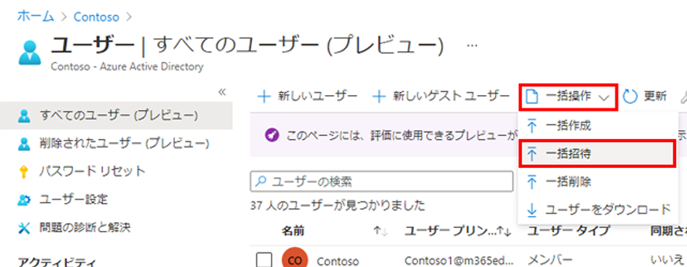

---
lab:
  title: 10 - ゲスト ユーザーを一括招待する'
  learning path: "01"
  module: Module 01 - Implement an identity management solution
ms.openlocfilehash: 5f8181892dabf5f4dbc00f1241101a636bf0c184
ms.sourcegitcommit: 448f935ad266989a6f0086019e0c0e0785ad162b
ms.translationtype: HT
ms.contentlocale: ja-JP
ms.lasthandoff: 02/10/2022
ms.locfileid: "138421430"
---
# ラボ 10: ゲスト ユーザーを一括招待する

## ラボのシナリオ

最近では、他社との提携が行われています。 当面は、パートナー企業の従業員がゲストとして追加されます。 複数のゲスト ユーザーを一度にインポートできるようにする必要があります。

#### 推定時間:10 分

### 演習 1 - ゲスト ユーザーを一括で招待する

#### タスク - ユーザーの一括招待

1. グローバル管理者として [https://portal.azure.com](https://portal.azure.com) にサインインします。

2. ナビゲーション ペインで、 **[Azure Active Directory]** を選択します。

3. **[管理]** にある **[ユーザー]** を選択します。

4. [ユーザー] ブレードのメニューで、**[一括操作] > [一括招待]** を選択します。

     

5. [ユーザー一括招待] ウィンドウで、招待プロパティを持つサンプル CSV テンプレートへの **[ダウンロード]** を選択します。

6. エディターを使用して CSV ファイルを表示し、テンプレートを確認します。

7. この .csv テンプレートを開いて、ゲスト ユーザーごとに 1 行追加します。 必要な値は次のとおりです。

    - **招待するメール アドレス** - 招待が送信されるユーザー
    - **リダイレクト URL** - 招待されたユーザーが招待を承認した後に転送される URL。

    

8. ファイルを保存します。

9. [ユーザー一括招待] ページの **[csv ファイルをアップロードします]** で、そのファイルを参照します。

     **注** - ファイルを選択すると、.csv ファイルの検証が開始されます。

10. ファイルの内容が検証された後、**[ファイルが正常にアップロードされました]** と表示されます。 エラーが存在する場合は、ジョブを送信する前にそれらを修正する必要があります。

    

11. ファイルが検証に合格したら、 **[送信]** を選択して、招待を追加する Azure の一括操作を開始します。

12. ジョブの状態を表示するには、 **[各操作の状態を表示するには、ここをクリックします]** を選択します。 または、 [アクティビティ] セクションの **[一括操作の結果]** を選択します。 一括操作に含まれる各行の項目の詳細については、 **[成功数]** 、 **[失敗数]** 、 **[要求数合計]** の各列の値を選択してください。 エラーが発生した場合、その理由が表示されます。

    

13. ジョブが完了すると、一括操作が成功したという通知が表示されます。
