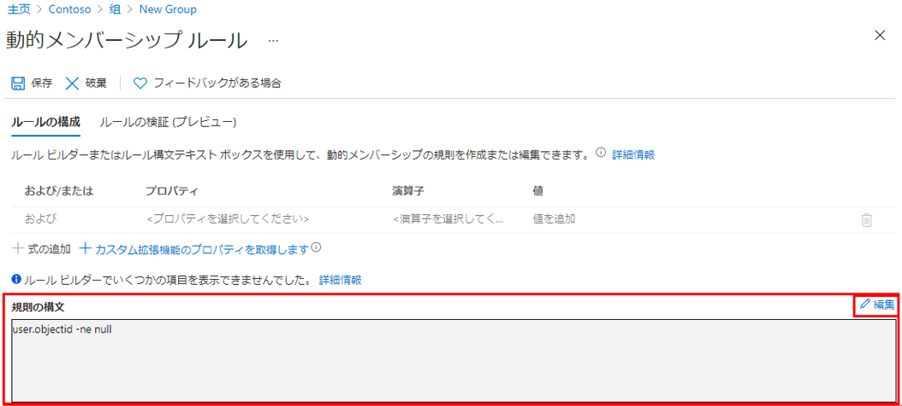

---
lab:
  title: 11 - 動的グループを使用する
  learning path: "02"
  module: Module 02 - Implement an Authentication and Access Management Solution
ms.openlocfilehash: 51da3b93097f3e97d8b8936ee6ba2601834a5eec
ms.sourcegitcommit: 448f935ad266989a6f0086019e0c0e0785ad162b
ms.translationtype: HT
ms.contentlocale: ja-JP
ms.lasthandoff: 02/10/2022
ms.locfileid: "138421421"
---
# <a name="lab-11-working--with-dynamic-groups"></a>ラボ 11: 動的グループを使用する

## <a name="lab-scenario"></a>ラボのシナリオ

会社の規模が大きくなると、手作業でのグループ管理は時間がかかりすぎます。 ディレクトリを標準化したことで、動的グループを活用できるようになりました。 運用環境で動的グループを作成できるようにするためには、新しい動的グループを作成する必要があります。

#### <a name="estimated-time-10-minutes"></a>推定時間:10 分

### <a name="exercise-1---creating-a-dynamic-group-with-all-users-as-members"></a>演習1 - すべてのユーザーをメンバーとして持つ動的グループを作成する

#### <a name="task-1---create-the-dynamic-group"></a>タスク 1 - 動的グループを作成する

1. テナントのグローバル管理者またはユーザー管理者ロールが割り当てられたアカウントで [https://portal.azure.com](https://portal.azure.com) にサインインします。

2. **[Azure Active Directory]** を選択します。

3. **[管理]** の下の **[グループ]** を選択し、 **[新しいグループ]** を選択します。

4. [新しいグループ] ページで、 **[グループの種類]** の下の **[セキュリティ]** を選択します。

5. **「グループ名」** ボックスに、 **「SC300-myDynamicGroup」** と入力します。

6. **[メンバーシップの種類]** メニューを選択し、**[動的ユーザー]** を選択します。

7. **[動的なユーザー メンバー]** で、**[動的クエリの追加]** を選択します。

8. **[ルール構文]** ボックスの上にある **[編集]** を選択します。

9. [ルール構文の編集] ウィンドウで、**[ルール構文]** ボックスに次の式を入力します。

    ```powershell
    user.objectid -ne null
    ```

    **警告** - `user.objectid` は大文字と小文字が区別されます。

10. **[OK]** を選択します。 [ルール構文] ボックスにルールが表示されます。

    

11. **[保存]** を選択します。 これで、新しい動的グループには、B2B ゲスト ユーザーとメンバー ユーザーが含まれるようになります。

12. [新規グループ] ページで **[作成]** を選択して、グループを作成します。

#### <a name="task-2---verify-the-members-have-been-added"></a>タスク 2 - メンバーが追加されたことを確認する

1. **[ホーム]** `Azure Active Directory` をクリックします。
2. **「Azure Active Directory」** を起動します。
3. **「管理」** メニューで、 **「グループ」** をクリックします。
4. フィルター ボックスに **「SC300」** と入力すると、新しく作成したグループが一覧表示されます。
5. **「SC300-myDynamicGroup」** をクリックして、グループを開きます。
6. 30 人以上の **ダイレクト メンバー* が含まれていることを示していることに注意してください。
7. **「管理」** メニューの **「メンバー」** をクリックします。
8. メンバーを確認します。

#### <a name="task-3---experiment-with-alternate-rules"></a>タスク 3 - 別のルールを試す

1. **ゲスト** ユーザーのみが含まれ得るグループを作成してみます。
   - (user.objectid -ne null)and(user.userType -eq "Guest")

2. Azure AD ユーザーの**メンバー**のみが含まれるグループを作成してみます。
   - (user.objectid -ne null)and(user.userType -eq "Member")
