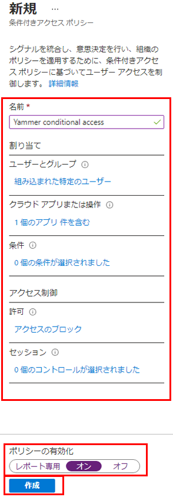

---
lab:
  title: 13 - 条件付きアクセス ポリシーの実装とテストを行う
  learning path: '02'
  module: Module 02 - Implement an Authentication and Access Management Solution
---

# ラボ 13 - 条件付きアクセス ポリシーの実装とテストを行う

### ログインの種類 = Microsoft 365 管理

## ラボのシナリオ

組織では、内部アプリケーションへのユーザーのアクセスを制限する必要があります。 Microsoft Entra 条件付きアクセス ポリシーを展開する必要があります。

**注** - 条件付きアクセス ポリシーについては、セキュリティの既定値群をオフにできます。覚えておくべき重要なポイントはトレーニングの内容です。  セキュリティの既定値群の詳細については、次のリンクを参照してください: <https://docs.microsoft.com/en-us/azure/active-directory/fundamentals/concept-fundamentals-security-defaults>

#### 推定時間:20 分

### 演習 1 - DebraB が Sway にアクセスするのをブロックする条件付きアクセス ポリシーを設定する

#### タスク 1 - DebraB が Swaｙ にアクセスできることを確認する

1. 新しい InPrivate ブラウザー ウィンドウを開きます。
2. [https://www.office.com](https://www.office.com) に接続します 
3. プロンプトが表示されたら、DebraB としてログインします。

  | 設定 | 値 |
  | :--- | :--- |
  | ユーザー名 | **DebraB@** `<<your lab domain>>.onmicrosoft.com` |
  | パスワード | テナント管理者のパスワードを入力します (テナントの管理者のパスワードを取得するには、[ラボ リソース] タブを参照してください)。 |
    
4. ようこそ画面と導入画面をバイパスします。

5. **[アプリ]** ページを開き、**Sway** アイコンを選択して、正しく読み込まれることを確認します。

6. Office からログアウトし、ブラウザー セッションを閉じます。

#### タスク 2 - 条件付きアクセスポリシーを作成する

Microsoft Entra 条件付きアクセスは、Microsoft Entra ID の高度な機能です。リソースにアクセスできるユーザーを制御する、詳細なポリシーを指定できます。 条件付きアクセスを使用すると、グループ、デバイスの種類、場所、ロールなどに基づいてユーザーのアクセスを制限することでアプリケーションを保護できます。

1. ディレクトリのグローバル管理者アカウントを使用して、[https://entra.microsoft.com](https://entra.microsoft.com) にアクセスし、サインインします。

2. ポータル メニューを開き、 **[Microsoft Entra ID]** を選択します。

3. メニューの **[ID]** で、**[保護]** を選択します。

4. [セキュリティ] ページの左側のナビゲーションで **[条件付きアクセス]** を選択します。

5. **[概要 (プレビュー)]** で、**[+ 新しいポリシーの作成]** をクリックします。

   ![[新しいポリシー] が強調表示されている [条件付きアクセス] ページを表示している画面イメージ](./media/lp2-mod1-conditional-access-new-policy.png)

6. **[名前]** ボックスに「**Block Sway for DebraB**」と入力します。

   **注** - この命名を使用すると、ポリシーとその機能をすばやく認識できます。

7. **[割り当て]** で、**[0 個のユーザーとグループが選択されました]** を選択します。

8. [含める] タブで **[ユーザーとグループの選択]** を選択してから、**[ユーザーとグループ]** チェックボックスをオンにします。

9. [選択] ウィンドウで **DebraB** アカウントを選択してから、**[選択]** を選択します。

10. **[ターゲット リソース]** で、**[ターゲット リソースが選択されていません]** を選択します。

11. **[クラウド アプリ]** が選択されていることを確認し、**[アプリの選択]** を選択してから、[選択] セクションで **[なし]** を選択します。

12. [選択] ウィンドウで **[Sway]** を検索し、**[Sway]**、**[選択]** の順に選択します。

13. **[アクセス制御]** の **[許可]** セクションで、**[0 個のコントロールが選択されました]** を選択します。

14. [許可] ウィンドウで **[アクセスのブロック]** を選択し、**[選択]** を選択します。

   **注** - このポリシーは、演習用にのみ構成されており、条件付きアクセス ポリシーを迅速に実証するために使用されます。

15. **[ポリシーを有効にする]** で、 **[オン]** を選択してから **[作成]** を選びます。

   

#### タスク 3 - 条件付きアクセス ポリシーをテストする

条件付きアクセス ポリシーをテストして、想定どおりに動作することを確認する必要があります。

1. 新しい [InPrivate] ブラウザー タブを開いて、[https://sway.office.com](https://sway.office.com) に移動します。
    - プロンプトが表示されたら、DebraB としてログインします。

   | 設定 | 値 |
   | :--- | :--- |
   | ユーザー名 | **DebraB@** `<<your lab domain>>.onmicrosoft.com` |
   | パスワード | テナント管理者のパスワードを入力します (テナントの管理者のパスワードを取得するには、[ラボ リソース] タブを参照してください)。 |
     
2. Microsoft Sway に正常にアクセスできないことを確認します。

   

3. サインインしている場合は、タブを閉じ、1 分待ってから、もう一度やり直してください。
    
   **注** - DebraB として Sway に自動ログインしている場合は、手動でログアウトする必要があります。資格情報/アクセスはキャッシュされました。  ログアウトしてサインインすると、Sway セッションはアクセスを拒否するはずです。

4. タブを閉じて、[条件付きアクセス] ページに戻ります。

5. **[Block Sway for DebraB]** ポリシーを選択します。

6. **[ポリシーを有効にする]** で **[オン]** を選択し、**[保存]** を選択します。

### 演習 2 - "What If" を使用して条件付きアクセス ポリシーをテストする

#### タスク - What If を使用して条件付きアクセス ポリシーをテストする

1. Microsoft Entra 管理センター メニューを開き、 **[Microsoft Entra ID]** を選択します。

1. メニューの **[ID]** で、**[保護]** を選択します。

1. [セキュリティ] ページの左側のナビゲーションで **[条件付きアクセス]** を選択します。

1. ナビゲーション ウィンドウで、 **[ポリシー]** を選択します。

1. **[What If]** を選択します。

1. **[ユーザーまたはワークロード ID]** で、 **[ユーザーまたはサービス プリンシパルが選択されていません]** を選択します。

1. ユーザーとして **DebraB** を選択します。

1. **[クラウド アプリ、アクション、または認証コンテキスト]** で、**[Sway]** を選択します。 

1. **[What If]** を選択します。 **[適用するポリシー]** と **[適用しないポリシー]** のタイルの下部にレポートが表示されます。

これにより、ポリシーを有効にする前に、ポリシーとその影響をテストできます。

### 演習 3 - 条件付きアクセス ポリシーを使用してサインイン頻度の制御を構成する

#### タスク - Microsoft Entra 管理センターを使用して条件付きアクセスを構成する

会社の大規模なセキュリティ構成の一部として、サインインの頻度を制御するために使用できる条件付きアクセス ポリシーをテストする必要があります

1. ディレクトリのグローバル管理者アカウントを使用して、[https://entra.microsoft.com](https://entra.microsoft.com) にアクセスし、サインインします。

2. ポータル メニューを開き、 **[Microsoft Entra ID]** を選択します。

3. メニューの **[ID]** で、**[保護]** を選択します。

4. [保護] メニューの左側のナビゲーションで、**[条件付きアクセス]** を選択します。

5. 上部のメニューで、ドロップダウンから **[+ 新しいポリシー]** を選択し、 **[新しいポリシーの作成]** を選択します。

   ![[新しいポリシー] が強調表示されている [条件付きアクセス] ページを表示している画面イメージ](./media/lp2-mod1-conditional-access-new-policy.png)

6. **[名前]** ボックスに「**Sign in frequency**」と入力します。

7. **[割り当て]** で、**[0 個のユーザーとグループが選択されました]** を選択します。

8. [含める] タブで **[ユーザーとグループの選択]** をマークしてから、**[ユーザーとグループ]** チェックボックスをオンにします。

9. [選択] ウィンドウで、**Grady Archie** のアカウントを選択してから、**[選択]** を選択します。

10. **[ターゲット リソース]、[ターゲット リソースが選択されていません]** を選択します。

11. **[含める]** 内で **[リソースの選択]** が選択されていることを確認し、[選択] セクションで **[なし]** を選択します。

12. [選択] ウィンドウで **[Office 365]** を選択し、**[選択]** を選択します。

13. **[アクセス制御]** で **[セッション]** を選択します。

14. [セッション] ウィンドウで **[サインインの頻度]** を選択します。

15. 値のボックスに「**30**」と入力します。

16. 単位のメニューを選択し、**[日]**、**[選択]** の順に選択します。

17. **[ポリシーを有効にする]** で **[レポート専用]**、**[作成]** の順に選択します。

   

   **注** - レポート専用モードは、条件付きアクセス ポリシーの新しい状態であり、管理者が環境で条件付きアクセス ポリシーを有効にする前に、その影響を評価することができます。 レポート専用モードのリリースによる変更点は次のとおりです。
    
- 条件付きアクセス ポリシーをレポート専用モードで有効にできます。
- サインイン中に、レポート専用モードになっているポリシーが評価されますが、強制はされません。
- 結果は、サインイン ログの詳細にある [条件付きアクセス] および [レポート専用] タブに記録されます。
- Azure Monitor サブスクリプションをお持ちのお客様は、条件付きアクセスに関する分析情報のブックを使用して、条件付きアクセス ポリシーの影響を監視できます。
