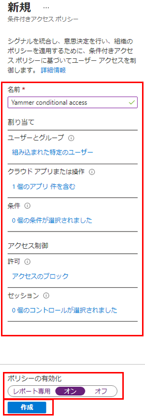
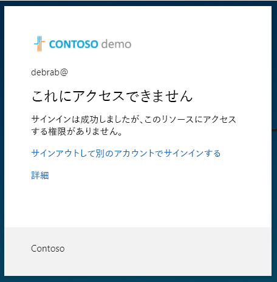
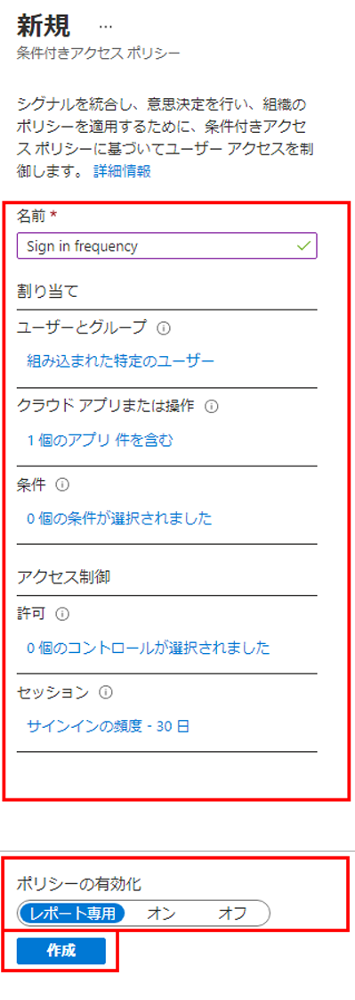

---
lab:
  title: 13 - 条件付きアクセス ポリシーの実装とテストを行う
  learning path: '02'
  module: Module 02 - Implement an Authentication and Access Management Solution
  description: 組織では、内部アプリケーションへのユーザーのアクセスを制限する必要があります。 Microsoft Entra 条件付きアクセス ポリシーを展開する必要があります。
  duration: 20 minutes
  level: 300
  islab: true
  primarytopics:
    - Microsoft Entra
---

# ラボ 13 - 条件付きアクセス ポリシーの実装とテストを行う

### ログインの種類 = Microsoft 365 管理

## ラボのシナリオ

組織では、内部アプリケーションへのユーザーのアクセスを制限する必要があります。 Microsoft Entra 条件付きアクセス ポリシーを展開する必要があります。

**注** - 条件付きアクセス ポリシーについては、セキュリティの既定値群をオフにできます。覚えておくべき重要なポイントはトレーニングの内容です。  セキュリティの既定値群の詳細については、次のリンクを参照してください: <https://docs.microsoft.com/en-us/azure/active-directory/fundamentals/concept-fundamentals-security-defaults>

#### 推定時間:20 分

### 演習 1 - DebraB が Sway にアクセスするのをブロックする条件付きアクセス ポリシーを設定する

#### タスク 1 - DebraB が Sway にアクセスできることを確認する

1. 新しい InPrivate ブラウザー ウィンドウを開きます。

1. Office (**`https://www.office.com`**) に接続します。

1. プロンプトが表示されたら、DebraB としてログインします。

  | 設定 | 値 |
  | :--- | :--- |
  | Username (ユーザー名) | `DebraB@<your lab domain>.onmicrosoft.com` |
  | Password (パスワード) | 指定されたパスワードを入力します |
    
1. ようこそ画面と導入画面をバイパスします。

1. **[アプリ]** ページを開き、**Sway** アイコンを選択して、正しく読み込まれることを確認します。

1. Office からログアウトし、ブラウザー セッションを閉じます。

#### タスク 2 - 条件付きアクセスポリシーを作成する

Microsoft Entra 条件付きアクセスは、Microsoft Entra ID の高度な機能です。リソースにアクセスできるユーザーを制御する、詳細なポリシーを指定できます。 条件付きアクセスを使用すると、グループ、デバイスの種類、場所、ロールなどに基づいてユーザーのアクセスを制限することでアプリケーションを保護できます。

1. **`https://entra.microsoft.com`**  で全体管理者アカウントを使用して **Microsoft Entra 管理センター**にサインインします。

    > **注:** サインイン中に多要素認証 (MFA) を完了するように求められる場合があります。 続行する前に、プロンプトに従って認証方法を構成または確認します。

1. 左側のナビゲーションの **[Entra ID]** の下にある **[条件付きアクセス]** を選択します。

1. **[概要]** から、**[+ 新しいポリシーの作成]** を選択します。

   ![[新しいポリシー] が強調表示されている [条件付きアクセス] ページを表示している画面イメージ](./media/lp2-mod1-conditional-access-new-policy.png)

1. **[名前]** ボックスに「**Block Sway for DebraB**」と入力します。

    >**注:** この命名を使用すると、ポリシーとその機能をすばやく認識できます。

1. **[割り当て]** で、**[0 人のユーザーまたはエージェント (プレビュー) が選択済み]** を選択します。

1. [含める] タブで **[ユーザーとグループの選択]** を選択してから、**[ユーザーとグループ]** チェックボックスをオンにします。

1. **[ユーザーとグループの選択]** ペインで、**DebraB** アカウントを選択し、**[選択]** を選択します。

1. **[ターゲット リソース]** で、**[ターゲット リソースが選択されていません]** を選択します。

1. **[リソース] (旧称クラウド アプリ)** が選択されていることを確認し、**[リソースの選択]** を選び、**[特定のリソースを選択]** で **[なし]** を選択します。

1. **[リソース]** ペインで、**Sway** を検索し、**[Sway]** を選択し、**[選択]** を選択します。

1. **[アクセス制御]** の **[許可]** セクションで、**[0 個のコントロールが選択されました]** を選択します。

1. **[許可]** ペインで **[アクセスのブロック]** を選択し、**[選択]** を選択します。

     >**注:** このポリシーは、演習用にのみ構成されており、条件付きアクセス ポリシーを迅速に実証するために使用されます。

1. **[ポリシーを有効にする]** で、 **[オン]** を選択してから **[作成]** を選びます。

   

#### タスク 3 - 条件付きアクセス ポリシーをテストする

条件付きアクセス ポリシーをテストして、想定どおりに動作することを確認する必要があります。

1. 新しい **InPrivate** ブラウザー タブを開き、**Microsoft Sway** (`https://sway.cloud.microsoft`) にアクセスします。

   ダイアログが表示されたら、**DebraB** としてサインインします。

   | 設定 | 値 |
   | :--- | :--- |
   | Username (ユーザー名) | `DebraB@<your lab domain>.onmicrosoft.com` |
   | Password (パスワード) | 指定されたパスワードを入力します |
     
1. Microsoft Sway に正常にアクセスできないことを確認します。

   

1. サインインしている場合は、タブを閉じ、1 分待ってから、もう一度やり直してください。
    
    >**注:** DebraB として Sway に自動ログインしている場合は、手動でログアウトする必要があります。お使いの資格情報またはアクセスはキャッシュされました。  ログアウトしてサインインすると、Sway セッションはアクセスを拒否するはずです。

1. タブを閉じて、**[条件付きアクセス]** に戻ります。

1. 左側のナビゲーションで **[ポリシー]** を選択して、条件付きアクセス ポリシーのリストを表示します。

1. **[Block Sway for DebraB]** ポリシーを選択します。

1. **[ポリシーを有効にする]** で **[オン]** を選択し、**[保存]** を選択します。

### 演習の概要

この演習では、特定のクラウド アプリからユーザーをブロックする条件付きアクセス ポリシーを作成し、そのブロックを検証しました。 この演習では、ポリシーがアプリレベルのアクセス決定を強制するしくみを説明しました。

### 演習 2 - "What If" を使用して条件付きアクセス ポリシーをテストする

#### タスク - What If を使用して条件付きアクセス ポリシーをテストする

1. **Microsoft Entra 管理センター**を開きます。

1. 左側のナビゲーションの **[Entra ID]** の下にある **[条件付きアクセス]** を選択します。

1. ナビゲーション ウィンドウで、 **[ポリシー]** を選択します。

1. 上部のメニューから **[What if]** を選択します。

1. **[What if]** ページの **[ID]** で **[ID の種類の選択]** が **[ユーザー]** に設定されていることを確認します。

1. **[ユーザー]** で、**[ユーザーの編集]** を選択し、**[DebraB]** を選択します。

1. **[ターゲット リソース]** で **[ターゲットの種類の選択]** が **[クラウド アプリ]** に設定されていることを確認します。

1. **[クラウド アプリ]** で、**[+ クラウド アプリの選択]** を選択し、**[Sway]** を選択します。

1. **[サインイン条件]** で、**[デバイス プラットフォーム]** を選択し、**[Windows]** を選択します。

1. **[クライアント アプリ] **を選択し、**[ブラウザー]** を選択します。

1. **[What If]** を選択します。 ページの下部の **[適用するポリシー]** と **[適用しないポリシー]** の下に表示される結果を確認します。

このレポートにより、条件付きアクセス ポリシーを有効にする前にその効果をテストすることができます。

### 演習の概要

この演習では、What If ツールを使って、サインインに条件付きアクセス ポリシーが適用されるしくみをモデル化しました。 この演習では、ユーザー向けにポリシーを有効化する前に、その影響を検証する方法を説明しました。

### 演習 3 - 条件付きアクセス ポリシーを使用してサインイン頻度の制御を構成する

#### タスク - Microsoft Entra 管理センターを使用して条件付きアクセスを構成する

会社の大規模なセキュリティ構成の一部として、サインインの頻度を制御するために使用できる条件付きアクセス ポリシーをテストする必要があります

1. **Microsoft Entra 管理センター**を開きます。

1. 左側のナビゲーションの **[Entra ID]** の下にある **[条件付きアクセス]** を選択します。

1. **[概要]** から、**[+ 新しいポリシーの作成]** を選択します。

   ![[新しいポリシー] が強調表示されている [条件付きアクセス] ページを表示している画面イメージ](./media/lp2-mod1-conditional-access-new-policy.png)

1. **[名前]** ボックスに「**Sign in frequency**」と入力します。

1. **[割り当て]** で、**[0 人のユーザーまたはエージェント (プレビュー) が選択済み]** を選択します。

1. **[含める]** タブで、**[ユーザーとグループを選択]** をマークし、**[ユーザーとグループ]** チェック ボックスをオンにします。

1. **[ユーザーとグループを選択]** ペインで、**Grady Archie** のアカウントを選択し、**[選択]** を選択します。

1. **[ターゲット リソース]、[ターゲット リソースが選択されていません]** を選択します。

1. **[含める]** 内で **[リソースの選択]** が選択されていることを確認し、**[特定のリソースを選択]** で **[なし]** を選択します。

1. **[リソース]** ペインで、**[Office 365]** を検索して選択します。

1. **[アクセス制御]** の **[セッション]** セクションで、**[0 個のコントロールが選択されました]** を選択します。

1. **[セッション]** ウィンドウで **[サインインの頻度]** を選択します。

1. 値のボックスに「**30**」と入力します。

1. 単位のドロップダウンを選択し、**[日]** を選択します。

1. **[選択]** を選択します。

1. **[ポリシーを有効にする]** で **[レポート専用]**、**[作成]** の順に選択します。

   

   >**注:** レポート専用モードは、条件付きアクセス ポリシーの新しい状態であり、管理者が環境で条件付きアクセス ポリシーを有効にする前に、その影響を評価することができます。 レポート専用モードのリリースによる変更点は次のとおりです。
    
- 条件付きアクセス ポリシーをレポート専用モードで有効にできます。
- サインイン中に、レポート専用モードになっているポリシーが評価されますが、強制はされません。
- 結果は、サインイン ログの詳細にある [条件付きアクセス] および [レポート専用] タブに記録されます。
- Azure Monitor サブスクリプションをお持ちのお客様は、条件付きアクセスに関する分析情報のブックを使用して、条件付きアクセス ポリシーの影響を監視できます。

### 演習の概要

この演習では、レポート専用モードで、ユーザーに定義された頻度で再認証することを要求するセッション制御を構成しました。 この演習では、セッション制御で、有効期間が長いセッションのリスクを軽減する方法を説明しました。
