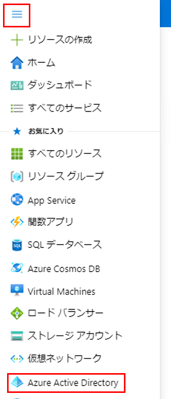
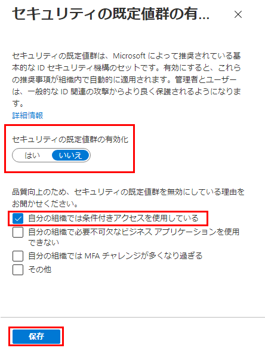

---
lab:
  title: 14 - Azure AD の多要素認証を有効にする
  learning path: "02"
  module: Module 02 - Implement an Authentication and Access Management Solution
ms.openlocfilehash: 1561aad5cf589b73ffbb3592fb20e2910ddff9c6
ms.sourcegitcommit: 448f935ad266989a6f0086019e0c0e0785ad162b
ms.translationtype: HT
ms.contentlocale: ja-JP
ms.lasthandoff: 02/10/2022
ms.locfileid: "138421364"
---
# ラボ 14 - セキュリティの既定値群を使用する

## ラボのシナリオ

組織で Azure Active Directory のセキュリティの既定値群の設定を構成する必要があります。
    **これは完全にオプションのラボです!!**  メニュー オプションがどこにあるかを調べるために、- セキュリティの既定値群をオン/オフにすることができます。  しかし、覚えておくべき重要なポイントはトレーニングからです。  セキュリティの既定値群をオンにし、無効にしない場合、条件付きアクセスを含む後のラボは機能しないことに注意してください。

#### 推定時間:7 分

### 演習 - 準備作業

セキュリティの既定値群を有効にするには、既存の条件付きアクセス ポリシーを削除または無効にする必要があります。  前のラボでは、Delia に MFA を適用するためのポリシーを作成しています。  以下の手順を行う前に、これを無効にする必要があります。

1. Azure Portal にログインします。
2. Azure Active Directory を開きます。
3. メニューの [セキュリティ] セクションで、 **[セキュリティ]** 、 **[条件付きアクセス]** の順に選択します。
4. [オン] または [レポート専用] に設定されている条件付きアクセスポリシーをクリックし、[オフ] に変更します。

### 演習 1 - セキュリティの既定値群を有効にする

#### タスク 1 - セキュリティの既定値群を有効にする

ディレクトリでセキュリティの既定値群を有効にするには、次のようにします。

1. ディレクトリのグローバル管理者アカウントを使用して、[https://portal.azure.com](https://portal.azure.com) にアクセスし、サインインします。

2. **[ポータル メニューの表示]** ハンバーガー アイコンを選択し、**[Azure Active Directory]** を選択します。

    

3. 左側のナビゲーションの [管理] セクションで **[プロパティ]** を選択します。

4. [プロパティ] ブレードの下部にある **[セキュリティの既定値群の管理]** を選択します。

5. **[セキュリティの既定値群の有効化]** トグルを **[はい]** に設定します。

6. これは、既に有効になっている可能性があります。

7. **[保存]** を選択します。

#### タスク 2 - セキュリティの既定値群を無効にする

セキュリティの既定値群を置き換える条件付きアクセス ポリシーを実装する組織では、セキュリティの既定値群を無効にする必要があります。

ディレクトリでセキュリティの既定値群を無効にするには、次のようにします。

1. ディレクトリのグローバル管理者アカウントを使用して、[https://portal.azure.com](https://portal.azure.com/) にアクセスし、サインインします。

2. **[ポータル メニューの表示]** ハンバーガー アイコンを選択し、**[Azure Active Directory]** を選択します。

3. [プロパティ] ブレードの下部にある **[セキュリティの既定値群の管理]** を選択します。

4. **[セキュリティの既定値群の有効化]** トグルを **[いいえ]** に設定します。

    

5. **[保存]** を選択します。
