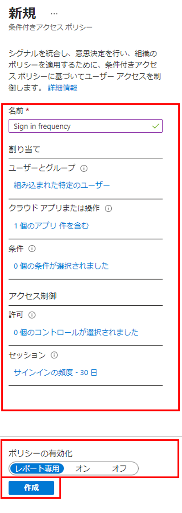

---
lab:
  title: 16 - 認証セッション コントロールを構成する
  learning path: "02"
  module: Module 02 - Implement an Authentication and Access Management Solution
ms.openlocfilehash: 8fadbe8fc6c26f79f2f75efae07e90cae714088b
ms.sourcegitcommit: 448f935ad266989a6f0086019e0c0e0785ad162b
ms.translationtype: HT
ms.contentlocale: ja-JP
ms.lasthandoff: 02/10/2022
ms.locfileid: "138421361"
---
# ラボ16 - 認証セッション制御を構成する

## ラボのシナリオ

会社の大規模なセキュリティ構成の一部として、サインインの頻度を制御するために使用できる条件付きアクセス ポリシーをテストする必要があります。

#### 推定時間:10 分

### 演習 1 - 条件付きアクセス ポリシーを使用してサインイン頻度の制御を構成する

#### タスク - Azure portal を使用して条件付きアクセスを構成する

1. ディレクトリのグローバル管理者アカウントを使用して、[https://portal.azure.com](https://portal.azure.com) にアクセスし、サインインします。

2. ポータル メニューを開き、**[Azure Active Directory]** を選択します。

3. [Azure Active Directory] ブレードで、**[管理]** の下にある **[セキュリティ]** を選択します。

4. [セキュリティ] ブレードの左側のナビゲーションで **[条件付きアクセス]** を選択します。

5. 上部のメニューで、ドロップダウンから **[+ 新しいポリシー]** を選択し、 **[新しいポリシーの作成]** を選択します。

    ![[新しいポリシー] が強調表示されている [条件付きアクセス] ブレードを表示している画面イメージ](./media/lp2-mod1-conditional-access-new-policy.png)

6. **[名前]** ボックスに「**Sign in frequency**」と入力します。

7. **[割り当て]** で、 **[ユーザーまたはワークロード ID]** を選択します。

8. [含める] タブで **[ユーザーとグループ]** チェックボックスをオンにします。

9. [選択] ウィンドウで、**Grady Archie** のアカウントを選択してから、**[選択]** を選択します。

10. **[クラウド アプリまたは操作]** を選択します。

11. **[クラウド アプリ]** が選択されていることを確認し、**[アプリの選択]** を選択します。

12. [選択] ウィンドウで **[Office 365]** を選択し、**[選択]** を選択します。

13. **[アクセス制御]** で **[セッション]** を選択します。

14. [セッション] ウィンドウで **[サインインの頻度]** を選択します。

15. 値のボックスに「**30**」と入力します。

16. 単位のメニューを選択し、**[日]**、**[選択]** の順に選択します。

17. **[ポリシーを有効にする]** で **[レポート専用]**、**[作成]** の順に選択します。

    

   **注** - レポート専用モードは、条件付きアクセス ポリシーの新しい状態であり、管理者が環境で条件付きアクセス ポリシーを有効にする前に、その影響を評価することができます。 レポート専用モードのリリースによる変更点は次のとおりです。
    
    - 条件付きアクセス ポリシーをレポート専用モードで有効にできます。
    - サインイン中に、レポート専用モードになっているポリシーが評価されますが、強制はされません。
    - 結果は、サインイン ログの詳細にある [条件付きアクセス] および [レポート専用] タブに記録されます。
    - Azure Monitor サブスクリプションをお持ちのお客様は、条件付きアクセスに関する分析情報のブックを使用して、条件付きアクセス ポリシーの影響を監視できます。
