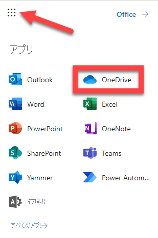

---
lab:
  title: 18 - Defender for Cloud Apps アクセス ポリシー
  learning path: "03"
  module: Module 03 - Implement Access Management for Apps
ms.openlocfilehash: 96c7c24c45e155c80a6e8c44852fb930c36aa876
ms.sourcegitcommit: 80c5c0ef60c1d74fcc58c034fe6be67623013cc0
ms.translationtype: HT
ms.contentlocale: ja-JP
ms.lasthandoff: 07/01/2022
ms.locfileid: "146823209"
---
# 18 - Defender for Cloud Apps アクセスとセッション ポリシー

## ラボのシナリオ

Microsoft Defender for Cloud Apps では、監視しているクラウド アプリに固有の追加の条件付きアクセス ポリシーを作成できます。  これらのポリシーの作成は、Microsoft Defender for Cloud Apps ポータル内の [制御] メニューから行うことができます。

#### 推定時間:20 分

### 演習 1 - Defender for Cloud Apps アクセス ポリシーを作成する

#### タスク 1: Defender for Cloud Apps と連動するように Azure AD を構成する

1. [portal.azure.com](portal.azure.com) に移動して、Azure Active Directory にアクセスします。

1. **[管理]** で、 **[セキュリティ]** を選択します。

1. **[保護]** で、 **[条件付きアクセス]** を選択します。

1. **[+ 新しいポリシー]** ドロップダウンを選択し、 **[新しいポリシーの作成]** を選択します。

1. "**Defender for Cloud Apps コントロール**" などのポリシー名を入力します。

1. **[ユーザーまたはワークロード ID]** で、 **[users or workload identities selected]\(選択されているユーザーまたはワークロード ID\)** を選択し、 **[ユーザーとグループの選択]** と **[ユーザーとグループ]** を選択します。

1. ラボ テナントの管理者ユーザー アカウントを選択し、 **[選択]** を選択します。

1. **[クラウド* アプリ*または操作*]** で、 **クラウド アプリ、アクション、または認証コンテキストが選択されません** を選択します。

1. **[アプリを選択]** を選択し、 **[Microsoft Cloud App Security]** 、 **[Office 365 Exchange Online]** 、 **[Office 365]** を選択して **[選択]** を選択します。 

1. **[アクセスの制御]** で、 **[セッション]** と **[0 個のコントロールが選択されました]** を選択します。

1. **[アプリの条件付きアクセス制御を使う]** ボックスを選択し、既定の **[監視のみ]** のままにして、 **[選択]** を選択します。

1. **[ポリシーの有効化]** で、 **[オン]** を選択してから **[作成]** を選択します。

#### タスク 2 - Microsoft Defender for Cloud Apps にアクセスし、アプリの条件付きアクセス制御を作成する

アプリケーションを登録すると、アプリケーションと Microsoft ID プラットフォームとの間の信頼関係が確立されます。 この信頼は一方向です。つまり、アプリは Microsoft ID プラットフォームを信頼しますが、その逆はありません。

1. グローバル管理者アカウントを使用して、[https://security.microsoft.com](https://security.microsoft.com) にサインインします。

1. 左側のメニューで、一番下までスクロールし、 **[その他のリソース]** を選択します。

1. **[その他のリソース]** ウィンドウの **[Microsoft Defender for Cloud Apps]** で **[開く]** を見つけて選択します。  Microsoft 365 アカウント内で **Microsoft Defender for Cloud Apps** ポータルに異動します。

1. **Microsoft Defender for Cloud Apps** ポータル メニューで、 **[Control/制御]** のドロップダウン矢印を選択し、 **[Policies/ポリシー]** を選択します。

1. **[+ Create Policy/ポリシーの作成]** を選びます。 **[Access Policy/アクセス ポリシー]** を選択します。

1. "**管理されていないデバイスからのアクセスをブロックする**" など、ポリシーの名前を入力します。

1. **[Category/カテゴリ]** は **[Access control/アクセス制御]** のままにします。

1. **[Activities matching all of the following]\ 次のすべてに一致するアクティビティ ** で、 **[Intune compliant, Hybrid Azure AD joined]\ Intune 準拠、ハイブリッド Azure AD 参加済み)** のドロップダウンを選択し、 **[Hybrid Azure AD Joined]** の選択を解除します。

1. **[Select Apps / アプリを選択]** のドロップダウンを選択します。  **[Microsoft OneDrive for Business]** を選択します。もし存在しない場合は **[Microsoft Online Services]**を選択します。

1. **[アクション]** を **[テスト]** のままにします。

1. **[Alert / 通知]** で、 **[Create an alert / 通知の作成]** をオンのままにして、 **[Sent alert as email]\ 電子メールとして送信済みの通知** を選択します。

1. ラボ管理者の電子メール アドレスを入力し、キーボードで **Enter** キーを押します。

1. **[Create / 作成]** を選択してアクセス ポリシーを作成します。

1. 別のブラウザー タブで <login.microsoftonline.com> に移動し、ページの右上にあるアプリの選択から **[OneDrive]** を選択します。

    

1. **Microsoft Defender for Cloud Apps** で、メニューの **[通知]** を選択します。  これにより、組み込みとカスタムの両方のポリシーから通知のダッシュボードが表示されます。 

1. **[フィルター]** で、 **[アプリ: アプリを選択]** の **[OneDrive for Business]** と、 **[ポリシー: ポリシーの選択]** で作成したポリシーを選択します。 このポリシーの通知は、ここに表示されます。

1. <login.microsoftonline.com> から **Outlook** に移動して、通知の **[受信トレイ]** を表示します。 選択すると、 **[Access to Microsoft Exchange Online is monitored]\(Microsoft Exchange Online へのアクセスが監視されます\)** が表示されます。 これは、ラボ プロバイダーから設定される条件付きアクセス ポリシーに基づいています。

   **注** - このポリシーが反映され、アラートが提供されるまで遅延が生じる場合があります。
