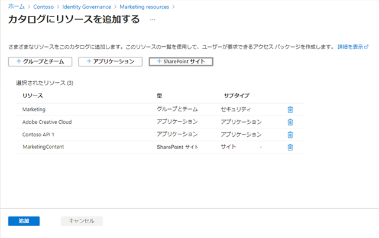
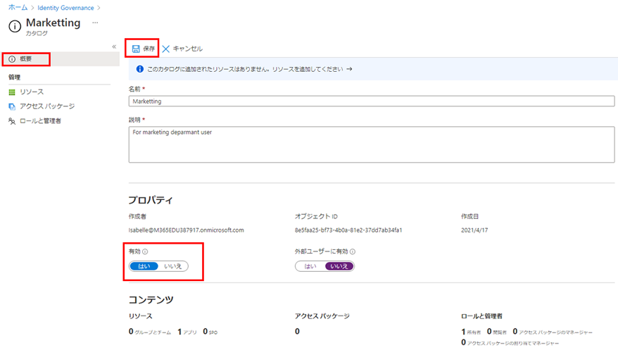

---
lab:
  title: 22 - Microsoft Entra エンタイトルメント管理でリソースのカタログを作成して管理する
  learning path: '04'
  module: Module 04 - Plan and Implement and Identity Governance Strategy
  description: Microsoft Entra のエンタイトルメント管理を使って資格パッケージを作成して展開します。 その後、ユーザーとして作業し、エンタイトルメントを要求して使用します。
  duration: 15 minutes
  level: 300
  islab: true
  primarytopics:
    - Microsoft Entra
---

# ラボ 22: Microsoft Entra エンタイトルメント管理でリソースのカタログを作成して管理する

### ログインの種類: Microsoft 365 管理

## ラボのシナリオ

カタログは、リソースとアクセス パッケージのコンテナーです。 関連するリソースとアクセス パッケージをグループ化するときは、カタログを作成します。 どのユーザーでも、カタログを作成すると、最初のカタログ所有者になります。 カタログ所有者は、別のカタログ所有者を追加できます。 組織では、カタログを作成して構成する必要があります。

#### 推定時間:15 分

### 演習 1 - エンタイトルメント管理でのリソースの構築

#### タスク 1: カタログを作成する

1. **Microsoft Entra 管理センター** (**`https://entra.microsoft.com`**) にグローバル管理者としてサインインします。

    > **注:** サインイン中に多要素認証 (MFA) を完了するように求められる場合があります。 続行する前に、プロンプトに従って認証方法を構成または確認します。

    **重要** - Microsoft Entra ID の利用規約を使用および構成するには、以下が必要です。
    - Microsoft Entra ID Premium P1、P2、EMS E3、または EMS E5 サブスクリプション。
    - これらのいずれかのサブスクリプションをお持ちでない場合は、Microsoft Entra ID Premium 試用版を入手できます。
    - 構成するディレクトリに対する次のいずれかの管理者アカウント。
        - グローバル管理者
        - セキュリティ管理者
        - 条件付きアクセス管理者

1. 左側のナビゲーション メニューで、**[ID ガバナンス]** を展開し、**[エンタイトルメント管理]** を選択します。

1. **[ID ガバナンス | はじめに]** ページで、左側のナビゲーションの **[カタログ]** の下にある **[カタログ]** を選択します。

1. 上部のメニューで **[+ 新しいカタログ]** を選択します。

    ![[新しいカタログ] メニューが強調表示された Identity Governance カタログ ページが表示されている画面イメージ ](./media/lp4-mod1-identity-governance-new-catalog.png)

1. [新しいカタログ] ペインで、**[名前]** ボックスに「**Marketing**」と入力します。

1. **[説明]** ボックスに「**マーケティング部門ユーザー**」と入力します。 この情報は、アクセス パッケージの詳細に表示されます。

1. **[有効]** で **[はい]** を選択します。

    - **[外部ユーザーに有効]** で **[いいえ]** を選択します。  この設定により、選択した外部ディレクトリのユーザーが、このカタログのアクセス パッケージを要求できるようになります。 この設定は変更されません。

1. カタログをステージするか、必要になるまで無効にしておくかにより、カタログの即時使用を有効または無効にできます。 この演習では、カタログを有効にする必要はありません。

   ![[名前]、[説明]、[有効]、[作成] オプションが強調された [新しいカタログ] ペインが表示されている画面イメージ](./media/lp4-mod1-new-catalog-marketing.png)

1. **［作成］** を選択します

#### タスク 2 - カタログにリソースを追加する

アクセス パッケージにリソースを含めるには、リソースがカタログ内に存在している必要があります。 追加できるリソースの種類は、グループ、アプリケーション、および SharePoint Online サイトです。 追加できるグループは、クラウドで作成された Microsoft 365 グループ、またはクラウドで作成された Microsoft Entra セキュリティ グループです。 追加できるアプリケーションは Microsoft Entra エンタープライズ アプリケーションで、これには SaaS アプリケーションと、Microsoft Entra ID にフェデレーションされた独自アプリケーションの両方が含まれます。 追加できるサイトは、SharePoint Online サイトまたは SharePoint Online サイト コレクションです。

1. **[ID ガバナンス]** ページで、必要に応じて **[カタログ]** を選択します。

1. **[カタログ]** の一覧で **Marketing** を選択します。

1. 左側のナビゲーション メニューの **[管理]** で、**[リソース]** を選択します。

1. メニューで、**[+ リソースの追加]** を選択します。

1. [Add resources to catalog](カタログへのリソースの追加) ページで、使用可能なオプションを確認します。  次の項目を追加します。

   | リソースの種類 | 値 |
   | :------------- | :---------- |
   |  **グループとチーム** | **Retail** |
   |  **アプリケーション** | **Box** |
   |  **アプリケーション** | **Salesforce** |
   |  **SharePoint サイト** | **[ブランド]** - 利用可能なサイトの一覧からこの SharePoint を選択します |

1. [Groups and Teams](グループとチーム)、[アプリケーション]、または [SharePoint サイト] にはリソースがないかもしれません。 任意のリソース カテゴリを選択し、そのカテゴリからリソースを選択します。

1. この演習では、使用可能などのリソースを選択してもかまいません。

    

1. 完了したら、 **[追加]** を選択します。 これらのリソースをカタログ内のアクセス パッケージに含めることができるようになりました。

#### タスク 3 - カタログ所有者をさらに追加する

カタログを作成したユーザーは最初のカタログ所有者になります。 カタログの管理を委任するには、カタログ所有者ロールにユーザーを追加します。 これは、カタログの管理責任を共有するのに役立ちます。

1. 必要に応じて、Microsoft Entra 管理センターで **[ID ガバナンス]** を展開し、**[エンタイトルメント管理]**、**[カタログ]**、**[マーケティング]** の順に選択します。

1. [Marketing catalog](マーケティング カタログ) ページの左側のナビゲーション メニューで、 **[ロールと管理者]** を選択します。

    ![Marketing カタログの [ロールと管理者] ページが表示されている画面イメージ](./media/lp4-mod1-catalog-roles-and-admins.png)

1. 上部のメニューで、利用可能なロールを確認し、 **「+ カタログ所有者の追加」** を選択します。

1. 「メンバーの選択」ウィンドウで、 **「Adele Vance」** を選択してから、 **「選択」** を選択します。

1. [ロールと管理者] の一覧で、新しく追加したロールを確認します。

#### タスク 4 - カタログを編集する

カタログの名前と説明を編集できます。 この情報は、アクセス パッケージの詳細に表示されます。

1. [マーケティング] ページの左側のナビゲーションで、 **[概要]** を選択します。

1. 上部のメニューで、**[編集]** を選択します。

1. 設定を確認し、**[プロパティ]** > **[有効]** で **[はい]** を選択します。

    

1. **[保存]** を選択します。

#### タスク 5 - ゲスト ユーザーのアクセス レビューを作成する

Microsoft Entra Identity Governance は、ゲスト ユーザーのアクセス ライフサイクルの管理と制御に役立つアクセス レビューを提供します。

1. **Microsoft Entra 管理センター**で **[ID ガバナンス]** を展開し、**[アクセス レビュー]** を選択します。

1. **[ID ガバナンス | アクセス レビュー]** ページで、**[+ 新規アクセス レビュー]** を選択します。

1. **[アクセス レビューの作成]** ページの、**[リソース レビュー]** ボックスで **[選択]** を選択します。

1. **[新規アクセス レビュー]** ページの **[レビュー対象を選択する]** で、**[レビューを選択]** ドロップダウンを開き、**[チームとグループ]** を選択します。

1. **[レビュー範囲]** で、**[ゲスト ユーザーを含むすべての Microsoft 365 グループ]** を選択します。

1. **[範囲]** で、**[ゲスト ユーザーのみ]** を選択します。

1. **[次へ: レビュー]** を選択します。

1. **[レビュー]** で、誰がアクセスのレビューと承認を行い、いつアクセスがレビューされて失効するかを設定します。

1. **[レビュー担当者の選択]** セクションの下で、レビュー担当者として **[グループ所有者]** を選択します。  
   > 推奨される ID ガバナンスの慣例として、ゲスト ユーザーが、自分のアクセスをレビューできないようにする必要があります。

1. **[期間 (日数)]** を既定値の **[3]** のままにし、レビュー用に **[確認の繰り返し]** および **[開始日]** を選択します。

1. **[設定]** タブで、レビュー動作を設定します。  
   - **[リソースへの結果の自動適用]** を有効にします。  
   - **[レビュー担当者が応答しない場合]** で、**[アクセス権を削除する]** を選択します。

1. **[確認および作成]**、**[作成]** の順に選択して、新しいアクセス レビューを作成します。

#### タスク 6 - カタログを削除する

カタログを削除できるのは、そのカタログにどのアクセス パッケージも含まれていない場合に限られます。

1. Marketing カタログの [概要] ページで、上部のメニューの [削除] を選択します。

1. 「削除」ダイアログ ボックスで情報を確認し、 **「いいえ」** を選択します。

    >**注:** カタログは、次のラボで使用するため、そのままにしています。

### 演習の概要

この演習では、Microsoft Entra エンタイトルメント管理でカタログを作成し、リソースを管理しました。 この演習では、委任されたパッケージベースのアクセス管理のために、カタログがリソースをどのようにグループ化するかを示しました。
