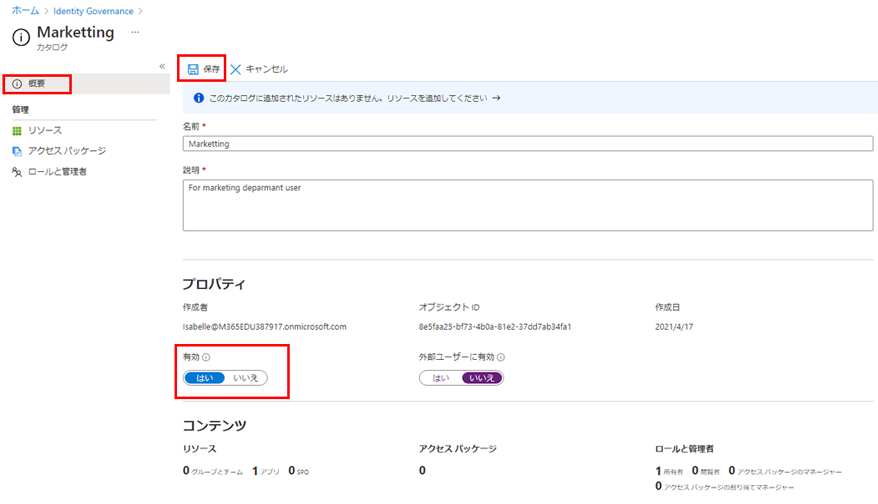

---
lab:
  title: 22 - Azure AD エンタイトルメント管理でリソースのカタログを作成して管理する
  learning path: "04"
  module: Module 04 - Plan and Implement and Identity Governance Strategy
ms.openlocfilehash: b53df1c7dc346715e52b77673bba150cc78fe332
ms.sourcegitcommit: b5fc07c53b5663eaa1883cf38b70c57cd88470ca
ms.translationtype: HT
ms.contentlocale: ja-JP
ms.lasthandoff: 06/29/2022
ms.locfileid: "146741698"
---
# ラボ 22:Azure AD エンタイトルメント管理でリソースのカタログを作成して管理する

## ラボのシナリオ

カタログは、リソースとアクセス パッケージのコンテナーです。 関連するリソースとアクセス パッケージをグループ化するときは、カタログを作成します。 どのユーザーでも、カタログを作成すると、最初のカタログ所有者になります。 カタログ所有者は、別のカタログ所有者を追加できます。 組織では、カタログを作成して構成する必要があります。

#### 推定時間:15 分

### 演習 1 - エンタイトルメント管理でのリソースの構築

#### タスク 1: カタログを作成する

1. グローバル管理者アカウントを使用して、[https://portal.azure.com](https://portal.azure.com) にサインインします。

    **重要** - Azure AD の使用条件を使用および構成するには、以下が必要です。
    - Azure AD Premium P1、P2、EMS E3、EMS E5 のいずれかのサブスクリプション。
    - これらのサブスクリプションをお持ちでない場合は、Azure AD Premium を入手するか、Azure AD Premium 試用版を有効にすることができます。
    - 構成するディレクトリに対する次のいずれかの管理者アカウント。
        - グローバル管理者
        - セキュリティ管理者
        - 条件付きアクセス管理者

2. **[Azure Active Directory]** を開き、**[Identity Governance]** を選択します。

3. 左側のメニューの **[エンタイトルメント管理]** で、**[カタログ]** を選択します。

4. 上部のメニューで **[+ 新しいカタログ]** を選択します。

    ![[新しいカタログ] メニューが強調表示された Identity Governance カタログ ページが表示されている画面イメージ  ](./media/lp4-mod1-identity-governance-new-catalog.png)

5. [新しいカタログ] ペインで、**[名前]** ボックスに「**Marketing**」と入力します。

6. **[説明]** ボックスに「**マーケティング部門ユーザー**」と入力します。 この情報は、アクセス パッケージの詳細に表示されます。

7. **[有効] で [いいえ] を選択** します。

8. **[Enabled for external users]\(外部ユーザーに対して有効\)** を指定すると、選択した外部ディレクトリのユーザーが、このカタログのアクセス パッケージを要求できるようになります。 この設定は変更されません。

9. カタログをステージするか、必要になるまで無効にしておくかにより、カタログの即時使用を有効または無効にできます。 この演習では、カタログを有効にする必要はありません。

    ![[名前]、[説明]、[有効]、[作成] オプションが強調された [新しいカタログ] ペインが表示されている画面イメージ](./media/lp4-mod1-new-catalog-marketing.png)

10. [作成] を選択します。

#### タスク 2 - カタログにリソースを追加する

アクセス パッケージにリソースを含めるには、リソースがカタログ内に存在している必要があります。 追加できるリソースの種類は、グループ、アプリケーション、および SharePoint Online サイトです。 追加できるグループは、クラウドで作成された Microsoft 365 グループ、またはクラウドで作成された Azure AD セキュリティ グループです。 追加できるアプリケーションは Azure AD エンタープライズ アプリケーションで、これには SaaS アプリケーションと、Azure AD にフェデレーションされた独自アプリケーションの両方が含まれます。 追加できるサイトは、SharePoint Online サイトまたは SharePoint Online サイト コレクションです。

1. [Identity Governance] ページで、必要に応じて **[カタログ]** を選択します。

2. **[カタログ]** の一覧で **Marketing** を選択します。

3. 左側のナビゲーション メニューの **[管理]** で、**[リソース]** を選択します。

4. メニューで、**[+ リソースの追加]** を選択します。

5. [Add resources to catalog]\(カタログへのリソースの追加\) ページで、使用可能なオプションを確認します。  次の項目を追加します。

   | リソースの種類 | 値 |
   | :------------- | :---------- |
   |  **グループとチーム** | Retail |
   |  **アプリケーション** | ボックス |
   |  **アプリケーション** | Salesforce |
   |  **SharePoint サイト** | ブランド SharePoint <<< 利用可能な SharePoint サイトの一覧から選択 |

6. [Groups and Teams]\(グループとチーム\)、[アプリケーション]、または [SharePoint サイト] にはリソースがないかもしれません。 任意のリソース カテゴリを選択し、そのカテゴリからリソースを選択します。

7. この演習では、使用可能などのリソースを選択してもかまいません。

    

8. 完了したら、 **[追加]** を選択します。 これらのリソースをカタログ内のアクセス パッケージに含めることができるようになりました。

#### タスク 3 - カタログ所有者をさらに追加する

カタログを作成したユーザーは最初のカタログ所有者になります。 カタログの管理を委任するには、カタログ所有者ロールにユーザーを追加します。 これは、カタログの管理責任を共有するのに役立ちます。

1. 必要に応じて、Azure portal で **[Azure Active Directory]** に移動してから、 **[Identity Governance]** 、 **[カタログ]** の順に選択し、 **[マーケティング]** を選択します。

2. [Marketing catalog]\(マーケティング カタログ\) ページの左側のナビゲーション メニューで、 **[ロールと管理者]** を選択します。

    ![Marketing カタログの [ロールと管理者] ページが表示されている画面イメージ](./media/lp4-mod1-catalog-roles-and-admins.png)

3. 上部のメニューで、利用可能なロールを確認し、 **「+ カタログ所有者の追加」** を選択します。

4. 「メンバーの選択」ウィンドウで、 **「Adele Vance」** を選択してから、 **「選択」** を選択します。

5. [ロールと管理者] の一覧で、新しく追加したロールを確認します。

#### タスク 4 - カタログを編集する

カタログの名前と説明を編集できます。 この情報は、アクセス パッケージの詳細に表示されます。

1. [マーケティング] ページの左側のナビゲーションで、 **[概要]** を選択します。

2. 上部のメニューで、**[編集]** を選択します。

3. 設定を確認し、**[プロパティ]** > **[有効]** で **[はい]** を選択します。

    

4. **[保存]** を選択します。

#### タスク 5 - ゲスト ユーザーのアクセス レビューを作成する

1. アクセス レビューでは、アクセス ライフサイクルを管理できます。  Azure AD Identity Governance には、アクセス レビューの状態を示す概要ダッシュボードが用意されています。 **[Identity Governance]** メニューの **[アクセス レビュー]** を選択します。

1. [アクセス レビュー] メニューで、 **[アクセス レビュー]** を選択して、ゲスト ユーザーのアクセス レビューを構成できます。  ゲスト ユーザーのアクセス レビューを作成するには、 **[+ 新しいアクセス レビュー]** を選択します。  タイルが開き、ゲスト ユーザーのアクセス レビューが構成されます。

1. **[レビュー対象を選択する]** で **[チームとグループ]** を選択します。

1. **[レビュー範囲を選択する]** で、 **[ゲスト ユーザーを含むすべての Microsoft 365 グループ]** を選択します

1. **[Select user scope]\(ユーザー スコープの選択\)** で、 **[ゲスト ユーザーのみ]** を選択します。

1. **[次へ: レビュー]** を選択します。

1. 次のタイルでは、アクセスをレビューして承認するユーザー、アクセスをレビューする頻度、アクセスの有効期限を構成します。

1. **[レビュー担当者を選択する]** で、これらのレビュー担当者として **[グループ所有者]** を選択します。 **注**:ゲスト ユーザーは、適切な ID ガバナンス プラクティスとして自分のアクセス権を確認できないようにする必要があります。

1. **[期間 (日数)]** を入力します。既定値は 3 で、 **[確認の繰り返し]** と **[開始日]** を選択します。

1. **[次へ: 設定]** を選択し、レビューの実行方法と、ゲスト ユーザーが応答した場合または応答しなかった場合の動作の設定を構成します。  **[リソースへの結果の自動適用]** を選択し、 **[レビュー担当者が応答しない場合]** で **[アクセス許可の削除]** を選択することをお勧めします。 

1. **[次へ: 確認および作成]** をクリックしてから **[作成]** をクリックし、新しい **[アクセス レビュー]** を作成します。

#### タスク 6 - カタログを削除する

カタログを削除できるのは、そのカタログにどのアクセス パッケージも含まれていない場合に限られます。

1. Marketing カタログの [概要] ページで、上部のメニューの [削除] を選択します。

2. 「削除」ダイアログ ボックスで情報を確認し、 **「いいえ」** を選択します。

    **注** - 次のラボで使用するためにカタログを保管しています。
