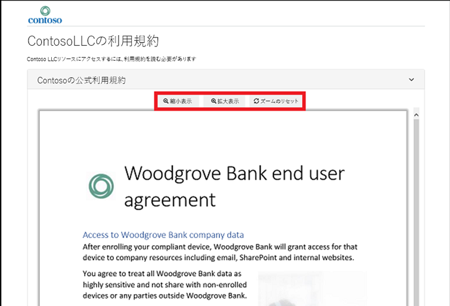
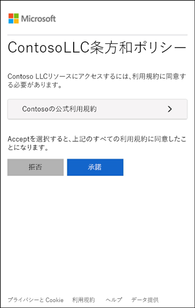
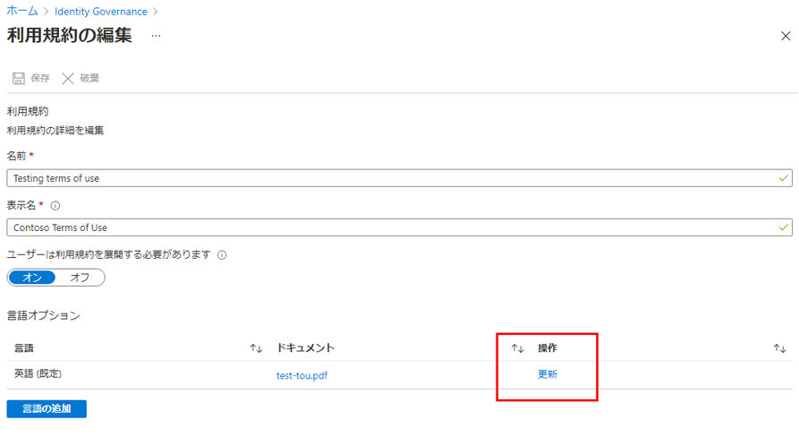

---
lab:
  title: 23 - 利用規約と同意レポートを追加する
  learning path: '04'
  module: Module 04 - Plan and Implement and Identity Governance Strategy
---

# ラボ 23: 利用規約と同意レポートを追加する 

## ラボのシナリオ

Azure AD 利用規約ポリシーは、エンド ユーザーに情報を提示するために使うことができる簡単な方法を提供します。 この方法で情報を提示することにより、法律上やコンプライアンス上の要件を満たすうえで重要な免責事項が確実にユーザーに表示されます。 この記事では、利用規約 (ToU) ポリシーの使用を開始する方法について説明します。

ToU ポリシーを作成して組織に適用する必要があります。

#### 推定時間:20 分

### 演習 1 - 利用規約を設定し、それらをテストする

#### タスク1 - 利用規約を追加する

利用規約のドキュメントが完成した後は、次の手順を使って追加します。

1. グローバル管理者アカウントを使用して、[https://portal.azure.com](https://portal.azure.com) にサインインします。

2. **[Azure Active Directory]** を開き、 **[Identity Governance]** を選択します。

3. 左側のナビゲーション メニューの **[利用規約]** で、**[利用規約]** を選択します。

4. [利用規約] ページの上部のメニューで、**[+ 新しい条件]** を選択します

    ![[新しい条件] が強調された [利用規約] ページが表示されている画面イメージ](./media/lp4-mod1-new-terms-of-use.png)

5. **[名前]** ボックスに「**使用条件のテスト**」と入力します。

6. これは、Azure portal で使用される使用条件です。

7. **[表示名]** ボックスに、「**Contoso 使用条件**」と入力します。

8. これは、ユーザーがサインインするときに表示されるタイトルです。

9. **[利用規約のドキュメント]** ボックスを選択し、完成した利用規約の PDF を参照して選択します。

   **提供される ToU ファイル** - github リポジトリ AllFiles/Labs/Lab26 を参照して、このラボで使用するためのサンプルの利用規約 PDF ドキュメントを入手します。

10. 利用規約のドキュメントの言語として **「英語」** を選択します。

   **注** - 言語オプションを使用して、言語が異なる複数の利用規約をアップロードできます。 エンドユーザーに表示される使用条件のバージョンは、ブラウザーの設定に基づきます。

11. エンド ユーザーが同意する前に利用規約を表示しなければならないようにする場合、 **[ユーザーは利用規約を展開する必要があります]** を **[オン]** に設定します。

12. エンド ユーザーがアクセスするすべてのデバイスで利用規約に同意しなければならないようにする場合、 **[各デバイスでユーザーによる同意が必要]** を **[オフ]** にします。 このオプションが有効な場合、追加のアプリケーションのインストールがユーザーに要求される可能性があります。

    **警告** - 各デバイスでの同意が指定されていると、ユーザーは、アクセス権を取得する前に、各デバイスを Azure AD に登録する必要があります。 この設定を [オン] にすることをお勧めします。しかし、クリーナー ラボのために、ここでは [オフ] を使用しています。

13. 定期的に利用規約への同意を期限切れにする場合、 **[期限切れの同意]** を **[オン]** にします。 オンに設定すると、2 つのスケジュール設定が追加表示されます。

    ![開始日、頻度、および期間を設定するための [期限切れの同意] 設定](./media/lp4-mod1-new-terms-of-use-create.png)

14. **[以下の日付から期限切れになります]** および **[頻度]** 設定を使用して、利用規約の期限切れのスケジュールを指定します。 次の表に、いくつかの設定例とその結果を示します。

    | 期限切れの開始日 | 頻度 | 結果 |
    |---|---|---|
    | 今日の日付 | 月単位 | ユーザーは本日から利用規約に同意する必要があります。また、毎月再同意する必要があります。|
    | 未来の日付 | 月単位 | ユーザーは本日から利用規約に同意する必要があります。 未来の日付が来ると、同意の有効期限が切れ、ユーザーは毎月再同意する必要があります。 |

    たとえば、期限切れの開始日を **1 月 1 日**に設定し、頻度で **[月単位]** を選んだ場合、2 人のユーザーの有効期限は次のようになります。

    | User | 最初の同意日 | 最初に有効期限が切れる日付 | 2 回目に有効期限が切れる日付 | 3 回目に有効期限が切れる日付 |
    |---|---|---|---|---|
    | Alice | 1 月 1 日 | 2 月 1 日 | 3 月 1 日 | 4 月 1 日|
    | Bob | 1 月 15 日 | 2 月 1 日 | 3 月 1 日| 4 月 1 日 |

15. **[Duration before re-acceptance requires (days)]** (再同意を要求するまでの日数) 設定を使用して、ユーザーが利用規約に再同意する必要があるまでの日数を指定します。 これにより、ユーザーに個別のスケジュールを適用することができます。 たとえば、日数に **30** 日を指定すると、2 人のユーザーの有効期限切れは次のようになります。

    | User | 最初の同意日 | 最初に有効期限が切れる日付 | 2 回目に有効期限が切れる日付 | 3 回目に有効期限が切れる日付 |
    |---|---|---|---|---|
    | Alice | 1 月 1 日 | 1 月 31 日 | 3 月 2 日 | 4 月 1 日|
    | Bob | 1 月 15 日 | 2 月 14 日 | 3 月 16 日| 4 月 15 日

    **注** - [期限切れの同意] と [Duration before re-acceptance requires (days)](再同意を要求するまでの日数) の両方の設定を使用することもできますが、通常はどちらか一方を使用します。

16. **[条件付きアクセス]** で、**[カスタム ポリシー]** を選択します。

    | Template | 説明 |
    |---|---|
    | **クラウド アプリへのアクセス (すべてのゲスト用)** | すべてのゲストとすべてのクラウド アプリに対して条件付きアクセス ポリシーが作成されます。 このポリシーは、Azure portal に影響します。 これが作成された後、サインアウトしてサインインし直さなければならないことがあります。 | 
    |**クラウド アプリへのアクセス (すべてのユーザー用)** | すべてのユーザーとすべてのクラウド アプリに対して条件付きアクセス ポリシーが作成されます。 このポリシーは、Azure portal に影響します。 これが作成された後、サインアウトしてサインインし直す必要があります。 |
    | **カスタム ポリシー** | この利用規約が適用されるユーザー、グループ、およびアプリを選択します。 |
    | **後で条件付きアクセス ポリシーを作成する** | この使用条件は、条件付きアクセス ポリシーを作成するときに、制御の許可一覧に表示されます。 |

    **重要** - 条件付きアクセス ポリシーによる制御 (利用規約を含む) は、サービス アカウントに対する強制をサポートしていません。 サービス アカウントはすべて、条件付きアクセス ポリシーから除外することをお勧めします。

    カスタム条件付きアクセス ポリシーを使うと、特定のクラウド アプリケーションやユーザー グループまで、きめ細かい使用条件を有効にできます。 詳細については、「[https://docs.microsoft.com/en-us/azure/active-directory/conditional-access/require-tou](https://docs.microsoft.com/en-us/azure/active-directory/conditional-access/require-tou)」を参照してください。

17. 完了したら、**[作成]** を選択します。

    ![構成済みのオプションが強調された [新しい利用規約] ページが表示されている画面イメージ](./media/lp4-mod1-new-terms-of-use-create.png)

18. 使用条件が作成されると、[条件付きアクセス ポリシー] ページに自動的に移動します。 そのページの **[名前]** ボックスに「**を適用する**」と入力します。

19. **[割り当て]** で、 **[ユーザーまたはワークロード ID]** を選択します。

20. [含める] タブで **[ユーザーとグループ]** チェック ボックスをオンにします。

21. 「選択」ウィンドウで、利用規約ポリシーをテストするために使用する **「Adele Vance」** を選択します。

   **警告** - すべての条件付きアクセス ポリシーと同様に、管理者アカウントを選択する場合は、条件付きアクセス ポリシーを変更するための十分なアクセス許可を持つ別のアカウントがあることを確認してください。 これは、条件付きアクセス ポリシーが望ましくない結果になった場合に、管理者アカウントがロックアウトされないようにするためです。

22. **「クラウド アプリまたは操作」** を選択します。

23. **[すべてのクラウド アプリ]** を選択します。

24. **[アクセス制御]** で **[許可]** を選択します。

25. [許可] ペインで、"**使用条件のテスト**" を選択し、**[選択]** を選択します。

26. **[ポリシーの有効化]** で、 **[オン]** を選択します。

27. 完了したら、**[作成]** を選択します。

    

28. 自分のアカウントを使用することを選択した場合は、ブラウザーを最新の状態に更新できます。 再度サインインするように求められます。 サインインするときに、使用条件に同意する必要があります。

#### タスク 2 - Adele としてログインする

1. InPrivate ブラウザー ウィンドウを開きます。
2. https://portal.azure.comに接続します。
3. 既にログインしていると表示された場合は、画面の右上にあるログイン ユーザー名を選択し、 **[別のアカウントでサインイン]** を選択します。
4. Adele としてログイン:

    | 設定 | 入力する値 |
    | :--- | :--- |
    | [ユーザー名] | **AdeleV@** `<<your domain name>>.onmicrosoft.com` |
    | パスワード | テナントの管理者パスワードを入力します (テナントの管理者パスワードを取得するには、[ラボ リソース] タブを参照してください) |

5. MFA リクエストを使用して Adele のログインを検証します。
6. 利用規約を表示します。
7. **「同意」** または **「拒否」** を選択できます。

    >**注** - **[拒否]** を選択した場合、AdeleV としての今後のログイン時に、利用規約をもう一度表示して同意する必要があります。

    >**注**:使用条件が表示されるまでに数分かかる場合があります。または、ログアウトしてポータルにログインし直すことができます。
 
#### タスク3 - 同意したユーザーと拒否したユーザーのレポートを表示する

[利用規約] ページには、同意したユーザーと拒否したユーザーの数が表示されます。 これらの数および同意したユーザーと拒否したユーザーは、利用規約が有効な間、保存されます。

1. Microsoft Azure の **「Identity Governance」 > 「利用規約」** で、自分の利用規約を見つけます。

2. 使用条件で、**[同意]** または **[拒否]** の下に表示される数値を選択し、現在のユーザーの状態を表示します。

    ![[同意] と [拒否] の列が強調された使用条件が表示されている画面イメージ](./media/lp4-mod1-terms-of-use-accept-decline.png)

3. この演習では、同意または拒否された使用条件がない可能性があります。 次の例では、**[同意]** の値が選択されています。 使用条件に同意したユーザーのユーザー情報のレポートを見ることができます。

    ![同意したユーザーを一覧表示する [利用規約の同意] ウィンドウ](./media/accepted-tou.png)

4. **[利用規約の同意]** ページで、 **[ダウンロード]** を選択して同意レポートをダウンロードします。

5. **[Identity Governance | 使用条件]** ページで、 **[テストの使用条件]** を強調表示し、 **[選択した監査ログの表示]** を選択して監査ログ アクティビティを表示します。

#### タスク 4 - ユーザーに表示される利用規約の外観

1. 使用条件を作成して適用すると、スコープ内のユーザーに使用条件のページが表示されるようになります。

    

2. ユーザーは利用規約を表示し、必要な場合はボタンを使用して拡大/縮小できます。

    

3. モバイル デバイスでは、次の例のような使用条件が表示されます。

    

#### タスク 5 - ユーザーが利用規約を確認する方法

ユーザーは、以下の手順を使用して、同意した利用規約を確認できます。

1. [https://myapps.microsoft.com](https://myapps.microsoft.com/) を参照し、自分のユーザー アカウントを使用してサインインします。

2. ユーザー プロファイルの写真を選択し、 **[アカウントの表示]** を選択します。 [概要] ページで、[VIEW SETTINGS AND PRIVACY](設定とプライバシーの表示) を選択します。

     と表示されているポップアップの画面イメージ](./media/lp4-mod1-myaccount-setting-and-privacy.png)

3. [Settings & Privacy](設定とプライバシー) ページで、**[プライバシー]** タブを選択します。

    

4. **[Organization's notice](組織からの注意)** で、同意した使用条件を確認できます。

#### タスク 6 - 利用規約の詳細を編集する

利用規約の詳細の一部を編集できますが、既存のドキュメントを変更することはできません。 詳細の編集方法を次の手順で説明します。

1. グローバル管理者として、 [https://portal.azure.com](https://portal.azure.com)  にサインインします。

2. [Azure Active Directory] を開き、 **[Identity Governance]** を選択します。

3. 左側のナビゲーション メニューの **[利用規約]** で、**[利用規約]** を選択します。

4. 編集する利用規約を選択します。

5. 上部メニューで **[条件の編集]** を選択します。

6. [使用条件の編集] ペインでは、次の項目を変更できます。

    - **名前** – これは、エンド ユーザーと共有されていない使用条件の内部名です。
  
    - **表示名** – これは、使用条件を表示しているときにエンド ユーザーに表示される名前です。

    - **ユーザーは使用条件を展開する必要があります** – これを **[オン]** に設定すると、エンド ユーザーは使用条件ドキュメントに同意する前にそれを展開することが強制されます。

    - **既存の使用条件ドキュメントを更新**します。

    - 既存の利用規約に言語を追加できます。各デバイスでユーザーによる同意が必要、期限切れの同意、再同意までの日数、条件付きアクセス ポリシーなど、その他の設定も変更したい場合は、新しい利用規約を作成する必要があります。

    

7. 完了したら、 **[保存]** を選択して変更を保存します。

#### タスク 7 - 既存の利用規約のドキュメントを更新する

場合によっては、使用条件ドキュメントの更新が必要になることがあります。

1. 編集する利用規約を選択します。

2. **[条件の編集]** を選択します。

3. **[言語オプション]** のテーブルで、更新する使用条件の言語を確認し、**[操作]** 列の **[更新]** を選択します。

    

4. [Update terms of use version](使用条件のバージョンの更新) ペインでは、使用条件ドキュメントの新しいバージョンをアップロードできます。

5. また、ユーザーが次回サインインしたときにこの新しいバージョンに同意するように要求する場合は、**[Require reaccept](再同意を要求する)** トグル ボタンを使用できます。 ユーザーに再同意を要求しない場合は、以前の同意が最新のままになり、それまでに同意していない新しいユーザーまたは同意の有効期限が切れてるユーザーだけに、新しいバージョンが表示されます。

     と [require re-accept](再同意を要求する) が強調された [update terms of use version](使用条件のバージョンの更新) ペインが表示されている画面イメージ](./media/lp4-mod1-update-terms-of-use-version.png)

6. 新しい PDF をアップロードして再同意を決定したら、**[追加]** を選択します。

7. ドキュメント列に、最新のバージョンが表示されます。

