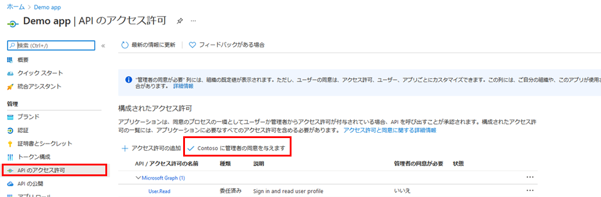
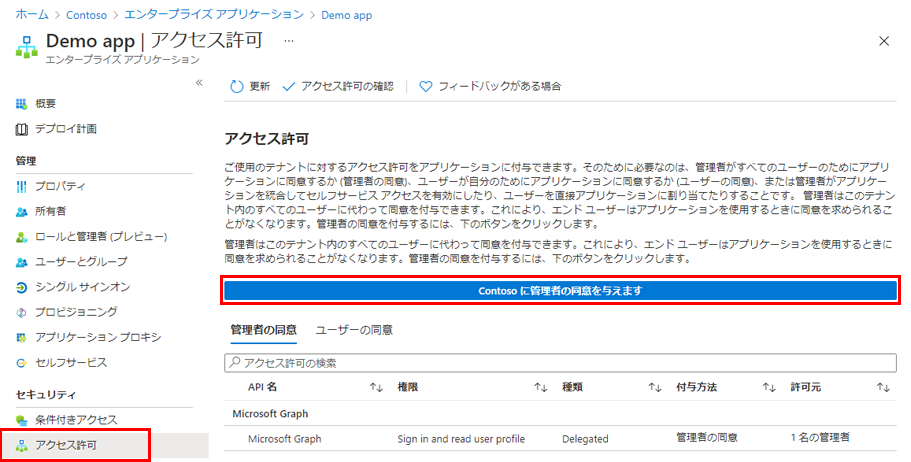

---
lab:
  title: 23 - アプリケーションに対してテナント全体の管理者の同意を付与する
  learning path: "03"
  module: Module 03 - Implement Access Management for Apps
ms.openlocfilehash: 0f643be480269183e30f1a8ce335520d75bea31a
ms.sourcegitcommit: 448f935ad266989a6f0086019e0c0e0785ad162b
ms.translationtype: HT
ms.contentlocale: ja-JP
ms.lasthandoff: 02/10/2022
ms.locfileid: "138421427"
---
# ラボ 23: アプリケーションに対してテナント全体の管理者の同意を付与する

## ラボのシナリオ

組織で開発したアプリケーション、または Azure AD テナントに直接登録されているアプリケーションの場合は、Azure portal の [アプリの登録] から、テナント全体の管理者の同意を付与できます。

#### 推定時間:10 分

### 演習 1 - 管理者の同意

#### タスク 1 - アプリの登録で管理者の同意を付与する

   **警告** - テナント全体の管理者の同意をアプリケーションに付与すると、アプリおよびアプリの発行者に、組織のデータへのアクセスが許可されます。 同意を付与する前に、アプリケーションで要求されているアクセス許可をよく確認してください。

Microsoft Graph API にアプリケーション許可のための管理者の同意を与えるには、グローバル管理者ロールが必要です。

1. 前の演習では、デモ アプリという名前のアプリを作成しました。 必要に応じて、Microsoft Azure で **[Azure Active Directory] > [アプリの登録] > [デモ アプリ]** を参照します。

2. **[デモ アプリ]** ブレードで、各 **アプリケーション (クライアント) ID** と **ディレクトリ (テナント) ID** の値を見つけて、後で使用できるようにコピーして保存します。

    ![ディレクトリ ID が強調表示されている [デモ アプリ] ブレードを示す画面イメージ](./media/lp3-mod3-demo-app-directory-id.png)

3. 左側のナビゲーションの **[管理]** で、**[API のアクセス許可]** を選択します。

4. **[構成されたアクセス許可]** で **[管理者の同意の付与]** を選択します。

    

5. ダイアログ ボックスを確認してから、**[はい]** を選択します。

   **警告** - アプリの登録経由でテナント全体に管理者の同意を与えると、以前にテナント全体に与えられていたアクセス許可が取り消されます。 以前にユーザーが自分で付与したアクセス許可は影響を受けません。

#### タスク 2 - エンタープライズ アプリで管理者の同意を付与する

テナントでアプリケーションが既にプロビジョニングされている場合、"エンタープライズ アプリケーション" を通じて、テナント全体の管理者の同意を付与できます。

1. Microsoft Azure で **[Azure Active Directory] > [エンタープライズ アプリケーション] > [デモ アプリ]** を参照します。

2. **[デモ アプリ]** ブレードの左側のナビゲーションで、**[セキュリティ]** の下にある **[アクセス許可]** を選択します。

3. **[アクセス許可]** で **[管理者の同意の付与]** を選択します。

    

   **警告** - アプリの登録経由でテナント全体に管理者の同意を与えると、以前にテナント全体に与えられていたアクセス許可が取り消されます。 以前にユーザーが自分で付与したアクセス許可は影響を受けません。

4. プロンプトが表示されたら、グローバル管理者アカウントを使用してサインインします。

5. **[要求されたアクセス許可]** ダイアログボックスで情報を確認し、**[同意する]** を選択します。
