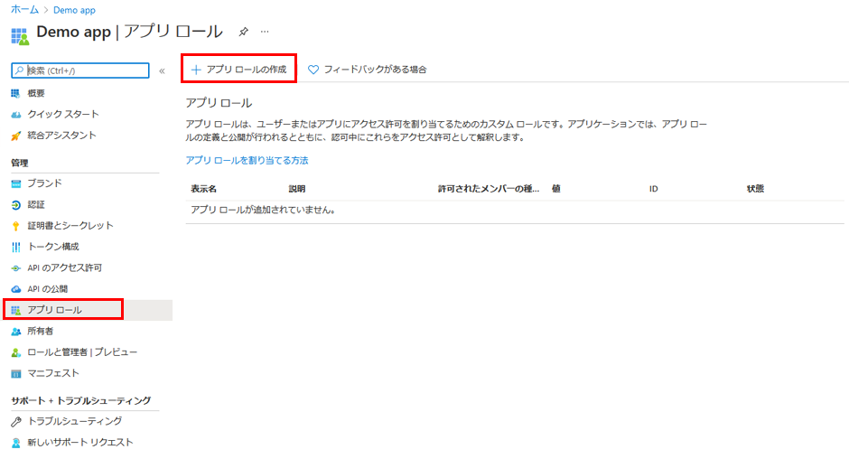

---
lab:
  title: 24 - アプリにアプリ ロールを追加してトークンで受け取る
  learning path: "03"
  module: Module 03 - Implement Access Management for Apps
ms.openlocfilehash: e796d84e5ece63e16de898aca18f36b37b88a515
ms.sourcegitcommit: 448f935ad266989a6f0086019e0c0e0785ad162b
ms.translationtype: HT
ms.contentlocale: ja-JP
ms.lasthandoff: 02/10/2022
ms.locfileid: "138421312"
---
# ラボ 24:アプリにアプリ ロールを追加してトークンで受け取る

## ラボのシナリオ

ロールベースのアクセス制御 (RBAC) は、アプリケーションにおいて承認を実施する一般的なメカニズムです。 RBAC を使用するとき、管理者は、個々のユーザーまたはグループではなく、ロールにアクセス許可を付与します。 その後、管理者はロールをさまざまなユーザーやグループに割り当てて、コンテンツや機能にだれがアクセスできるかを制御できます。 あなたは、RBAC ロールの実装を計画しており、手順の実行方法を理解していることを確認する必要があります。

#### 推定時間:10 分

### 演習 1 - ロールをアプリに追加する

#### タスク 1 - アプリ ロール UI を使用してアプリ ロールを宣言する

   **重要** - アプリ ロールのポータル UI 機能はパブリック プレビュー段階です。 このプレビュー版はサービス レベル アグリーメントなしで提供されています。運用環境のワークロードに使用することはお勧めできません。 特定の機能はサポート対象ではないか、機能が制限されることがあります。

Azure portal のユーザー インターフェイスを使用してアプリ ロールを作成するには:

1. グローバル管理者アカウントを使用して、[https://portal.azure.com](https://portal.azure.com) にサインインします。

2. ポータル メニューを開き、**[Azure Active Directory]** を選択します。

3. **[Azure Active Directory]** ブレードの **[管理]** の下にある **[アプリの登録]** を選択します。

4. 以前に作成した **[Demo App]** アプリの登録項目を選択します。

5. **[アプリ ロール]** を選択したら、 **[+ アプリ ロールの作成]** を選択します。

    

6. **[アプリ ロールの作成]** ペインの **[表示名]** ボックスに "**アンケート ライター**" と入力します。

7. **[Allow member types] (メンバーの種類を許可)** で、**[ユーザー/グループ]** を選択します。

8. **[値]** ボックスに "**Survey.Create**" と入力します。

9. **[説明]** ボックスに、"**ライターはアンケートを作成できます**" と入力します。

10. 説明は必須のフィールドであることに注意してください。

11. **[Do you want to enable this app role] (このアプリ ロールを有効にしますか)** が選択されていることを確認してから、**[適用]** を選択します。

#### タスク 2 - ロールにユーザーとグループを割り当てる

アプリケーションにアプリ ロールを追加したら、それらのロールにユーザーとグループを割り当てることができます。 ポータルの UI から、または [https://docs.microsoft.com/graph/api/user-post-approleassignments](https://docs.microsoft.com/graph/api/user-post-approleassignments) を使用してプログラミングによって、ユーザーとグループをロールに割り当てます。 さまざまなアプリのロールに割り当てられたユーザーがアプリケーションにサインインすると、roles 要求で割り当てられたロールがトークンに付与されます。

Azure portal を使用してユーザーとグループをロールに割り当てるには:

1. [https://portal.azure.com](https://portal.azure.com) にサインインします。

2. Azure Active Directory の左側にあるナビゲーション メニューで、**[エンタープライズ アプリケーション]** を選択します。

3. **[すべてのアプリケーション]** 一覧で **[デモ アプリ]** を選択します。

4. このアプリは、前の演習で作成されました。

5. **[管理]** で **[ユーザーとグループ]** を選択します。

6. メニューで、**[+ ユーザーまたはグループの追加]** をクリックします。

7. **[割り当ての追加]** ブレードの [ユーザーとグループ] で、 **[選択なし]** を選択します。

8. ユーザーとセキュリティ グループの一覧が表示されます。 **[Grady]** を検索して、[Grady Archie] を追加できます。

9. ユーザーとグループを選択したら、**[選択]** を選択します。

10. **[ロールの割り当ての選択]** で、**[Survey Writer]** が選択されていることを確認します。

    **注** - 存在するのが Survey Writer のみであるため、このオプションはグレー表示されます。

11. **[割り当て]** を選択して、アプリへのユーザーとグループの割り当てを終了します。

12. 追加したユーザーとグループが **[ユーザーとグループ]** の一覧に表示されることを確認します。
