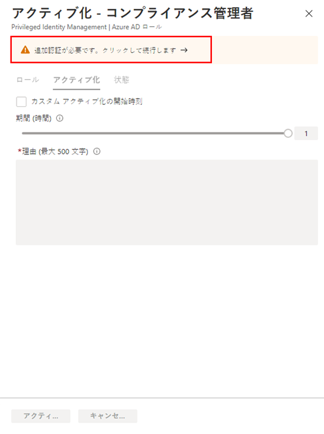

---
lab:
  title: 26 - Microsoft Entra ロール用に Privileged Identity Management を構成する
  learning path: '04'
  module: Module 04 - Plan and Implement and Identity Governance Strategy
  description: 'Microsoft Entra ロールを想定する必要がある場合は、Privileged Identity Management で [自分のロール] を開いてアクティブ化を要求できます。'
  duration: 30 minutes
  level: 300
  islab: true
  primarytopics:
    - Microsoft Entra
---

# ラボ 26: Microsoft Entra ロール用に Privileged Identity Management を構成する

### ログインの種類 = Microsoft 365 管理

## ラボのシナリオ

特権ロール管理者は、ロール候補の割り当てをアクティブ化しているユーザーの操作性を変更するなど、Microsoft Entra 組織の Privileged Identity Management (PIM) をカスタマイズできます。 PIM の構成について理解する必要があります。

#### 予想所要時間: 30 分

注 - ラボ環境で MFA が必要とされるように、継続的な変更が行われています。  このラボを完了するためにユーザーを切り替えると、MFA の設定を求められる場合があります。

### 演習 1 - Microsoft Entra ロールの設定を構成する

#### タスク 1 - ロールの設定を開く

以下の手順に従って、Microsoft Entra ロールの設定を開きます。

1. **Microsoft Entra 管理センター** (**`https://entra.microsoft.com`**) にグローバル管理者としてサインインします。

    > **注:** サインイン中に多要素認証 (MFA) を完了するように求められる場合があります。 続行する前に、プロンプトに従って認証方法を構成または確認します。

1. 左側のナビゲーション メニューで、**[ID ガバナンス]** を展開し、**[Privileged Identity Management]** を選択します。

1. **[Privileged Identity Management]** ページの左側のナビゲーションで **[Microsoft Entra ロール]** を選択します。

1. [クイック スタート] ページの左側のナビゲーションで **[設定]** を選択します。

    ![[設定] メニューが強調表示された [Microsoft Entra ロール] ページを表示している画面イメージ](./media/lp3-mod3-pim-ad-roles-settings.png)

1. ロールの一覧を確認してから、**[ロール名で検索]** に「**コンプライアンス**」と入力します。

1. 結果から **[コンプライアンス管理者]** を選択します。

1. ロール設定の詳細情報を確認します。

#### タスク 2 - 有効化の承認を要件とする

複数の承認者を設定した場合、承認は、承認者が 1 人でも承認または拒否すると直ちに完了します。 2 人以上のユーザーからの承認を要求することはできません。 ロールをアクティブ化するために承認を必須にする場合は、次の手順を実行します。

1. [ロール設定の詳細] ページの上部のメニューで **[編集]** を選択します。

    ![[ロール設定の詳細 - コンプライアンス管理者] ページの上部の [編集] が強調表示されている画面イメージ](./media/lp4-mod3-pim-edit-compliance-role.png)

1. [ロール設定の編集 - コンプライアンス管理者] ページで **[アクティブにするには承認が必要です]** チェックボックスをオンにします。

1. **[承認者の選択]** を選択します。

1. [メンバーの選択] ウィンドウで管理者アカウントを選択し、**[選択]** を選択します。

    ![[ロール設定の編集] ページと、選択したメンバーが強調表示された [メンバーの選択] ウィンドウを表示している画面イメージ](./media/lp4-mod3-pim-add-approver.png)

1. ロール設定を構成したら、 **[更新]** を選択して変更を保存します。

### 演習の概要

この演習では、Microsoft Entra ロールの承認要件を含むロールのアクティブ化設定を構成しました。 この演習では、PIM ポリシーを役割ごとにカスタマイズするしくみを説明しました。

### 演習 2: PIM を使用して Microsoft Entra ロールを割り当てる

#### タスク 1 - ロールを割り当てる

Microsoft Entra ID を使用すると、グローバル管理者は永続的な Microsoft Entra 管理者ロールの割り当てを行うことができます。 これらのロールの割り当ては、Microsoft Entra 管理センター、Azure portal または PowerShell コマンドを使用して作成できます。

常任管理者ロールの割り当ては、特権ロール管理者が Privileged Identity Management (PIM) サービスを使用して行うこともできます。 さらに、特権ロール管理者は、ユーザーを Microsoft Entra 管理者ロールの候補にすることもできます。 管理者候補は必要なときにロールをアクティブ化できます。作業が完了すると、そのアクセス許可は期限切れになります。

ユーザーを Microsoft Entra 管理者ロールの候補にするには、次の手順を実行します。

1. **Microsoft Entra 管理センター** (**`https://entra.microsoft.com`**) にグローバル管理者としてサインインします。

1. 左側のナビゲーション メニューで、**[ID ガバナンス]** を展開し、**[Privileged Identity Management]** を選択します。

1. **[Privileged Identity Management]** ページの左側のナビゲーションで **[Microsoft Entra ロール]** を選択します。

1. [クイック スタート] ページの左側のナビゲーションで **[ロール]** を選びます。

1. 上部のメニューで **[+ 割り当ての追加]** を選択します。

    ![[割り当ての追加] メニューが強調表示された Microsoft Entra ロールを表示している画面イメージ](./media/lp4-mod3-pim-assign-role.png)

1. **[割り当ての追加]** ページの **[メンバーシップ]** タブで、設定を確認します。

1. **[ロールの選択]** で、ドロップダウンを開き、**[コンプライアンス管理者]** を選択します。

1. 必要に応じて **[名前で役割を検索]** ボックスを使ってロールを見つけます。

1. **[名前でロールを検索]** フィルターを使用すると、ロールを見つけやすくなります。

1. **[メンバーの選択]** で **[メンバーが選択されていない]** を選択します。

1. [メンバーの選択] ウィンドウで、**[Miriam Graham]** を選択してから、**[選択]** を選択します。

    ![選択したメンバーが強調表示された [メンバーの選択] ウィンドウを表示している画面イメージ](./media/lp4-mod3-pim-add-role-assignment.png)

1. **[割り当ての追加]** ページで **[次へ >]** を選択します。

1. **[設定]** タブの **[割り当ての種類]** で、使用可能なオプションを確認します。 このタスクでは、既定の設定を使用します。

    - 有資格割り当ては、ロールを使用するためのアクションを実行することをロールのメンバーに要求します。 要求されるアクションには、多要素認証 (MFA) チェックの実行、業務上の妥当性の指定、指定された承認者に対する承認要求などがあります。
    - アクティブ割り当ては、ロールを使用するために何らかのアクションを実行することをメンバーに要求しません。 アクティブとして割り当てられたメンバーには常に、そのロールに割り当てられた特権があります。

1. 残りの設定を確認してから、**[割り当て]** を選択します。

#### タスク 2 - Miriam でログインする

1. InPrivate ブラウザー ウィンドウを開きます。

1. **Microsoft Entra 管理センター** (**`https://entra.microsoft.com`**) に接続します。

    >**注:** ユーザーがログインしている状態で開いた場合は、右上隅にあるユーザーの名前を選択し、**[別のアカウントとしてサインイン]** を選択します。

1. Miriam としてログインします。

   | フィールド | 値 |
   | :--- | :--- |
   | Username (ユーザー名) | `MiriamG@<your domain.onmicrosoft.com>` |
   | Password (パスワード) |  指定されたテナント管理者パスワードを入力します |

   > **注:** サインイン中に多要素認証 (MFA) を完了するように求められる場合があります。 続行する前に、プロンプトに従って認証方法を構成または確認します。

1. 左側にあるナビゲーションで、**[Entra ID]** の下にある **[ユーザー]** を選択し、**[すべてのユーザー]** を選択します。

1. ユーザー リストから **Miriam Graham** を見つけて選択します。

1. **[概要]** ページで、左側のナビゲーションの **[割り当てられたロール]** を選択します。

1. **[資格のある割り当て]** タブを選択します。

1. Miriam が**コンプライアンス管理者**のロールを利用できるようになったことに注意してください。

#### タスク 3 - Microsoft Entra ロールをアクティブにする

Microsoft Entra ロールを想定する必要がある場合は、Privileged Identity Management で **[自分のロール]** を開いてアクティブ化を要求できます。

1. **[検索、リソース、サービス、ドキュメント]** バーで「**Privileged**」を検索し、**[Microsoft Entra Privileged Identity Management]** を選択します。

1. **[Privileged Identity Management]** ページの左側のナビゲーション メニューで **[自分のロール]** を選択します。

1. **[自分のロール]** ページで、**[資格のある割り当て]** の一覧を確認します。

    ![資格のあるロールの割り当てが強調表示されている [自分のロール] を表示している画面イメージ](./media/lp4-mod3-my-roles.png)

1. [コンプライアンス管理者ロール] 行で **[アクティブ化]** を選択します。

1. [アクティブ化 - コンプライアンス管理者] ウィンドウで **[追加の確認が必要]** を選択し、指示に従って追加のセキュリティ確認を行います。 認証が要求されるのは、各セッションにつき 1 回だけです。

    

    **検証** - 現在のラボ環境構成に基づいて、MFA を構成し、正常にログインする必要があります。 ただし、以前に MFA でサインインしていた場合は、このウィンドウが表示されないことがあります (セッションごとに一度だけ認証が必要です)。

1. 追加のセキュリティ確認を完了したら、[アクティブ化 - コンプライアンス管理者] ウィンドウの **[理由]** ボックスに、「**これはこのロールをアクティブ化する理由です**」と入力します。

    **重要な注意** - 最小特権の原則として、アカウントは必要な期間だけアクティブ化する必要があります。  作業を行う必要がある場合は、1.5 時間しかかからないので、期間を 2 時間に設定します。 同様に、午後 3 時を過ぎないと作業ができないとわかっている場合は、カスタム アクティベーション時間を選択します。

1. **[アクティブ化]** を選びます。

#### タスク 4 - 制限スコープがあるロールを割り当てる

特定のロールでは、付与されるアクセス許可の範囲を 1 つの管理単位、サービス プリンシパル、またはアプリケーションに制限することができます。 この手順は、管理単位のスコープを持つロールを割り当てる場合の例です。

1. 必ず MiriamG のブラウザー ウィンドウを閉じてから、管理者アカウントとして Microsoft Entra 管理センターを開いてください。

1. **[Privileged Identity Management]** ページに移動し、左側のナビゲーション メニューで Azure **[Microsoft Entra ロール]** を選択します。

1. **[ロール]** を選びます。

1. **[ロール]** ページの上部のメニューで、**[+ 割り当ての追加]** を選択します。

1. **[割り当ての追加]** ページの、**[ロールの選択]** でドロップダウンを開き、**[ユーザー管理者]** を選択します。

1. **[スコープの種類]** メニューを選択し、使用可能なオプションを確認します。 ここでは、**[ディレクトリ]** というスコープの種類を使用します。

   **ヒント** - 管理単位のスコープの種類の詳細については、[https://docs.microsoft.com/en-us/azure/active-directory/roles/admin-units-manage](https://docs.microsoft.com/en-us/azure/active-directory/roles/admin-units-manage) に移動します。

1. 制限されたスコープを使用せずにロールを割り当てたときと同様に、メンバーを追加し、設定オプションを完了します。 ここでは、**[キャンセル]** を選択します。

#### タスク 5 - 既存のロールの割り当てを更新または削除する

既存のロールの割り当てを更新または削除するには、次の手順を実行します。

1. [Privileged Identity Management を開く] の [Microsoft Entra ロール] ページにおける左側のナビゲーションで、**[割り当て]** を選択します。

1. **[割り当て]** リストで、[コンプライアンス管理者] の **[操作]** 列のオプションを確認します。

    ![[コンプライアンス管理者] の [操作] 列に一覧表示されているオプションを表示している画面イメージ](./media/lp4-mod3-pim-edit-role-assignments.png)

1. **[更新]** を選択し、[メンバーシップの設定] ウィンドウで使用可能なオプションを確認します。 完了したら、ウィンドウを閉じます。

1. **[削除]** を選択します。

1. **[削除]** ダイアログ ボックスで情報を確認し、**[はい]** を選択します。

### 演習の概要

この演習では、Privileged Identity Management を使ってユーザーを Microsoft Entra ロールの対象にし、アクティブ化フローを検証して、割り当てを削除しました。 この演習では、Just-In-Time のロールのアクティブ化によって、常に付与されていた管理特権がどの程度抑制されるかを説明しました。
