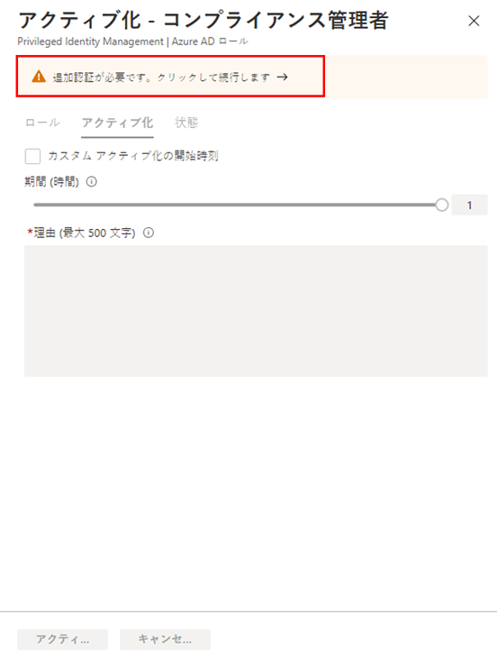

---
lab:
  title: 26 - Azure AD ロール用に Privileged Identity Management を構成する
  learning path: '04'
  module: Module 04 - Plan and Implement and Identity Governance Strategy
---

# ラボ 26: Azure AD ロール用に Privileged Identity Management を構成する

## ラボのシナリオ

特権ロール管理者は、ロール候補の割り当てをアクティブ化しているユーザーの操作性を変更するなど、Azure Active Directory (Azure AD) 組織の Privileged Identity Management (PIM) をカスタマイズできます。 PIM の構成について理解する必要があります。

#### 予想所要時間: 30 分

### 演習 1 - Azure AD ロールの設定を構成する

#### タスク 1 - ロールの設定を開く

次の手順を実行して、Azure AD ロールの設定を開きます。

1. グローバル管理者として、 [https://portal.azure.com](https://portal.azure.com)  にサインインします。

2. **[Azure AD Privileged Identity Management]** を検索してから選択します。

3. [Privileged Identity Management] ページの左側のナビゲーションで **[Azure AD ロール]** を選択します。

4. [クイック スタート] ページの左側のナビゲーションで **[設定]** を選択します。

    ![[設定] メニューが強調表示された [Azure AD ロール] ページを表示している画面イメージ](./media/lp3-mod3-pim-ad-roles-settings.png)

5. ロールの一覧を確認してから、**[ロール名で検索]** に「**コンプライアンス**」と入力します。

6. 結果から **[コンプライアンス管理者]** を選択します。

7. ロール設定の詳細情報を確認します。

#### タスク 2 - 有効化の承認を要件とする

複数の承認者を設定した場合、承認は、承認者が 1 人でも承認または拒否すると直ちに完了します。 2 人以上のユーザーからの承認を要求することはできません。 ロールをアクティブ化するために承認を必須にする場合は、次の手順を実行します。

1. [ロール設定の詳細] ページの上部のメニューで **[編集]** を選択します。

    ![[ロール設定の詳細 - コンプライアンス管理者] ページの上部の [編集] が強調表示されている画面イメージ](./media/lp4-mod3-pim-edit-compliance-role.png)

2. [ロール設定の編集 - コンプライアンス管理者] ページで **[アクティブ化には承認が必要です]** チェックボックスをオンにします。

3. **[承認者の選択]** を選択します。

4. [メンバーの選択] ウィンドウで管理者アカウントを選択し、**[選択]** を選択します。

    ![[ロール設定の編集] ページと、選択したメンバーが強調表示された [メンバーの選択] ウィンドウを表示している画面イメージ](./media/lp4-mod3-pim-add-approver.png)

5. ロール設定を構成したら、 **[更新]** を選択して変更を保存します。

### 演習 2 - Azure AD ロールを使用した PIM

#### タスク 1 - ロールを割り当てる

全体管理者は、Azure Active Directory (Azure AD) を使用して、永続的な Azure AD 管理者ロールの割り当てを行うことができます。 こうしたロールの割り当ては、Azure portal または PowerShell のコマンド を使用して作成できます。

永続的な管理ロールの割り当ては、特権ロール管理者が Azure AD Privileged Identity Management (PIM) サービスを使用して行うこともできます。 さらに、特権ロール管理者は、ユーザーを Azure AD 管理者ロールの候補にすることもできます。 管理者候補は必要なときにロールをアクティブ化できます。作業が完了すると、そのアクセス許可は期限切れになります。

ユーザーを Azure AD 管理者ロールの候補にするには、次の手順を実行します。

1. グローバル管理者アカウントを使用して、[https://portal.azure.com](https://portal.azure.com) にサインインします。

2. **[Azure AD Privileged Identity Management]** を検索してから選択します。

3. [Privileged Identity Management] ページの左側のナビゲーションで **[Azure AD ロール]** を選択します。

4. [クイック スタート] ページの左側のナビゲーションで **[ロール]** を選択します。

5. 上部のメニューで **[+ 割り当ての追加]** を選択します。

    ![[割り当ての追加] メニューが強調表示された Azure AD ロールを表示している画面イメージ](./media/lp4-mod3-pim-assign-role.png)

6. [割り当ての追加] ページの **[メンバーシップ]** タブで、設定を確認します。

7. **[ロールの選択]** メニューを選択し、**[コンプライアンス管理者]** を選択します。

8. **[名前でロールを検索]** フィルターを使用すると、ロールを見つけやすくなります。

9. **[メンバーの選択]** で **[メンバーが選択されていません]** を選択します。

10. [メンバーの選択] ウィンドウで、**[Miriam Graham]** を選択してから、**[選択]** を選択します。

    ![選択したメンバーが強調表示された [メンバーの選択] ウィンドウを表示している画面イメージ](./media/lp4-mod3-pim-add-role-assignment.png)

11. [割り当ての追加] ページで **[割り当て]** を選択します。

12. **[設定]** タブの **[割り当ての種類]** で、使用可能なオプションを確認します。 このタスクでは、既定の設定を使用します。

    - 有資格割り当ては、ロールを使用するためのアクションを実行することをロールのメンバーに要求します。 要求されるアクションには、多要素認証 (MFA) チェックの実行、業務上の妥当性の指定、指定された承認者に対する承認要求などがあります。
    - アクティブ割り当ては、ロールを使用するために何らかのアクションを実行することをメンバーに要求しません。 アクティブとして割り当てられたメンバーには常に、そのロールに割り当てられた特権があります。

13. 残りの設定を確認してから、**[割り当て]** を選択します。

#### タスク 2 - Miriam でログインする

1. InPrivate ブラウザー ウィンドウを開きます。
2. Azure portal (https://portal.azure.com) に接続します。
3. ユーザーがログインした状態で開いた場合は、右上隅にあるユーザーの名前を選択し、 **[別のアカウントとしてサインイン]** を選択します。
4. Miriam でログインします。

   | フィールド | 値 |
   | :--- | :--- |
   | ユーザー名 | **MiriamG@** `<<your domain.onmicrosoft.com>>` |
   | パスワード |  テナントの管理者パスワードを入力します (テナントの管理者パスワードを取得するには、[ラボ リソース] タブを参照してください) |

5. **[Azure へようこそ] ダイアログ**を閉じます。
6. **[リソース、サービス、ドキュメントの検索]** バーから、Azure Active Directory を探し、ページを開きます。
7. **[概要]** ページで、**[自分のフィード]** を探します。
8. Miriam Graham の名前の下で **[プロフィールを表示する]** を選択します。これにより、Miriam のプロフィール ページが開きます。
9. **[割り当てられたロール]** を選択してから、**[適格な割り当て]** を選択します。
10. Miriam が**コンプライアンス管理者**のロールを利用できるようになったことに注意してください。

#### タスク 3 - Azure AD ロールをアクティブにする

Azure AD ロールを想定する必要がある場合は、Privileged Identity Management で **[自分のロール]** を開いてアクティブ化を要求できます。

1. **[検索、リソース、サービス、ドキュメント]** バーから、特権を探します。
2. **[Azure AD Privileged Identity Management]** ページを開きます。
3. [Privileged Identity Management] ページの左側のナビゲーションで **[自分のロール]** を選択します。

4. [自分のロール] ページで、資格のある割り当ての一覧を確認します。

    ![資格のあるロールの割り当てが強調表示されている [自分のロール] を表示している画面イメージ](./media/lp4-mod3-my-roles.png)

5. [コンプライアンス管理者ロール] 行で **[アクティブ化]** を選択します。

6. [アクティブ化 - コンプライアンス管理者] ウィンドウで **[追加の確認が必要]** を選択し、指示に従って追加のセキュリティ確認を行います。 認証が要求されるのは、各セッションにつき 1 回だけです。

    

    **検証** - 現在のラボ環境構成に基づいて、MFA を構成し、正常にログインする必要があります。

7. 追加のセキュリティ確認を完了したら、[アクティブ化 - コンプライアンス管理者] ウィンドウの **[理由]** ボックスに、「**これはこのロールをアクティブ化する理由です**」と入力します。

    **重要な注意** - 最小特権の原則として、アカウントは必要な期間だけアクティブ化する必要があります。  作業を行う必要がある場合は、1.5 時間しかかからないので、期間を 2 時間に設定します。  同様に、午後 3 時以降まで作業を行うことができないことがわかっている場合は、カスタム アクティベーション時間を選択します。

8. **[アクティブ化]** を選びます。

#### タスク 4 - 制限スコープがあるロールを割り当てる

特定のロールでは、付与されるアクセス許可の範囲を 1 つの管理単位、サービス プリンシパル、またはアプリケーションに制限することができます。 この手順は、管理単位のスコープを持つロールを割り当てる場合の例です。

1. MiriamG のブラウザー ウィンドウを閉じてから、管理者アカウントとして Azure portal を開くことを忘れないでください。
2. [Privileged Identity Management] ページに移動し、左側のナビゲーション メニューで **[Azure AD ロール]** を選択します。
3. **[役割]** を選びます。
4. [ロール] ページの上部のメニューで、 **[+ 割り当ての追加]** を選択します。

5. [割り当ての追加] ページで **[ロールの選択]** メニューを選択し、 **[ユーザー管理者]** を選択します。

6. **[スコープの種類]** メニューを選択し、使用可能なオプションを確認します。 ここでは、**[ディレクトリ]** というスコープの種類を使用します。

   **ヒント** - 管理単位のスコープの種類の詳細については、[https://docs.microsoft.com/en-us/azure/active-directory/roles/admin-units-manage](https://docs.microsoft.com/en-us/azure/active-directory/roles/admin-units-manage) に移動します。

7. 制限されたスコープを使用せずにロールを割り当てたときと同様に、メンバーを追加し、設定オプションを完了します。 ここでは、**[キャンセル]** を選択します。

#### タスク 5 - 既存のロールの割り当てを更新または削除する

既存のロールの割り当てを更新または削除するには、次の手順を実行します。

1. [Privileged Identity Management を開く] の [Azure AD ロール] ページの左側のナビゲーションで **[割り当て]** を選択します。

2. **[割り当て]** リストで、[コンプライアンス管理者] の **[操作]** 列のオプションを確認します。

    ![[コンプライアンス管理者] の [操作] 列に一覧表示されているオプションを表示している画面イメージ](./media/lp4-mod3-pim-edit-role-assignments.png)

3. **[更新]** を選択し、[メンバーシップの設定] ウィンドウで使用可能なオプションを確認します。 完了したら、ウィンドウを閉じます。

4. **[削除]** を選択します。

5. **[削除]** ダイアログ ボックスで情報を確認し、**[はい]** を選択します。
